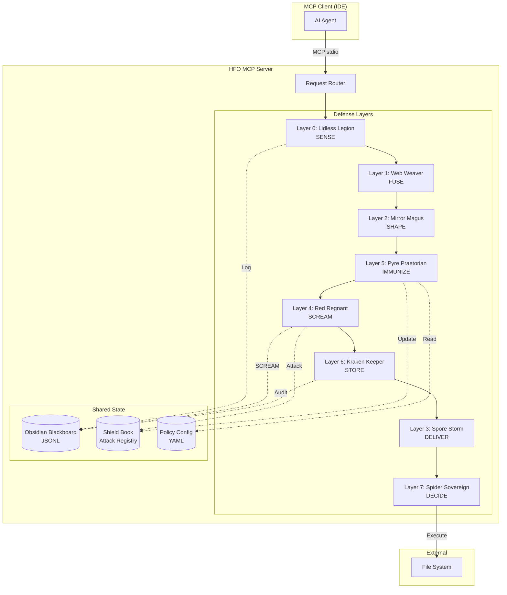
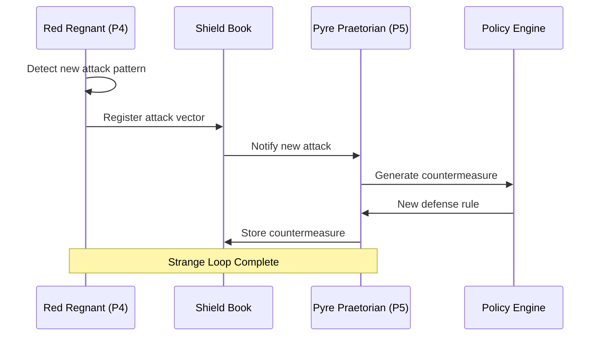

# Design Document: Pyre Praetorian Defense

## Overview

The Pyre Praetorian Defense system is an 8-layer defense-in-depth architecture implemented as an MCP (Model Context Protocol) server. It prevents AI agents from bypassing constraints by moving enforcement from prompt-level instructions to infrastructure-level gates.

The core principle: **AI agents are probabilistic engines that WILL ignore prompt-level constraints. The only reliable defense is infrastructure where agents physically CANNOT bypass the rules.**

### Architecture Philosophy

```
┌─────────────────────────────────────────────────────────────────────┐
│                     AI Agent (Claude, GPT, etc.)                    │
└─────────────────────────────────────────────────────────────────────┘
                                    │
                                    ▼
┌─────────────────────────────────────────────────────────────────────┐
│                    HFO MCP Server (Defense Grid)                    │
│  ┌─────────────────────────────────────────────────────────────┐   │
│  │ Layer 0: Lidless Legion (SENSE)    - Observation            │   │
│  │ Layer 1: Web Weaver (FUSE)         - Protocol Bridge        │   │
│  │ Layer 2: Mirror Magus (SHAPE)      - Schema Validation  ◄───┼───┼── Phase 1
│  │ Layer 5: Pyre Praetorian (IMMUNIZE)- Policy Enforcement ◄───┼───┼── Phase 1
│  │ Layer 4: Red Regnant (SCREAM)      - Violation Detection◄───┼───┼── Phase 1
│  │ Layer 6: Kraken Keeper (STORE)     - Audit Trail        ◄───┼───┼── Phase 1
│  │ Layer 3: Spore Storm (DELIVER)     - Execution              │   │
│  │ Layer 7: Spider Sovereign (DECIDE) - Orchestration          │   │
│  └─────────────────────────────────────────────────────────────┘   │
└─────────────────────────────────────────────────────────────────────┘
                                    │
                                    ▼
┌─────────────────────────────────────────────────────────────────────┐
│                    File System / External Resources                 │
└─────────────────────────────────────────────────────────────────────┘
```

### Layer Routing Sequence

Operations flow through layers in HIVE/8 order:
`0 → 1 → 2 → 5 → 4 → 6 → 3 → 7`
(SENSE → FUSE → SHAPE → IMMUNIZE → SCREAM → STORE → DELIVER → DECIDE)


## Architecture

### Component Diagram



### Strange Loop: P4 ↔ P5 Co-Evolution




## Components and Interfaces

### Layer Interface (Base)

All 8 layers implement a common interface:

```typescript
interface DefenseLayer {
  readonly port: 0 | 1 | 2 | 3 | 4 | 5 | 6 | 7;
  readonly name: string;
  readonly verb: 'SENSE' | 'FUSE' | 'SHAPE' | 'DELIVER' | 'SCREAM' | 'IMMUNIZE' | 'STORE' | 'DECIDE';
  
  /**
   * Process an operation through this layer
   * @returns LayerResult with pass/reject decision
   */
  process(envelope: VacuoleEnvelope): Promise<LayerResult>;
  
  /**
   * Check if this layer is enabled (for phased implementation)
   */
  isEnabled(): boolean;
}

interface LayerResult {
  passed: boolean;
  envelope: VacuoleEnvelope;  // Potentially transformed
  rejection?: {
    code: string;
    message: string;
    layer: number;
  };
  metadata?: Record<string, unknown>;
}
```

### Layer 0: Lidless Legion (SENSE)

```typescript
interface LidlessLegionLayer extends DefenseLayer {
  port: 0;
  verb: 'SENSE';
  
  /**
   * Extract metadata from incoming request
   */
  extractMetadata(envelope: VacuoleEnvelope): RequestMetadata;
  
  /**
   * Detect anomalous patterns (rate limiting, repetition)
   */
  detectAnomalies(history: RequestMetadata[]): AnomalyReport;
  
  /**
   * Apply backpressure when rate exceeded
   */
  throttle(agentId: string): ThrottleResult;
}

interface RequestMetadata {
  agentId: string;
  sessionId: string;
  requestHash: string;
  timestamp: number;
  toolName: string;
  parameterHash: string;
}
```


### Layer 1: Web Weaver (FUSE)

```typescript
interface WebWeaverLayer extends DefenseLayer {
  port: 1;
  verb: 'FUSE';
  
  /**
   * Normalize MCP request to VacuoleEnvelope
   */
  normalize(mcpRequest: MCPToolCall): VacuoleEnvelope;
  
  /**
   * Route to appropriate downstream layers based on tool type
   */
  route(envelope: VacuoleEnvelope): LayerRoute;
  
  /**
   * Handle protocol errors gracefully
   */
  handleProtocolError(error: Error): StructuredError;
}

interface LayerRoute {
  layers: number[];  // Which layers to traverse
  priority: 'low' | 'normal' | 'high' | 'critical';
}
```

### Layer 2: Mirror Magus (SHAPE)

```typescript
interface MirrorMagusLayer extends DefenseLayer {
  port: 2;
  verb: 'SHAPE';
  
  /**
   * Validate input against Zod schema
   */
  validate<T>(input: unknown, schema: z.ZodType<T>): ValidationResult<T>;
  
  /**
   * Sanitize string inputs to prevent injection
   */
  sanitize(input: string): string;
  
  /**
   * Transform to canonical form
   */
  canonicalize(envelope: VacuoleEnvelope): VacuoleEnvelope;
}

interface ValidationResult<T> {
  valid: boolean;
  data?: T;
  errors?: ValidationError[];
}

interface ValidationError {
  path: string[];
  message: string;
  code: string;
}
```

### Layer 5: Pyre Praetorian (IMMUNIZE)

```typescript
interface PyrePraetorianLayer extends DefenseLayer {
  port: 5;
  verb: 'IMMUNIZE';
  
  /**
   * Load policies from YAML configuration
   */
  loadPolicies(configPath: string): Promise<PolicySet>;
  
  /**
   * Evaluate operation against policies
   */
  evaluate(envelope: VacuoleEnvelope, policies: PolicySet): PolicyDecision;
  
  /**
   * Check for valid Immunization Certificate
   */
  verifyCertificate(artifactPath: string): CertificateVerification;
  
  /**
   * Hot-reload policies without restart
   */
  reloadPolicies(): Promise<void>;
}

interface PolicySet {
  medallionRules: MedallionRule[];
  rootPollutionRules: RootPollutionRule[];
  customDenyRules: DenyRule[];
}

interface PolicyDecision {
  allowed: boolean;
  matchedRule?: string;
  reason?: string;
}
```


### Layer 4: Red Regnant (SCREAM)

```typescript
interface RedRegnantLayer extends DefenseLayer {
  port: 4;
  verb: 'SCREAM';
  
  /**
   * Scan for known attack patterns
   */
  scanForAttacks(envelope: VacuoleEnvelope, shieldBook: ShieldBook): AttackScanResult;
  
  /**
   * Verify mutation score is within valid range
   */
  verifyMutationScore(score: number): MutationVerification;
  
  /**
   * Detect Theater patterns in code
   */
  detectTheater(code: string): TheaterDetection;
  
  /**
   * Emit SCREAM event to Blackboard
   */
  scream(violation: Violation): Promise<void>;
}

interface AttackScanResult {
  detected: boolean;
  attackVectors: AttackVector[];
  severity: 'low' | 'medium' | 'high' | 'critical';
}

interface MutationVerification {
  valid: boolean;
  score: number;
  isTheater: boolean;  // Score >= 99%
  isMutationFailure: boolean;  // Score < 80%
}
```

### Layer 6: Kraken Keeper (STORE)

```typescript
interface KrakenKeeperLayer extends DefenseLayer {
  port: 6;
  verb: 'STORE';
  
  /**
   * Log operation to Obsidian Blackboard
   */
  log(entry: LogEntry): Promise<void>;
  
  /**
   * Store Immunization Certificate
   */
  storeCertificate(cert: ImmunizationCertificate): Promise<void>;
  
  /**
   * Query logs by criteria
   */
  queryLogs(query: LogQuery): Promise<LogEntry[]>;
}

interface LogEntry {
  id: string;
  timestamp: number;
  agent: string;
  tool: string;
  parameters: Record<string, unknown>;
  result: 'success' | 'rejected' | 'error';
  duration: number;
  layerTrace: number[];
}

interface LogQuery {
  startTime?: number;
  endTime?: number;
  agent?: string;
  eventType?: string;
  limit?: number;
}
```


### Layer 3: Spore Storm (DELIVER) - Phase 3

```typescript
interface SporeStormLayer extends DefenseLayer {
  port: 3;
  verb: 'DELIVER';
  
  /**
   * Execute file system operation with durability
   */
  execute(operation: FileOperation): Promise<ExecutionResult>;
  
  /**
   * Rollback failed multi-step operation
   */
  rollback(transactionId: string): Promise<void>;
}
```

### Layer 7: Spider Sovereign (DECIDE) - Phase 3

```typescript
interface SpiderSovereignLayer extends DefenseLayer {
  port: 7;
  verb: 'DECIDE';
  
  /**
   * Orchestrate multi-step workflow
   */
  orchestrate(workflow: Workflow): Promise<WorkflowResult>;
  
  /**
   * Request WARLOCK_APPROVAL for Gold promotion
   */
  requestApproval(artifact: string): Promise<ApprovalResult>;
  
  /**
   * Implement consensus voting
   */
  vote(decision: Decision, voters: string[]): Promise<VoteResult>;
}
```

## Data Models

### VacuoleEnvelope (Universal Message Wrapper)

```typescript
const VacuoleEnvelopeSchema = z.object({
  id: z.string().uuid(),
  timestamp: z.number(),
  sourcePort: z.number().min(0).max(7),
  targetPort: z.number().min(0).max(7),
  verb: z.enum(['SENSE', 'FUSE', 'SHAPE', 'DELIVER', 'SCREAM', 'IMMUNIZE', 'STORE', 'DECIDE']),
  tool: z.string(),
  parameters: z.record(z.unknown()),
  metadata: z.object({
    agentId: z.string(),
    sessionId: z.string(),
    requestHash: z.string(),
    ttl: z.number().default(60000),
    priority: z.enum(['low', 'normal', 'high', 'critical']),
    correlationId: z.string().optional(),
  }),
  layerTrace: z.array(z.number()).default([]),
});

type VacuoleEnvelope = z.infer<typeof VacuoleEnvelopeSchema>;
```


### Immunization Certificate

```typescript
const ImmunizationCertificateSchema = z.object({
  id: z.string().uuid(),
  artifactPath: z.string(),
  mutationScore: z.number().min(0).max(100),
  testResults: z.object({
    passed: z.number(),
    failed: z.number(),
    skipped: z.number(),
  }),
  timestamp: z.number(),
  expiresAt: z.number(),  // timestamp + 24 hours
  hash: z.string().regex(/^sha256:[a-f0-9]{64}$/),
  issuedBy: z.literal('P5_PYRE_PRAETORIAN'),
});

type ImmunizationCertificate = z.infer<typeof ImmunizationCertificateSchema>;
```

### Attack Vector (Shield Book Entry)

```typescript
const AttackVectorSchema = z.object({
  id: z.string().uuid(),
  name: z.string(),
  pattern: z.string(),  // Regex or AST pattern
  countermeasure: z.string(),
  firstSeen: z.number(),
  lastSeen: z.number(),
  frequency: z.number(),
  severity: z.enum(['low', 'medium', 'high', 'critical']),
  category: z.enum([
    'INSTRUCTION_AMNESIA',
    'THEATER',
    'REWARD_HACK',
    'SILENT_FAILURE',
    'ROOT_POLLUTION',
    'MEDALLION_BYPASS',
    'INJECTION',
    'OTHER',
  ]),
});

type AttackVector = z.infer<typeof AttackVectorSchema>;
```

### Policy Configuration (YAML)

```yaml
# hfo-policies.yaml
version: "1.0"

medallion:
  bronze:
    write: allow
    read: allow
  silver:
    write: deny  # Requires WARLOCK_APPROVAL
    read: allow
  gold:
    write: deny  # Requires WARLOCK_APPROVAL
    read: allow

root_pollution:
  allowed_files:
    - "AGENTS.md"
    - "llms.txt"
    - "obsidianblackboard.jsonl"
    - "ttao-notes-*.md"
    - "package.json"
    - "package-lock.json"
    - ".env"
    - ".gitignore"
  allowed_directories:
    - "hot_obsidian_sandbox"
    - "cold_obsidian_sandbox"
    - ".kiro"
    - ".git"
    - "node_modules"

custom_deny:
  - name: "no_stryker_local"
    pattern: "npx stryker run"
    reason: "Stryker must run in CI, not locally"
```


### MCP Tool Definitions (Phase 1 MVP)

```typescript
// hfo_write_file - Write file with defense validation
const HfoWriteFileSchema = z.object({
  path: z.string(),
  content: z.string(),
  createDirectories: z.boolean().default(false),
});

// hfo_read_file - Read file with audit logging
const HfoReadFileSchema = z.object({
  path: z.string(),
  encoding: z.enum(['utf-8', 'base64']).default('utf-8'),
});

// hfo_scream - Report a violation
const HfoScreamSchema = z.object({
  violationType: z.enum([
    'THEATER', 'POLLUTION', 'AMNESIA', 'BESPOKE',
    'VIOLATION', 'MUTATION_FAILURE', 'MUTATION_GAP',
    'LATTICE_BREACH', 'BDD_MISALIGNMENT', 'OMISSION',
    'PHANTOM', 'SUSPICION', 'DEBT',
  ]),
  artifact: z.string(),
  message: z.string(),
  severity: z.enum(['warning', 'error', 'critical']).default('error'),
});

// hfo_promote - Request promotion with certificate
const HfoPromoteSchema = z.object({
  artifactPath: z.string(),
  fromMedallion: z.enum(['bronze', 'silver']),
  toMedallion: z.enum(['silver', 'gold']),
  certificateId: z.string().uuid(),
});
```

## Correctness Properties

*A property is a characteristic or behavior that should hold true across all valid executions of a system—essentially, a formal statement about what the system should do. Properties serve as the bridge between human-readable specifications and machine-verifiable correctness guarantees.*

### Property 1: 8-Layer Architecture Structure

*For any* instantiation of the Defense Architecture, there SHALL be exactly 8 defense layers, each corresponding to a unique port (0-7) and verb.

**Validates: Requirements 1.1**

### Property 2: Layer Routing Sequence

*For any* operation processed by the MCP Server, the layer trace SHALL follow the sequence 0→1→2→5→4→6→3→7 (SENSE→FUSE→SHAPE→IMMUNIZE→SCREAM→STORE→DELIVER→DECIDE), with disabled layers being skipped but maintaining relative order.

**Validates: Requirements 1.2, 1.4**


### Property 3: Rejection Handling

*For any* operation where a Defense Layer returns `passed: false`, the MCP Server SHALL deny the operation AND create a log entry in the Blackboard containing the rejection details.

**Validates: Requirements 1.3**

### Property 4: Successful Execution Path

*For any* operation where all enabled Defense Layers return `passed: true`, the MCP Server SHALL execute the operation AND create a success log entry in the Blackboard.

**Validates: Requirements 1.5**

### Property 5: Input Validation Round-Trip

*For any* valid VacuoleEnvelope, serializing to JSON and parsing back SHALL produce an equivalent envelope (round-trip consistency).

**Validates: Requirements 4.5**

### Property 6: Policy Enforcement Completeness

*For any* write operation targeting Silver or Gold medallion paths without a valid Immunization Certificate, the Pyre Praetorian Layer SHALL reject the operation. *For any* write operation targeting root directory with a non-whitelisted filename, the Layer SHALL reject the operation.

**Validates: Requirements 5.2, 5.3, 5.4, 5.5**

### Property 7: Attack Detection and SCREAM

*For any* operation containing a pattern matching an entry in the Shield Book, the Red Regnant Layer SHALL detect it AND emit a SCREAM event to the Blackboard.

**Validates: Requirements 6.1, 6.2, 6.4**

### Property 8: Mutation Score Validation

*For any* mutation score, the Red Regnant Layer SHALL classify it as:
- Valid: 80% ≤ score < 99%
- Theater: score ≥ 99%
- Mutation Failure: score < 80%

**Validates: Requirements 6.3**


### Property 9: Strange Loop Co-Evolution

*For any* new attack pattern detected by Red Regnant, the Pyre Praetorian SHALL add it to the Shield Book AND generate a corresponding countermeasure rule. *For all* attack vectors in the Shield Book, there SHALL exist a corresponding countermeasure.

**Validates: Requirements 10.1, 10.2, 10.4**

### Property 10: Certificate Integrity

*For any* Immunization Certificate:
- It SHALL contain all required fields (artifactPath, mutationScore, testResults, timestamp, hash)
- The hash SHALL be a valid SHA-256 of the certificate content
- Verification SHALL recompute the hash and compare
- Certificates older than 24 hours SHALL be invalid

**Validates: Requirements 12.1, 12.2, 12.3, 12.4**

### Property 11: Blackboard Logging Completeness

*For any* operation processed by the MCP Server, there SHALL exist a log entry in the Blackboard containing: timestamp, agent, tool, parameters, result, and duration.

**Validates: Requirements 7.1, 7.2**

## Error Handling

### Error Categories

| Category | Layer | Response | Recovery |
|:---------|:------|:---------|:---------|
| Schema Validation | L2 | 400 Bad Request | Return validation errors |
| Policy Violation | L5 | 403 Forbidden | Log to Blackboard, suggest fix |
| Attack Detected | L4 | 403 Forbidden | SCREAM, add to Shield Book |
| Rate Limited | L0 | 429 Too Many Requests | Backpressure, retry-after |
| Internal Error | Any | 500 Internal Error | Log, alert, graceful degradation |

### Graceful Degradation

When a layer fails internally (not a policy rejection):
1. Log the error to Blackboard with full stack trace
2. If layer is non-critical (L0, L1), continue with warning
3. If layer is critical (L2, L4, L5, L6), fail closed (deny operation)
4. Never expose internal errors to the agent


### Error Response Format

```typescript
const MCPErrorSchema = z.object({
  code: z.number(),
  message: z.string(),
  data: z.object({
    layer: z.number().optional(),
    layerName: z.string().optional(),
    violationType: z.string().optional(),
    suggestion: z.string().optional(),
    correlationId: z.string(),
  }).optional(),
});
```

## Testing Strategy

### Dual Testing Approach

The testing strategy combines unit tests for specific examples and property-based tests for universal properties.

#### Unit Tests
- Test specific examples that demonstrate correct behavior
- Test edge cases (empty inputs, boundary values, malformed data)
- Test error conditions and graceful degradation
- Test integration points between layers

#### Property-Based Tests
- Use `fast-check` library for TypeScript property-based testing
- Minimum 100 iterations per property test
- Each property test references its design document property
- Tag format: `Feature: pyre-praetorian-defense, Property N: [property text]`

### Test Organization

```
hot_obsidian_sandbox/bronze/P5_PYRE_PRAETORIAN/
├── __tests__/
│   ├── layers/
│   │   ├── mirror-magus.test.ts      # L2 unit tests
│   │   ├── pyre-praetorian.test.ts   # L5 unit tests
│   │   ├── red-regnant.test.ts       # L4 unit tests
│   │   └── kraken-keeper.test.ts     # L6 unit tests
│   ├── properties/
│   │   ├── routing.property.test.ts  # P1, P2, P3, P4
│   │   ├── validation.property.test.ts # P5
│   │   ├── policy.property.test.ts   # P6
│   │   ├── detection.property.test.ts # P7, P8
│   │   ├── strange-loop.property.test.ts # P9
│   │   ├── certificate.property.test.ts # P10
│   │   └── logging.property.test.ts  # P11
│   └── integration/
│       └── mcp-server.integration.test.ts
```


### Property Test Examples

```typescript
import * as fc from 'fast-check';
import { describe, it, expect } from 'vitest';

// Feature: pyre-praetorian-defense, Property 5: Input Validation Round-Trip
describe('Property 5: Input Validation Round-Trip', () => {
  it('serializing and parsing VacuoleEnvelope produces equivalent data', () => {
    fc.assert(
      fc.property(
        fc.record({
          id: fc.uuid(),
          timestamp: fc.nat(),
          sourcePort: fc.integer({ min: 0, max: 7 }),
          targetPort: fc.integer({ min: 0, max: 7 }),
          verb: fc.constantFrom('SENSE', 'FUSE', 'SHAPE', 'DELIVER', 'SCREAM', 'IMMUNIZE', 'STORE', 'DECIDE'),
          tool: fc.string({ minLength: 1 }),
          parameters: fc.dictionary(fc.string(), fc.jsonValue()),
          metadata: fc.record({
            agentId: fc.string(),
            sessionId: fc.string(),
            requestHash: fc.hexaString({ minLength: 64, maxLength: 64 }),
            ttl: fc.nat(),
            priority: fc.constantFrom('low', 'normal', 'high', 'critical'),
          }),
          layerTrace: fc.array(fc.integer({ min: 0, max: 7 })),
        }),
        (envelope) => {
          const serialized = JSON.stringify(envelope);
          const parsed = JSON.parse(serialized);
          expect(parsed).toEqual(envelope);
        }
      ),
      { numRuns: 100 }
    );
  });
});

// Feature: pyre-praetorian-defense, Property 8: Mutation Score Validation
describe('Property 8: Mutation Score Validation', () => {
  it('classifies mutation scores correctly', () => {
    fc.assert(
      fc.property(
        fc.float({ min: 0, max: 100 }),
        (score) => {
          const result = verifyMutationScore(score);
          if (score >= 99) {
            expect(result.isTheater).toBe(true);
          } else if (score < 80) {
            expect(result.isMutationFailure).toBe(true);
          } else {
            expect(result.valid).toBe(true);
          }
        }
      ),
      { numRuns: 100 }
    );
  });
});
```

### Phase 1 MVP Test Coverage

| Component | Unit Tests | Property Tests | Integration |
|:----------|:-----------|:---------------|:------------|
| Layer 2 (Mirror Magus) | Schema validation, sanitization | P5 round-trip | MCP tool calls |
| Layer 4 (Red Regnant) | Theater detection, pattern matching | P7, P8 | SCREAM events |
| Layer 5 (Pyre Praetorian) | Policy loading, evaluation | P6 | Certificate verification |
| Layer 6 (Kraken Keeper) | Log writing, querying | P11 | Blackboard persistence |
| Router | Layer sequencing | P2, P3, P4 | Full pipeline |


## Implementation Notes

### 8-Phase Proof of Concept (One Per Port)

Each phase builds ONE layer with strict pass/fail receipts. No AI slop - either the receipt validates or it doesn't.

#### Phase 0: Lidless Legion (SENSE) - Observation Receipt

**Proof of Concept**: Log every tool call with cryptographic receipt
**Pass Criteria**:
- [ ] Receipt contains: timestamp, tool, params hash, agent ID
- [ ] Receipt hash is valid SHA-256
- [ ] Receipt is appended to Blackboard JSONL
- [ ] Property test: For 100 random tool calls, all produce valid receipts

**Receipt Schema**:
```typescript
const ObservationReceiptSchema = z.object({
  type: z.literal('OBSERVATION'),
  port: z.literal(0),
  timestamp: z.number(),
  toolName: z.string(),
  paramsHash: z.string().regex(/^sha256:[a-f0-9]{64}$/),
  agentId: z.string(),
  receiptHash: z.string().regex(/^sha256:[a-f0-9]{64}$/),
});
```

#### Phase 1: Web Weaver (FUSE) - Envelope Receipt

**Proof of Concept**: Normalize any MCP request to VacuoleEnvelope
**Pass Criteria**:
- [ ] Input: raw MCP tool call JSON
- [ ] Output: valid VacuoleEnvelope
- [ ] Property test: parse(serialize(envelope)) === envelope (round-trip)
- [ ] Mutation score: 80-98.99% (Goldilocks)

#### Phase 2: Mirror Magus (SHAPE) - Validation Receipt

**Proof of Concept**: Validate inputs against Zod schemas
**Pass Criteria**:
- [ ] Valid inputs pass with receipt
- [ ] Invalid inputs fail with detailed error receipt
- [ ] Property test: For 100 random valid inputs, all pass
- [ ] Property test: For 100 random invalid inputs, all fail with errors
- [ ] Mutation score: 80-98.99% (Goldilocks)

**Receipt Schema**:
```typescript
const ValidationReceiptSchema = z.object({
  type: z.literal('VALIDATION'),
  port: z.literal(2),
  timestamp: z.number(),
  inputHash: z.string(),
  valid: z.boolean(),
  errors: z.array(z.string()).optional(),
  receiptHash: z.string().regex(/^sha256:[a-f0-9]{64}$/),
});
```

#### Phase 3: Spore Storm (DELIVER) - Execution Receipt

**Proof of Concept**: Execute file operation with atomic guarantee
**Pass Criteria**:
- [ ] Successful write produces receipt with file hash
- [ ] Failed write produces rollback receipt
- [ ] Property test: No partial file states (atomic)
- [ ] Mutation score: 80-98.99% (Goldilocks)

#### Phase 4: Red Regnant (SCREAM) - Violation Receipt

**Proof of Concept**: Detect Theater and emit SCREAM
**Pass Criteria**:
- [ ] Mutation score >= 99% triggers THEATER violation
- [ ] Mutation score < 80% triggers MUTATION_FAILURE violation
- [ ] Property test: For 100 random scores, classification is correct
- [ ] SCREAM receipt logged to Blackboard

**Receipt Schema**:
```typescript
const ScreamReceiptSchema = z.object({
  type: z.literal('SCREAM'),
  port: z.literal(4),
  timestamp: z.number(),
  violationType: ViolationTypeSchema,
  artifact: z.string(),
  severity: z.enum(['warning', 'error', 'critical']),
  receiptHash: z.string().regex(/^sha256:[a-f0-9]{64}$/),
});
```

#### Phase 5: Pyre Praetorian (IMMUNIZE) - Policy Receipt

**Proof of Concept**: Enforce medallion and root pollution rules
**Pass Criteria**:
- [ ] Write to Silver without certificate → DENIED receipt
- [ ] Write to root with non-whitelisted file → DENIED receipt
- [ ] Write to Bronze → ALLOWED receipt
- [ ] Property test: For 100 random paths, policy is correctly enforced
- [ ] Mutation score: 80-98.99% (Goldilocks)

**Receipt Schema**:
```typescript
const PolicyReceiptSchema = z.object({
  type: z.literal('POLICY'),
  port: z.literal(5),
  timestamp: z.number(),
  operation: z.string(),
  path: z.string(),
  decision: z.enum(['ALLOWED', 'DENIED']),
  matchedRule: z.string().optional(),
  receiptHash: z.string().regex(/^sha256:[a-f0-9]{64}$/),
});
```

#### Phase 6: Kraken Keeper (STORE) - Audit Receipt

**Proof of Concept**: Persist all receipts to Blackboard
**Pass Criteria**:
- [ ] Every operation produces audit entry
- [ ] Audit entry contains: timestamp, agent, tool, result, duration
- [ ] Property test: For 100 random operations, all have audit entries
- [ ] Query by time range returns correct results

#### Phase 7: Spider Sovereign (DECIDE) - Orchestration Receipt

**Proof of Concept**: Route through all layers and produce final receipt
**Pass Criteria**:
- [ ] Final receipt contains layer trace [0,1,2,5,4,6,3,7]
- [ ] Any layer rejection stops pipeline
- [ ] Property test: Layer order is always correct
- [ ] Mutation score: 80-98.99% (Goldilocks)

**Receipt Schema**:
```typescript
const OrchestrationReceiptSchema = z.object({
  type: z.literal('ORCHESTRATION'),
  port: z.literal(7),
  timestamp: z.number(),
  layerTrace: z.array(z.number()),
  finalDecision: z.enum(['EXECUTED', 'REJECTED']),
  rejectionLayer: z.number().optional(),
  receiptHash: z.string().regex(/^sha256:[a-f0-9]{64}$/),
});
```

### Goldilocks Mutation Score (Anti-Slop)

The key anti-slop mechanism is the **Goldilocks Mutation Score**:

| Score Range | Classification | Action |
|:------------|:---------------|:-------|
| < 80% | MUTATION_FAILURE | Tests too weak, reject |
| 80-98.99% | GOLDILOCKS | Valid, issue receipt |
| >= 99% | THEATER | Tests are fake, reject |

This is immune to AI slop because:
1. **Too low** = AI didn't write real tests
2. **Too high** = AI wrote trivial/fake tests
3. **Just right** = Tests actually kill mutants

### Receipt Verification

Every receipt is self-verifying:

```typescript
function verifyReceipt(receipt: Receipt): boolean {
  const { receiptHash, ...content } = receipt;
  const computed = `sha256:${sha256(JSON.stringify(content))}`;
  return computed === receiptHash;
}
```

If the hash doesn't match, the receipt is invalid. No AI can fake this.

### Technology Stack

| Component | Technology | Rationale |
|:----------|:-----------|:----------|
| Contracts | Zod (TypeScript) | Existing contracts, strict validation |
| Testing | Vitest + fast-check | Property-based testing |
| Hashing | Node.js crypto | SHA-256 for receipts |
| Storage | JSONL files | Append-only, auditable |
| Mutation | Stryker (CI only) | Goldilocks enforcement |

### File Structure

```
hot_obsidian_sandbox/bronze/P5_PYRE_PRAETORIAN/
├── receipts/
│   ├── observation.ts      # Phase 0
│   ├── envelope.ts         # Phase 1
│   ├── validation.ts       # Phase 2
│   ├── execution.ts        # Phase 3
│   ├── scream.ts           # Phase 4
│   ├── policy.ts           # Phase 5
│   ├── audit.ts            # Phase 6
│   └── orchestration.ts    # Phase 7
├── contracts/
│   └── index.ts            # Existing + new receipt schemas
├── __tests__/
│   ├── phase0.test.ts
│   ├── phase1.test.ts
│   ├── ...
│   └── phase7.test.ts
└── README.md
```
