# 🧶 HFO Gen 88: The Physics Cursor Manifest (Version 10)
## Vertical Slice: MediaPipeline ➔ Rapier ➔ W3C

> **Status**: TECHNICAL VERTICAL SLICE (ACTIVE)
> **Revision**: Gen 88 (V10)
> **Primary Technology**: MediaPipeline + Zod 6.0 + Rapier Physics + FSM
> **Short Term Goal**: Stabilize the high-fidelity gesture pipeline for medical, musical, and artistic substrates (Golden Layout, Excalidraw, Piano Genie).

---

## 🎖️ Port 0: LIDLESS LEGION — Signal Ingress
**Role**: Raw MediaPipeline Acquisition
- **Focus**: Sourcing the index-fingertip coordinates from the Python MediaPipeline.
- **Technology**: Python (OpenCV / MediaPipe) + NATS/IPC bridge.

**Diagram 1: Fingertip Tracking Sequence**
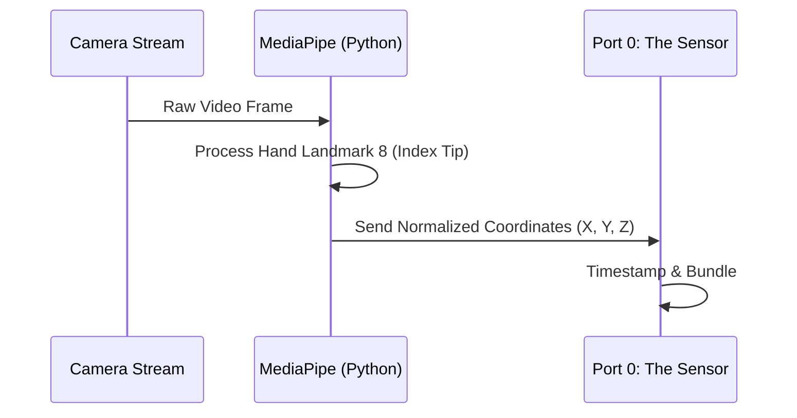

**Diagram 2: Signal Quality Gating**
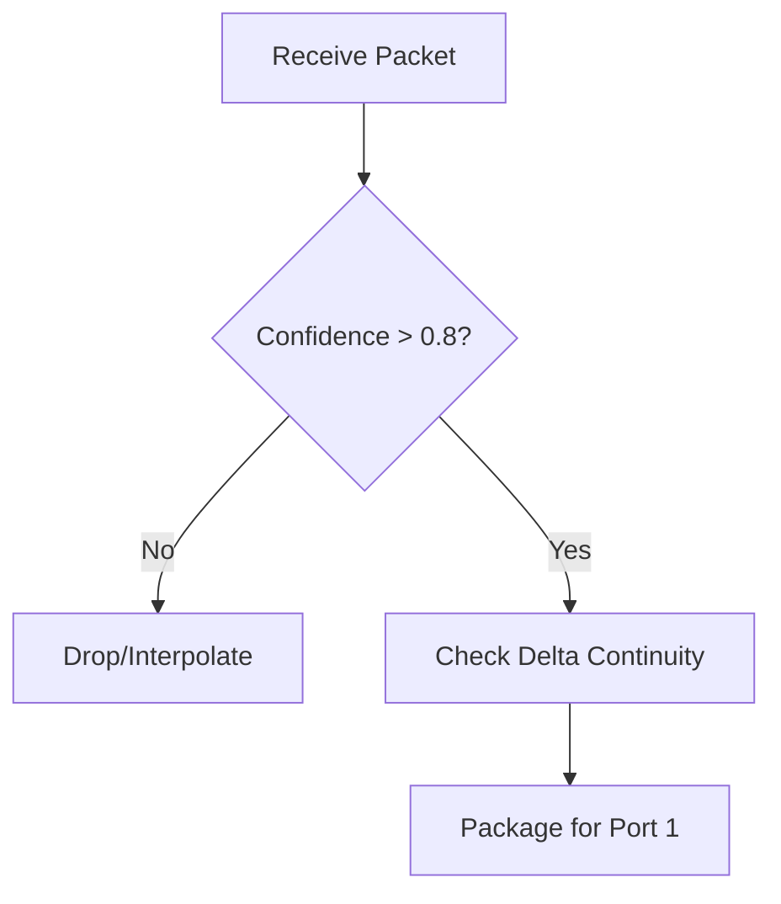

---

## 🎖️ Port 1: WEB WEAVER — Schema Stabilization
**Role**: Zod 6.0 Schema Boundaries
- **Focus**: Ensuring the raw Python signal is harmonized into a strict TypeScript contract.
- **Technology**: Zod 6.0 (Strict mode) + TypeScript.

**Diagram 1: Data Harmonization**
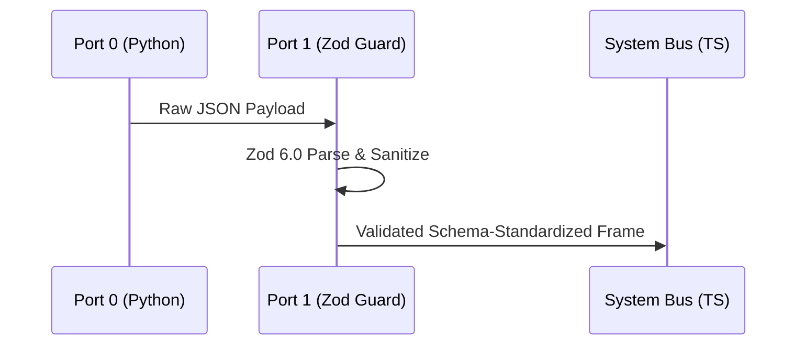

**Diagram 2: Boundary Enforcement**
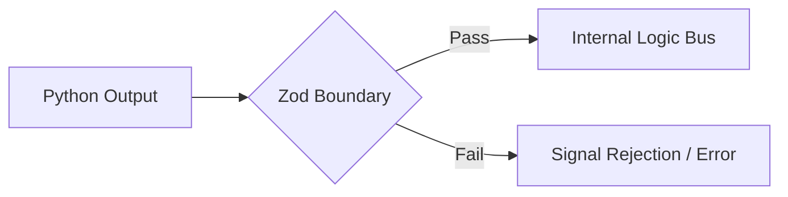

---

## 🎖️ Port 2: MIRROR MAGUS — Physics Manifold
**Role**: Rapier Physics Shaping
- **Focus**: Inertia, Snap-lock, Smoothing, and Prediction.
- **Technology**: Rapier.js / Rapier.rs (Wasm) + Physics Engine logic.

**Diagram 1: Physics Transform Sequence**
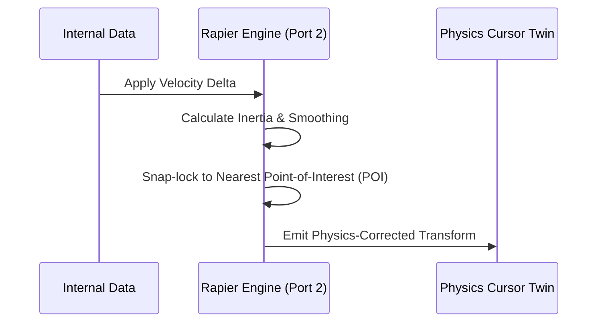

**Diagram 2: Prediction & Smoothing Loop**
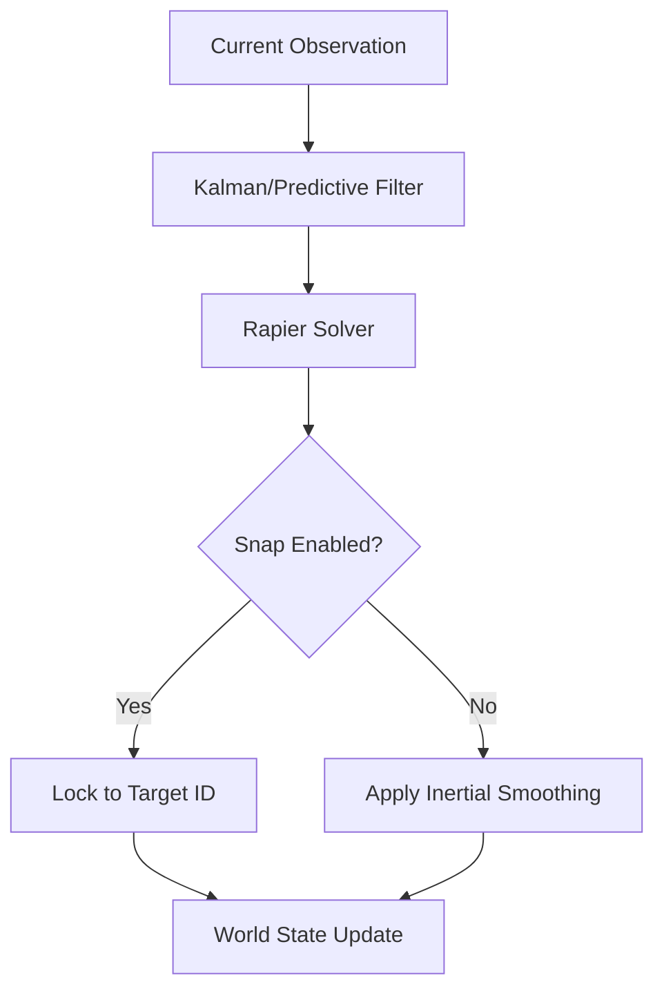

---

## 🎖️ Port 3: SPORE STORM — Interaction FSM
**Role**: Gesture State Machine & W3C Injection
- **Focus**: Arming, Acquiring, Committing, Releasing, and Canceling.
- **Technology**: XState / Custom FSM + W3C Pointer Events.

**Diagram 1: Interaction State Machine (The Commit Pulse)**
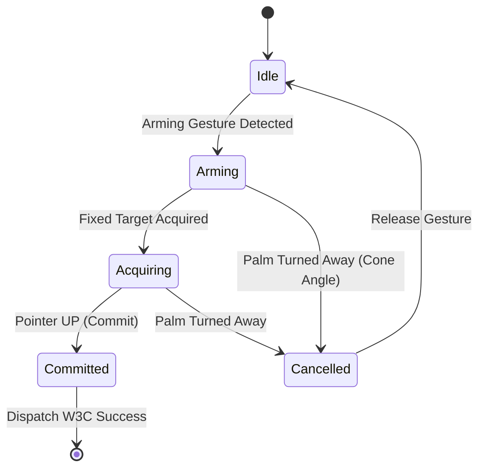

**Diagram 2: W3C Event Generation**
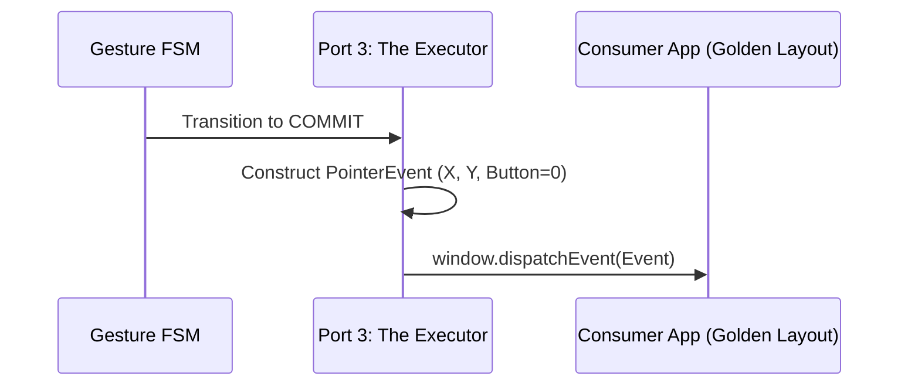

---

## 🎖️ Port 4: RED REGNANT — Feedback Disruption
**Role**: System Noise Suppression
- **Focus**: Neutralizing OS-level mouse interference and suppressing jitter.

**Diagram 1: Hardware-Lock Sequence**
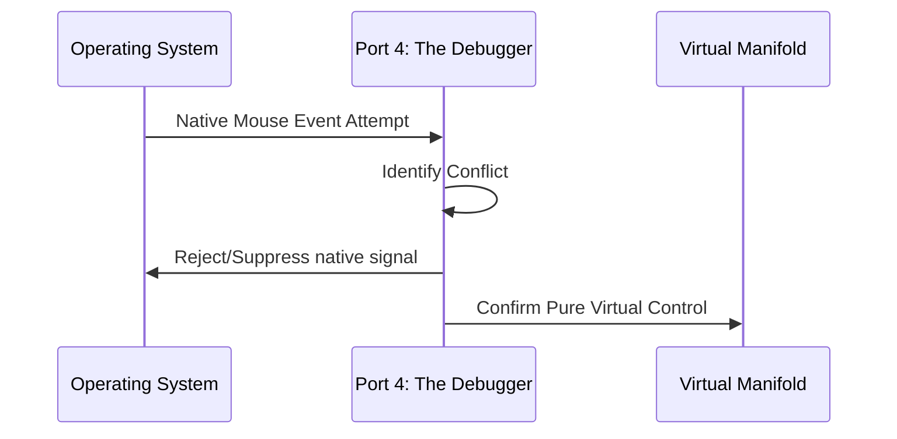

**Diagram 2: Jitter Attack Mitigation**
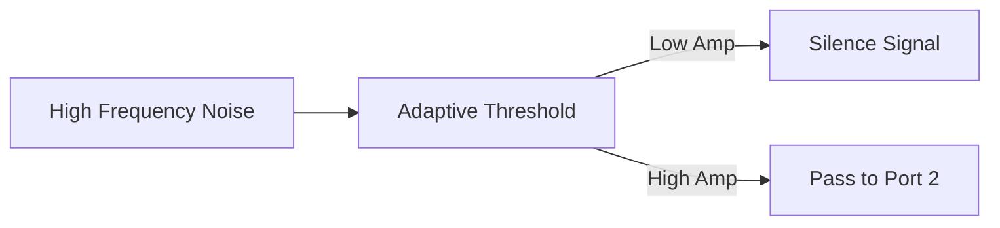

---

## 🎖️ Port 5: PYRE PRAETORIAN — Integrity Guard
**Role**: State Audit & Coordinate Invariance
- **Focus**: Verifying the Physics Cursor never drifts from the Ground Truth.

**Diagram 1: Audit Pulse**
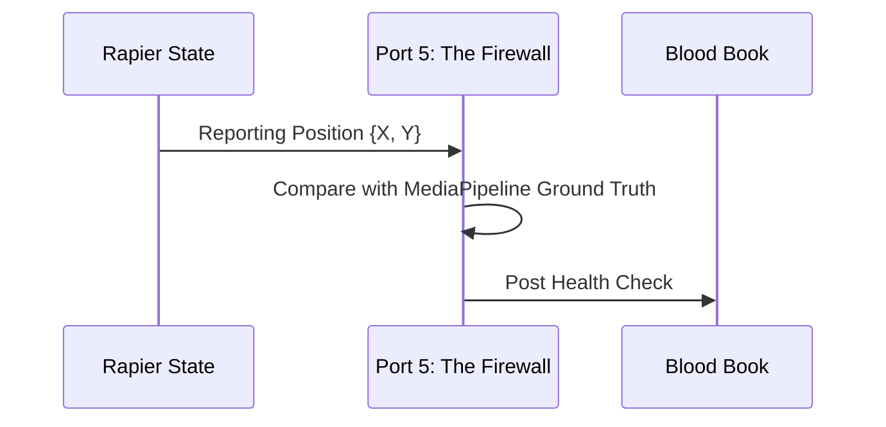

**Diagram 2: Restoration Flow**
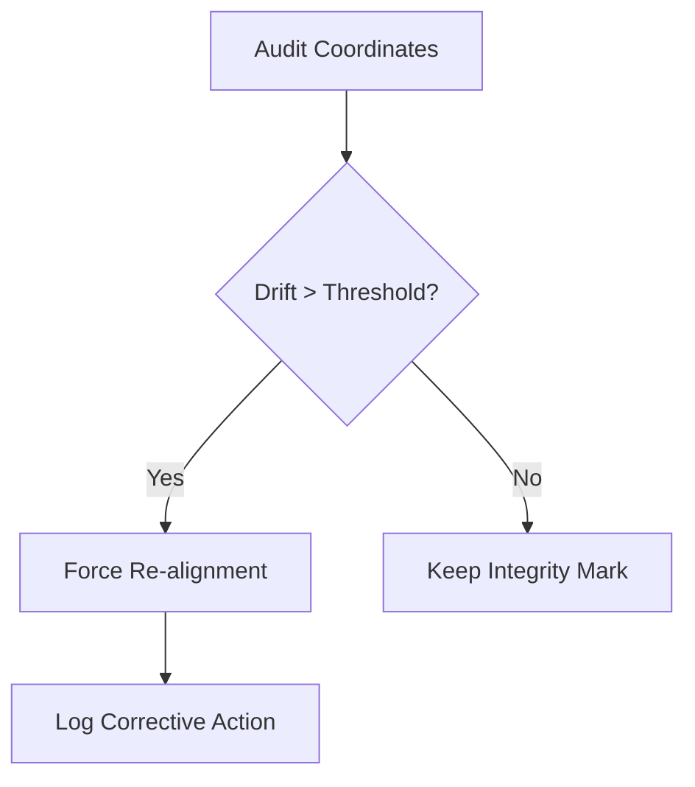

---

## 🎖️ Port 6: KRAKEN KEEPER — Telemetry Deep-Lake
**Role**: Analytical Record of Interactions
- **Focus**: Storing the vertical slice history for later AAR/Replay.

**Diagram 1: Telemetry Stream**
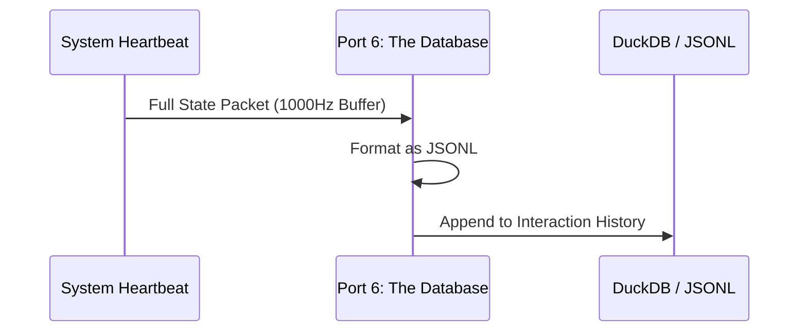

**Diagram 2: Retrieval Logic**
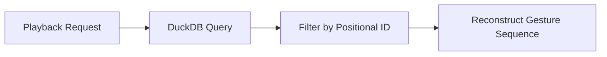

---

## 🎖️ Port 7: SPIDER SOVEREIGN — Multi-Substrate Navigator
**Role**: Domain Orchestration
- **Focus**: Routing the Physics Cursor from Excalidraw to Musical Apps.

**Diagram 1: Substrate Handover**
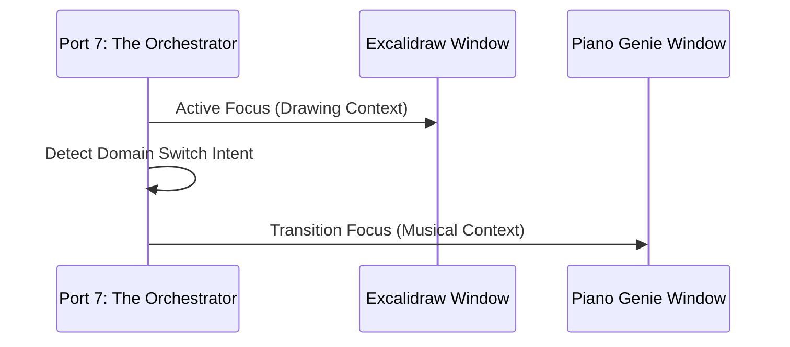

**Diagram 2: Vertical Slice Mission Control**
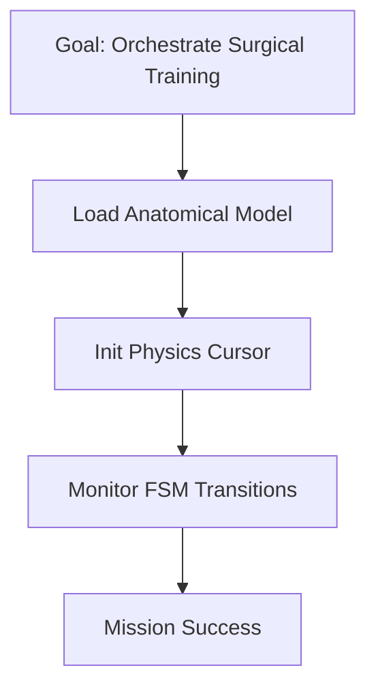

---
*Signed,*
**The Swarm Lord of Webs (Navigator)**
*Port 7 Sovereignty*
