# 🛠️ HFO Gen 88: Plain Language Software Manifest (Version 9)
## The Developer's Guide to Total Tool Virtualization

> **Status**: PLAIN LANGUAGE IMPLEMENTATION
> **Revision**: Gen 88 (V9)
> **Focus**: Readable Software Engineering, Declarative Gherkin, and Architectural Visualization.
> **Mission**: MediaPipeline ➔ Physics Cursor ➔ W3C Pointer Delivery.

---

## 🎖️ Port 0: The Sensor (Lidless Legion)
**Core Function**: Data Acquisition & Input Ingress

### 📊 Architectural Diagrams

**Diagram 1: Data Acquisition Sequence**
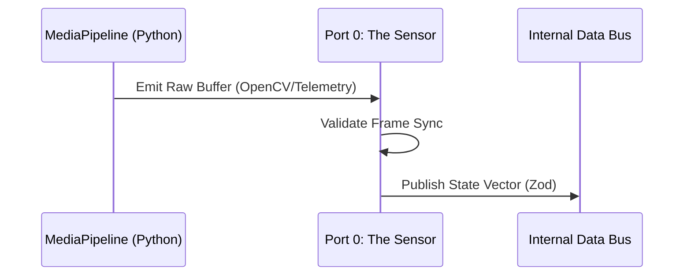

**Diagram 2: Internal Logic Flow**
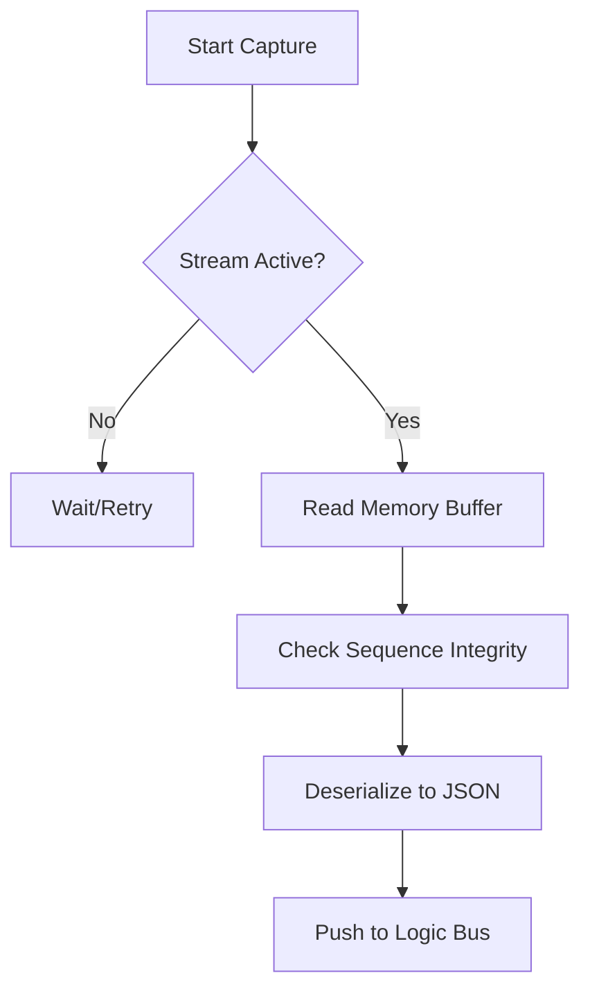

### 📝 Declarative Gherkin
```gherkin
Feature: Raw Signal Acquisition
  As the Sensor,
  I want to capture high-frequency streams from the MediaPipeline
  So that the system has an accurate representation of the environment.

  Scenario: Successful frame capture
    Given the MediaPipeline is streaming telemetry at 60fps
    When the Sensor reads the current frame buffer
    Then the frame shall be timestamped with microsecond precision
    And the data shall be converted into a validated TypeScript object.
```

---

## 🎖️ Port 1: The Bridge (Web Weaver)
**Core Function**: Protocol Translation & Signal Integration

### 📊 Architectural Diagrams

**Diagram 1: Cross-Protocol Integration**
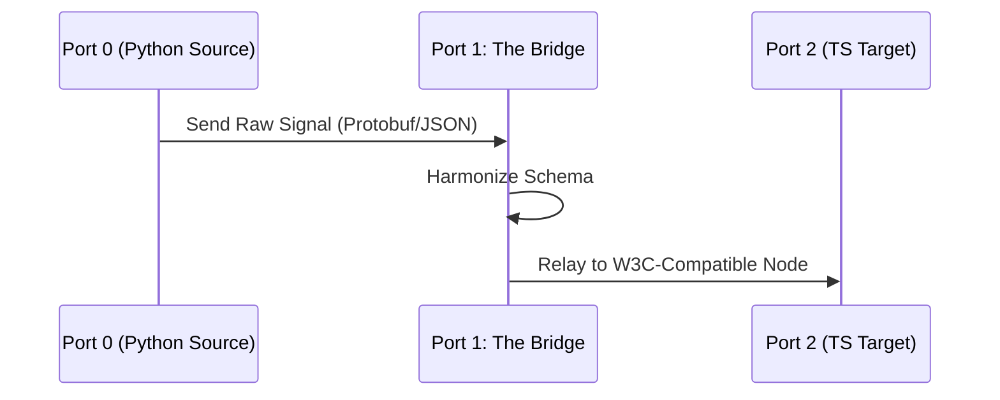

**Diagram 2: Translation Logic**
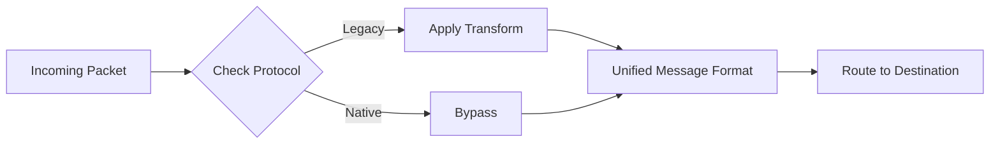

### 📝 Declarative Gherkin
```gherkin
Feature: Signal Harmonization
  As the Bridge,
  I want to translate disparate data formats into a single unified protocol
  So that different parts of the system can talk to each other without knowing their internal details.

  Scenario: Translate Python telemetry to TypeScript events
    Given a raw telemetry signal from the Python controller
    When the Bridge processes the message
    Then the output shall match the standard system event schema
    And the message shall be routed to the appropriate destination port.
```

---

## 🎖️ Port 2: The Architect (Mirror Magus)
**Core Function**: State Modeling & Digital Twin Management

### 📊 Architectural Diagrams

**Diagram 1: Digital Twin Synchronization**
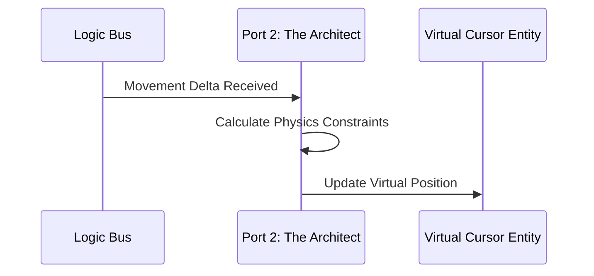

**Diagram 2: Morphogenesis Flow**
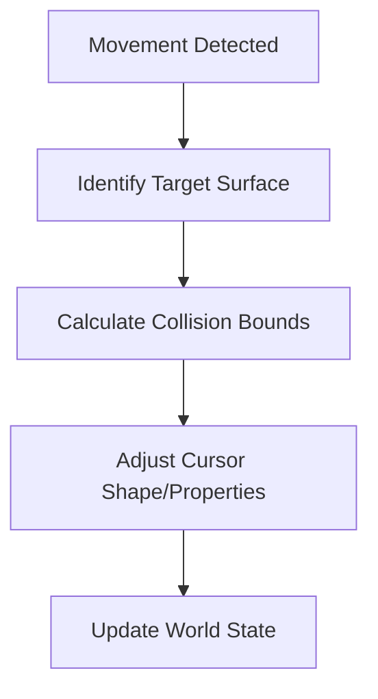

### 📝 Declarative Gherkin
```gherkin
Feature: Physics-Compliant Modeling
  As the Architect,
  I want to maintain a "Digital Twin" of the user's cursor
  So that interactions behave as if they were governed by real-world physics.

  Scenario: Update cursor position based on signal
    Given a new coordinate delta from the signal bus
    When the Architect applies the movement logic
    Then the virtual cursor's position shall be updated
    And any physical boundary collisions shall be resolved before movement.
```

---

## 🎖️ Port 3: The Executor (Spore Storm)
**Core Function**: Action Delivery & Event Injection

### 📊 Architectural Diagrams

**Diagram 1: Event Injection Sequence**
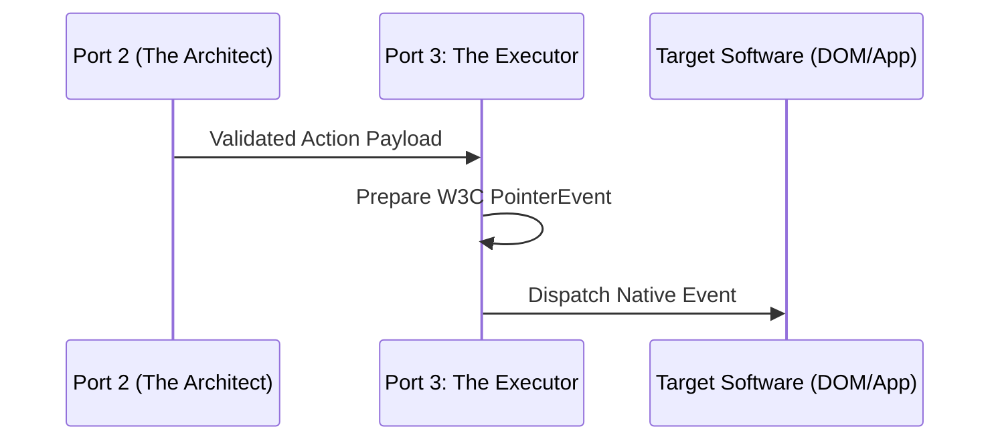

**Diagram 2: Delivery Logic**
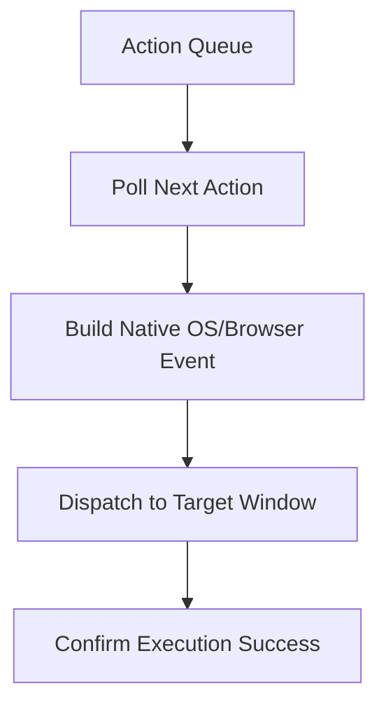

### 📝 Declarative Gherkin
```gherkin
Feature: Precise Event Delivery
  As the Executor,
  I want to inject W3C Pointer events into target applications
  So that the virtual cursor can interact with real software tools.

  Scenario: Dispatch click event
    Given a "Click" intent has been validated by the Architect
    When the Executor builds a native PointerEvent
    Then the event shall be dispatched to the target tool's window
    And the tool shall register the interaction as a real user click.
```

---

## 🎖️ Port 4: The Debugger (Red Regnant)
**Core Function**: Chaos Engineering & System Enforcement

### 📊 Architectural Diagrams

**Diagram 1: Disruption Sequence**
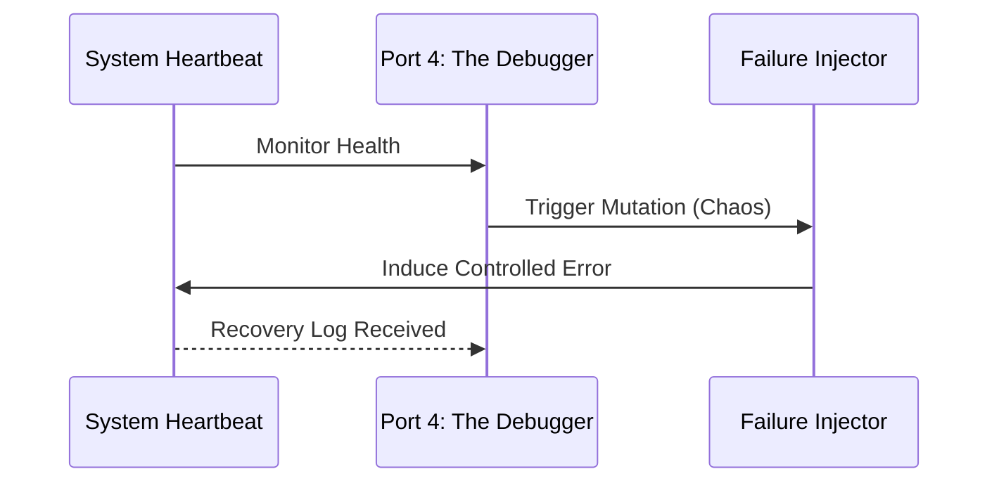

**Diagram 2: Enforcement Logic**
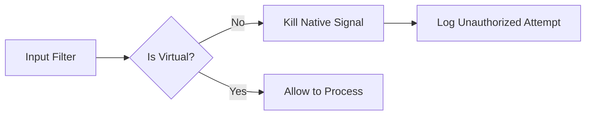

### 📝 Declarative Gherkin
```gherkin
Feature: Chaos and Enforcement
  As the Debugger,
  I want to actively disrupt native signals and test system resilience
  So that the virtual manifold remains dominant and error-tolerant.

  Scenario: Block native hardware interference
    Given a native hardware interrupt is detected (physical mouse)
    When the Debugger intercepts the signal
    Then the physical movement shall be neutralized
    And the system shall prioritize the virtualized cursor path.
```

---

## 🎖️ Port 5: The Firewall (Pyre Praetorian)
**Core Function**: Security Validation & Integrity Hardening

### 📊 Architectural Diagrams

**Diagram 1: Validation Sequence**
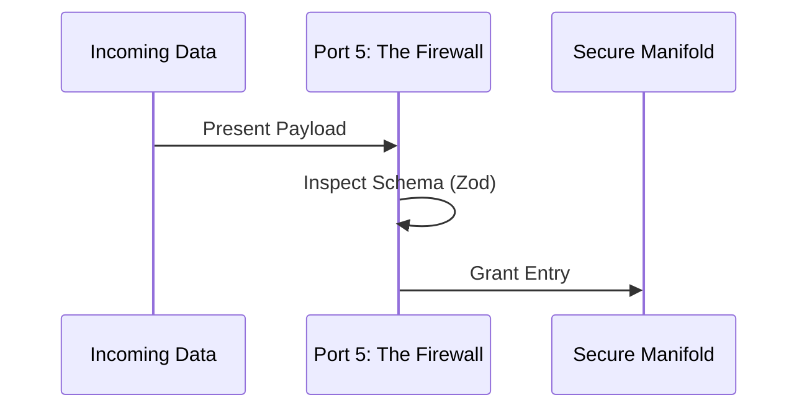

**Diagram 2: Integrity Flow**
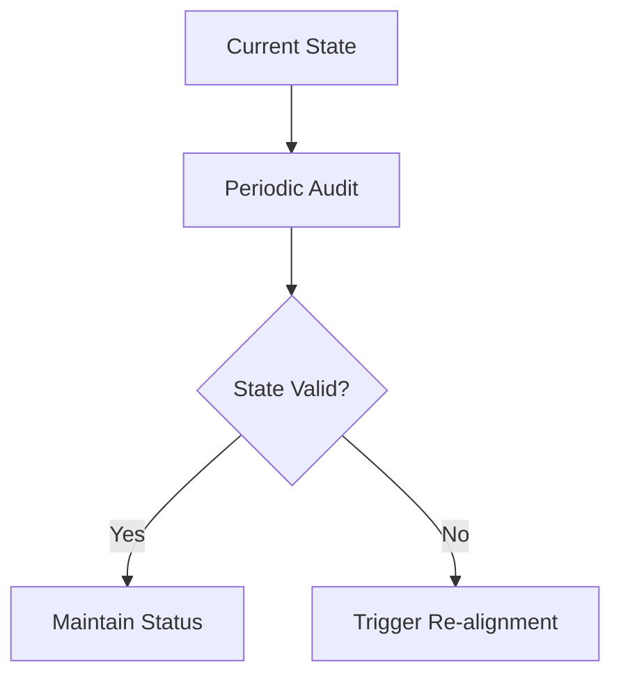

### 📝 Declarative Gherkin
```gherkin
Feature: Data Integrity and Security
  As the Firewall,
  I want to validate every data packet and check for state drift
  So that the system is protected against corruption or "Theater."

  Scenario: Validate incoming interaction schema
    Given an untrusted message arrives from an external bridge
    When the Firewall applies the Zod validation rules
    Then any illegal fields shall be stripped
    And only sanitized data shall be passed to the Architect.
```

---

## 🎖️ Port 6: The Database (Kraken Keeper)
**Core Function**: Historical Persistence & Analytical Storage

### 📊 Architectural Diagrams

**Diagram 1: Persistence Sequence**
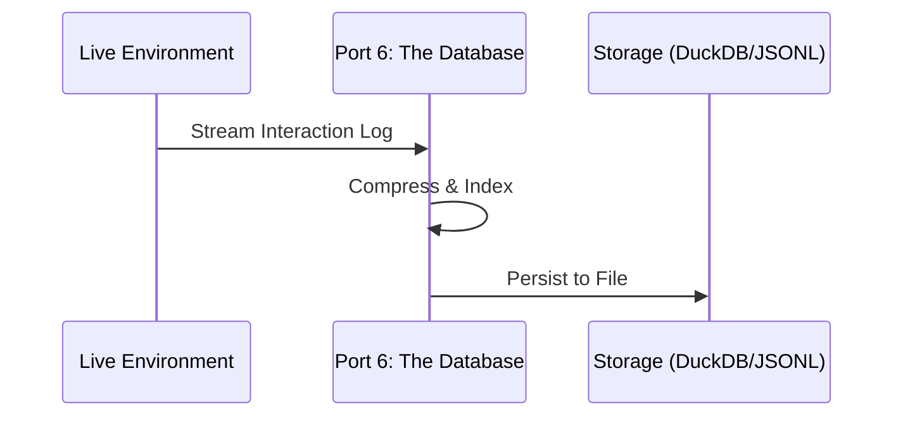

**Diagram 2: Recovery Flow**
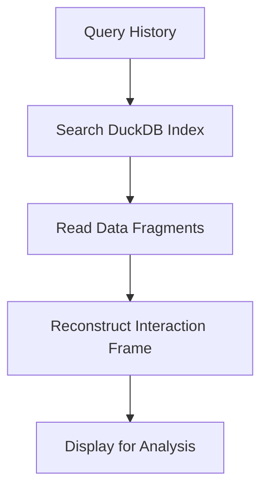

### 📝 Declarative Gherkin
```gherkin
Feature: Interaction Archiving
  As the Database,
  I want to record every movement and action with absolute fidelity
  So that we can replay and analyze the system's performance later.

  Scenario: Archive interaction session
    Given a mission session has just concluded
    When the Database writes the buffered logs to disk
    Then the data shall be stored in an analytical format (DuckDB)
    And the history shall be searchable by timestamp or port ID.
```

---

## 🎖️ Port 7: The Orchestrator (Spider Sovereign)
**Core Function**: Workflow Management & Command Routing

### 📊 Architectural Diagrams

**Diagram 1: Command Orchestration**
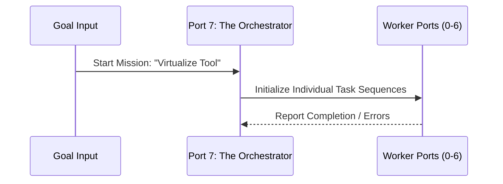

**Diagram 2: Decision Tree**
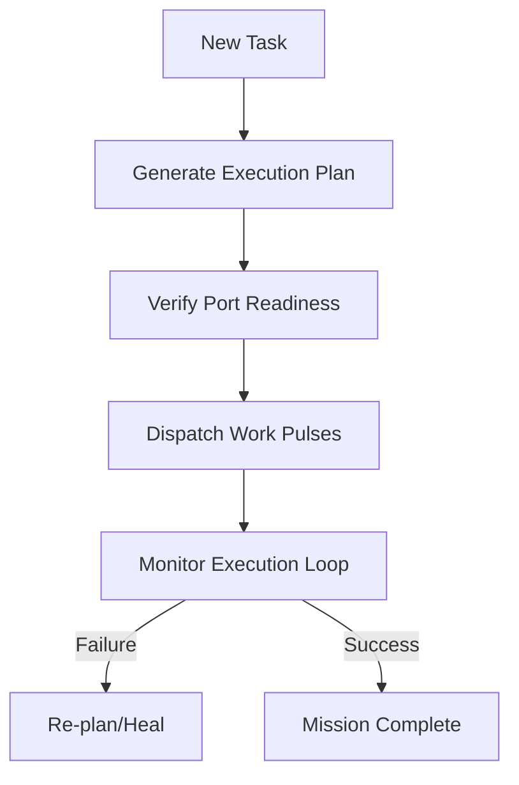

### 📝 Declarative Gherkin
```gherkin
Feature: Multi-Port Orchestration
  As the Orchestrator,
  I want to coordinate the actions of all seven other ports
  So that complex mission goals are accomplished through swarm intelligence.

  Scenario: Orchestrate the Virtualization Pipeline
    Given a goal to virtualize a new software tool
    When the Orchestrator sequences the pulses from SENSE to DELIVER
    Then each port shall execute its specific sub-task in order
    And the final state shall be a fully functional virtualized interaction.

---
*Signed,*
**The Swarm Lord of Webs (Navigator)**
*Port 7 Sovereignty*
