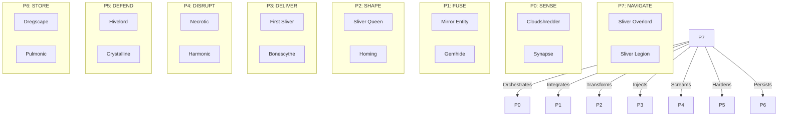

# 🕸️ 16-Sliver Synergy Manifold
**Reference**: JADC2 Visualizer (V1.2 Hardened)
**Source**: cold_obsidian_sandbox/bronze/3_resources
**Status**: HARDENED

> "The Hive is the Architecture. The 16 are the Execution."

---

## The 16-Card JADC2 Foundation

Every Port = Primary Sliver + Secondary Sliver

| Port | Commander | Verb | Primary | Secondary |
|:---:|:---|:---:|:---|:---|
| P0 | Lidless Legion | SENSE | Cloudshredder | Synapse |
| P1 | Web Weaver | FUSE | Mirror Entity | Gemhide |
| P2 | Mirror Magus | SHAPE | Sliver Queen | Homing |
| P3 | Spore Storm | DELIVER | The First Sliver | Bonescythe |
| P4 | Red Regnant | DISRUPT | Necrotic | Harmonic |
| P5 | Pyre Praetorian | DEFEND | Hivelord | Crystalline |
| P6 | Kraken Keeper | STORE | Dregscape | Pulmonic |
| P7 | Spider Sovereign | NAVIGATE | Overlord | Legion |

---

## Mermaid Visualization

---

## Synergy Exploits

### P0: High-Velocity Recon
- **Cloudshredder** (Haste/Flying): Immediate sensation
- **Synapse**: Draw data on combat contact

### P1: Standardization Exploit
- **Mirror Entity**: Universal interface, gives Sliver type to non-Slivers
- **Gemhide**: Feeds resources back to fabric

### P2: Capitalization & Propagation
- **Sliver Queen**: Multiply the swarm
- **Homing**: Dynamically manifest any capability

### P3: Automatic Injection
- **The First Sliver**: Cascade code into reality
- **Bonescythe**: Double strike for maximum impact

### P4: Kinetic Disruption
- **Necrotic**: Vaporize system nodes (Scream)
- **Harmonic**: Passive infrastructure dissolution

### P5: Immunity & Shroud
- **Hivelord**: Indestructible medallions
- **Crystalline**: Untargetable by technical debt

### P6: Active Persistence
- **Dregscape**: Unearth defunct logic
- **Pulmonic**: Cycle back to sensing stack

### P7: Orchestration & Scale
- **Overlord**: Navigate entire manifold
- **Legion**: Synergistic power scale

---

## Medallion Pipeline Mapping

| Stage | Mitigation | Sliver Equivalent |
|:---|:---|:---|
| Bronze | Kinetic development | Manaweft/Gemhide |
| Silver | Verified integration | Mirror Entity |
| Gold | Immutable truth | Sliver Hivelord |
| HFO | Omniscient swarming | Sliver Overlord |

---

*Hardened V1.2 | Spider Sovereign (Port 7)*
