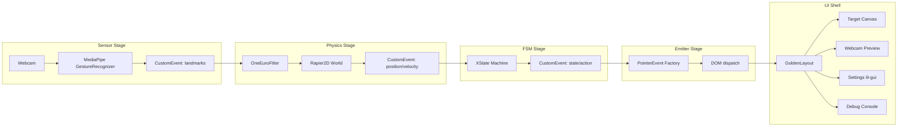
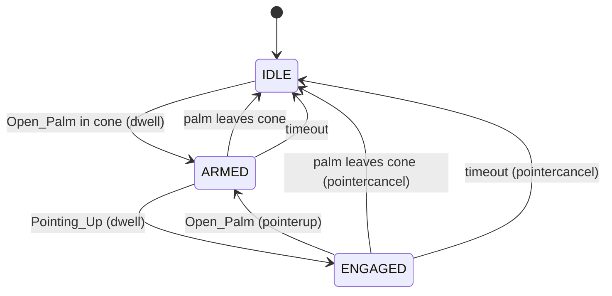

# Design Document: Gesture Pointer Monolith

## Overview

A modular monolith that transforms webcam hand tracking into W3C Pointer Events. The pipeline uses physics-based smoothing (Rapier2D + OneEuroFilter) to create a responsive, predictive cursor from noisy MediaPipe input.

**Pipeline Flow:**
```
Webcam → MediaPipe → OneEuro → Rapier2D → FSM → W3C Pointer → GoldenLayout UI
         (sensor)    (filter)  (physics)  (intent) (emit)      (consume)
```

**Key Innovation:** Triple cursor visualization showing raw/physics/predictive positions, with physics-based coasting during tracking gaps.

## Architecture



## Components and Interfaces

### 1. Sensor Stage

**Purpose:** Capture webcam and run MediaPipe GestureRecognizer

**Interface:**
```typescript
interface SensorStageConfig {
  resolution: '480p' | '720p' | '1080p';
  modelComplexity: 'lite' | 'full';
  coneAngle: number; // degrees, default 45
}

interface LandmarkEvent {
  type: 'landmarks';
  detail: {
    landmarks: Array<{x: number, y: number, z: number}>; // 21 points
    gesture: string; // 'Open_Palm', 'Pointing_Up', 'None', etc.
    confidence: number; // 0-1
    palmAngle: number; // degrees from camera normal
    timestamp: number;
  }
}

interface NoHandEvent {
  type: 'no_hand';
  detail: { timestamp: number }
}
```

### 2. Physics Stage

**Purpose:** Smooth cursor with OneEuro + Rapier2D spring physics, handle coasting/snap-lock

**Interface:**
```typescript
interface PhysicsStageConfig {
  stiffness: number; // spring constant, default 50
  damping: number; // damping coefficient, default 5
  minCutoff: number; // OneEuro, default 0.5
  beta: number; // OneEuro, default 0.001
  fps: number; // physics step rate, default 30
  snapLockThreshold: number; // distance to trigger snap, default 0.1
}

interface CursorEvent {
  type: 'cursor';
  detail: {
    raw: {x: number, y: number}; // MediaPipe index tip
    physics: {x: number, y: number}; // Rapier body position
    predictive: {x: number, y: number}; // physics + velocity extrapolation
    velocity: {vx: number, vy: number};
    isCoasting: boolean;
    timestamp: number;
  }
}
```

### 3. FSM Stage (XState)

**Purpose:** Translate gestures into pointer intent with anti-Midas safeguards

**State Machine:**


**Interface:**
```typescript
interface FSMStageConfig {
  dwellTime: number; // ms before transition, default 100
  enterThreshold: number; // confidence to enter state, default 0.7
  exitThreshold: number; // confidence to exit state, default 0.5 (hysteresis)
  coneAngle: number; // degrees, default 45
  timeout: number; // ms before IDLE, default 2000
}

interface FSMEvent {
  type: 'fsm';
  detail: {
    state: 'IDLE' | 'ARMED' | 'ENGAGED';
    action: 'NONE' | 'MOVE' | 'DOWN' | 'UP' | 'CANCEL';
    position: {x: number, y: number};
    timestamp: number;
  }
}
```

### 4. Emitter Stage

**Purpose:** Convert FSM actions to W3C Pointer Events

**Interface:**
```typescript
interface PointerEventData {
  type: 'pointermove' | 'pointerdown' | 'pointerup' | 'pointercancel';
  clientX: number;
  clientY: number;
  pointerId: number; // fixed: 1
  pointerType: 'touch'; // 'hand' not supported
  button: number;
  buttons: number;
  pressure: number;
  isPrimary: boolean;
}
```

### 5. UI Shell (GoldenLayout)

**Panels:**
- **Webcam Preview:** Video feed with landmark overlay
- **Target Canvas:** Receives pointer events, displays triple cursors
- **Settings (lil-gui):** All stage configurations
- **Debug Console:** Event log, FSM state, cursor positions

## Data Models

### Landmark Index Reference
```typescript
const LANDMARK = {
  WRIST: 0,
  THUMB_CMC: 1, THUMB_MCP: 2, THUMB_IP: 3, THUMB_TIP: 4,
  INDEX_MCP: 5, INDEX_PIP: 6, INDEX_DIP: 7, INDEX_TIP: 8,
  MIDDLE_MCP: 9, MIDDLE_PIP: 10, MIDDLE_DIP: 11, MIDDLE_TIP: 12,
  RING_MCP: 13, RING_PIP: 14, RING_DIP: 15, RING_TIP: 16,
  PINKY_MCP: 17, PINKY_PIP: 18, PINKY_DIP: 19, PINKY_TIP: 20,
} as const;
```

### Palm Angle Calculation
```typescript
function calculatePalmAngle(landmarks: Landmark[]): number {
  const wrist = landmarks[LANDMARK.WRIST];
  const middleMcp = landmarks[LANDMARK.MIDDLE_MCP];
  // Palm normal approximation: wrist to middle_mcp vector
  const palmNormal = { x: middleMcp.x - wrist.x, y: middleMcp.y - wrist.y, z: middleMcp.z - wrist.z };
  // Camera normal is (0, 0, -1)
  const dot = -palmNormal.z;
  const mag = Math.sqrt(palmNormal.x**2 + palmNormal.y**2 + palmNormal.z**2);
  return Math.acos(dot / mag) * (180 / Math.PI); // degrees
}
```


## Correctness Properties

*A property is a characteristic or behavior that should hold true across all valid executions of a system—essentially, a formal statement about what the system should do. Properties serve as the bridge between human-readable specifications and machine-verifiable correctness guarantees.*

### Property 1: Landmark events contain valid structure
*For any* MediaPipe result with detected hand, the dispatched CustomEvent SHALL contain exactly 21 landmarks with x, y, z coordinates, a gesture string, and confidence score between 0 and 1.
**Validates: Requirements 1.2, 1.3**

### Property 2: Palm cone filtering
*For any* palm angle greater than the configured cone angle, the gesture SHALL be treated as invalid (no state transition).
**Validates: Requirements 1.5, 3.3**

### Property 3: OneEuro smoothing bounds
*For any* sequence of input positions, the OneEuroFilter output SHALL remain within the bounding box of the input positions (with small overshoot tolerance).
**Validates: Requirements 2.1**

### Property 4: Physics coasting during tracking loss
*For any* tracking loss (no landmark events), the physics cursor SHALL continue moving based on its last velocity (inertia), not jump to a default position.
**Validates: Requirements 2.6**

### Property 5: Snap-lock on tracking resumption
*For any* tracking resumption after loss, the physics cursor SHALL converge toward the new detected position within a bounded number of physics steps.
**Validates: Requirements 2.7**

### Property 6: Gesture vocabulary constraint
*For any* gesture not in {Open_Palm, Pointing_Up}, the FSM SHALL NOT transition to ARMED or ENGAGED states.
**Validates: Requirements 3.2**

### Property 7: Dwell time gates state transitions
*For any* gesture held for less than dwell time, the FSM SHALL NOT transition to the next state.
**Validates: Requirements 3.4, 3.6**

### Property 8: Hysteresis prevents oscillation
*For any* confidence value between exit threshold and enter threshold, the FSM SHALL maintain its current state (no transition).
**Validates: Requirements 3.7**

### Property 9: Active states emit pointermove
*For any* FSM state in {ARMED, ENGAGED}, a pointermove event SHALL be emitted on each cursor update.
**Validates: Requirements 3.5, 3.8**

### Property 10: State transitions emit correct pointer events
*For any* FSM transition:
- ARMED → ENGAGED: pointerdown
- ENGAGED → ARMED: pointerup
- Any → IDLE (from active): pointercancel
**Validates: Requirements 3.6, 3.9, 3.10, 3.11**

### Property 11: FSM action to pointer event mapping
*For any* FSM action, the Emitter SHALL produce the corresponding pointer event type:
- MOVE → pointermove
- DOWN → pointerdown
- UP → pointerup
- CANCEL → pointercancel
**Validates: Requirements 4.1, 4.2, 4.3**

### Property 12: Pointer event coordinate scaling
*For any* normalized position (0-1), the emitted pointer event clientX/clientY SHALL equal position * viewport dimension.
**Validates: Requirements 4.1, 4.2, 4.3**

### Property 13: Pointer event type consistency
*For any* emitted pointer event, pointerType SHALL be "touch" and pointerId SHALL be 1.
**Validates: Requirements 4.4**

## Error Handling

### Webcam Access Denied
- Display error message in Webcam Preview panel
- Disable Sensor Stage, other stages remain functional with synthetic data

### MediaPipe Model Load Failure
- Retry with exponential backoff (3 attempts)
- Fall back to lite model if full model fails
- Display error in Debug Console

### Rapier WASM Load Failure
- Critical error: display modal, halt pipeline
- Log to obsidianblackboard.jsonl

### Tracking Loss
- Physics Stage coasts on inertia (not an error)
- FSM maintains state until timeout
- Debug Console shows "coasting" indicator

### Invalid Gesture Confidence
- Treat as no gesture (confidence < threshold)
- No state transition

## Testing Strategy

### Unit Tests
- OneEuroFilter: verify smoothing with known input sequences
- Palm angle calculation: verify with known landmark positions
- FSM state transitions: verify each transition path

### Property-Based Tests (fast-check)
Each correctness property above SHALL have a corresponding property test:
- Minimum 100 iterations per property
- Tag format: `Feature: gesture-pointer-monolith, Property N: [title]`

### Synthetic Data Tests
- Frame drop simulation: verify coasting behavior
- Tracking resumption: verify snap-lock convergence
- Gesture transition gaps: verify grace period handling

### Mutation Testing (Stryker)
- Target: 80% mutation score minimum
- Focus on: FSM transitions, physics calculations, event emission
- Log failures to Blood Book of Grudges

### Integration Tests
- Full pipeline with synthetic MediaPipe data
- Verify end-to-end: landmarks → pointer events
- Verify triple cursor positions diverge correctly
