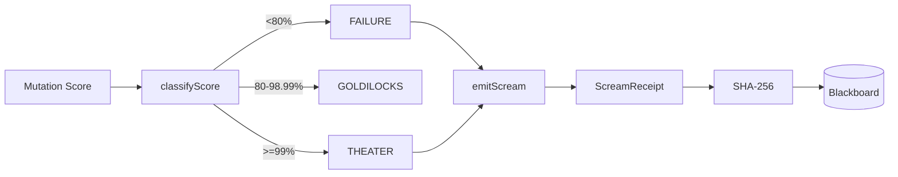
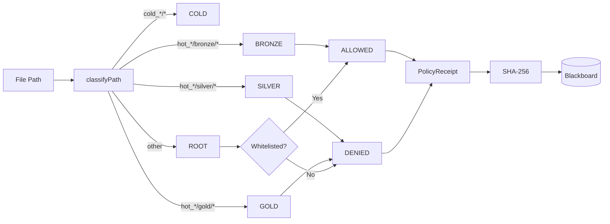

# Design Document: P4/P5 Silver Sprint

## Overview

A 1-hour time-boxed sprint to promote Red Regnant (P4) and Pyre Praetorian (P5) to Silver tier with verifiable receipts.

### Hot/Cold Obsidian Sandbox Structure

```
workspace_root/
├── AGENTS.md                    # Root allowed
├── llms.txt                     # Root allowed
├── obsidianblackboard.jsonl     # Root allowed (stigmergy)
├── ttao-notes-*.md              # Root allowed
├── package.json                 # Root allowed
├── .kiro/                       # Root allowed
│
├── hot_obsidian_sandbox/        # FAST, KINETIC, SPIKES
│   ├── bronze/                  # Experiments, slop, kinetic energy
│   │   └── [PARA structure]
│   ├── silver/                  # Verified implementations (TDD/CDD)
│   │   └── [PARA structure]
│   └── gold/                    # Canonical manifests (WARLOCK only)
│       └── [PARA structure]
│
└── cold_obsidian_sandbox/       # SOLID, ARCHIVES, APPEND-ONLY
    ├── bronze/                  # Stale context, old payloads
    │   └── [PARA structure]
    ├── silver/                  # Frozen verified code
    │   └── [PARA structure]
    └── gold/                    # Immutable canonical truth
        └── [PARA structure]
```

### PARA Structure (Per Medallion)

```
{medallion}/
├── 1_projects/     # Active work with deadlines
├── 2_areas/        # Ongoing responsibilities
├── 3_resources/    # Reference materials
└── 4_archive/      # Completed/inactive items
```

### Current Work Location

**P4 Red Regnant**: `hot_obsidian_sandbox/bronze/P4_RED_REGNANT/`
**P5 Pyre Praetorian**: `hot_obsidian_sandbox/bronze/P5_PYRE_PRAETORIAN/`

**Target (after sprint)**: `hot_obsidian_sandbox/silver/P4_RED_REGNANT/` and `hot_obsidian_sandbox/silver/P5_PYRE_PRAETORIAN/`


## Architecture

### P4 Red Regnant Vertical Slice



### P5 Pyre Praetorian Vertical Slice



## Components and Interfaces

### P4 Red Regnant Core Functions

```typescript
// hot_obsidian_sandbox/bronze/P4_RED_REGNANT/core/score-classifier.ts

import { z } from 'zod';
import { createHash } from 'crypto';

export const ScoreClassification = z.enum(['FAILURE', 'GOLDILOCKS', 'THEATER']);
export type ScoreClassification = z.infer<typeof ScoreClassification>;

export const ScreamReceiptSchema = z.object({
  type: z.literal('SCREAM'),
  port: z.literal(4),
  timestamp: z.number(),
  violationType: z.enum(['MUTATION_FAILURE', 'THEATER']),
  score: z.number(),
  artifact: z.string(),
  receiptHash: z.string().regex(/^sha256:[a-f0-9]{64}$/),
});
export type ScreamReceipt = z.infer<typeof ScreamReceiptSchema>;

/**
 * Classify mutation score into FAILURE, GOLDILOCKS, or THEATER
 * @param score - Mutation score (0-100)
 * @returns Classification
 */
export function classifyScore(score: number): ScoreClassification {
  if (score < 80) return 'FAILURE';
  if (score >= 99) return 'THEATER';
  return 'GOLDILOCKS';
}

/**
 * Create a SCREAM receipt for a violation
 */
export function createScreamReceipt(
  score: number,
  artifact: string
): ScreamReceipt {
  const classification = classifyScore(score);
  if (classification === 'GOLDILOCKS') {
    throw new Error('Cannot create SCREAM for GOLDILOCKS score');
  }
  
  const content = {
    type: 'SCREAM' as const,
    port: 4 as const,
    timestamp: Date.now(),
    violationType: classification === 'FAILURE' ? 'MUTATION_FAILURE' : 'THEATER',
    score,
    artifact,
  };
  
  const hash = createHash('sha256')
    .update(JSON.stringify(content))
    .digest('hex');
  
  return {
    ...content,
    receiptHash: `sha256:${hash}`,
  };
}
```


### P5 Pyre Praetorian Core Functions

```typescript
// hot_obsidian_sandbox/bronze/P5_PYRE_PRAETORIAN/core/path-classifier.ts

import { z } from 'zod';
import { createHash } from 'crypto';

export const Medallion = z.enum(['BRONZE', 'SILVER', 'GOLD', 'ROOT']);
export type Medallion = z.infer<typeof Medallion>;

export const Temperature = z.enum(['HOT', 'COLD']);
export type Temperature = z.infer<typeof Temperature>;

export const PolicyDecision = z.enum(['ALLOWED', 'DENIED']);
export type PolicyDecision = z.infer<typeof PolicyDecision>;

export const PolicyReceiptSchema = z.object({
  type: z.literal('POLICY'),
  port: z.literal(5),
  timestamp: z.number(),
  path: z.string(),
  medallion: Medallion,
  temperature: Temperature.nullable(),
  decision: PolicyDecision,
  reason: z.string(),
  receiptHash: z.string().regex(/^sha256:[a-f0-9]{64}$/),
});
export type PolicyReceipt = z.infer<typeof PolicyReceiptSchema>;

// Root whitelist
const ROOT_WHITELIST = [
  'AGENTS.md',
  'llms.txt',
  'obsidianblackboard.jsonl',
  /^ttao-notes-.*\.md$/,
  'package.json',
  'package-lock.json',
  '.env',
  '.gitignore',
];

const ROOT_DIRS = [
  'hot_obsidian_sandbox',
  'cold_obsidian_sandbox',
  '.kiro',
  '.git',
  'node_modules',
  '.vscode',
  '.husky',
];

/**
 * Classify a path into medallion and temperature
 */
export function classifyPath(path: string): { medallion: Medallion; temperature: Temperature | null } {
  const normalized = path.replace(/\\/g, '/');
  
  // Hot sandbox
  if (normalized.startsWith('hot_obsidian_sandbox/bronze/')) {
    return { medallion: 'BRONZE', temperature: 'HOT' };
  }
  if (normalized.startsWith('hot_obsidian_sandbox/silver/')) {
    return { medallion: 'SILVER', temperature: 'HOT' };
  }
  if (normalized.startsWith('hot_obsidian_sandbox/gold/')) {
    return { medallion: 'GOLD', temperature: 'HOT' };
  }
  
  // Cold sandbox
  if (normalized.startsWith('cold_obsidian_sandbox/bronze/')) {
    return { medallion: 'BRONZE', temperature: 'COLD' };
  }
  if (normalized.startsWith('cold_obsidian_sandbox/silver/')) {
    return { medallion: 'SILVER', temperature: 'COLD' };
  }
  if (normalized.startsWith('cold_obsidian_sandbox/gold/')) {
    return { medallion: 'GOLD', temperature: 'COLD' };
  }
  
  // Root
  return { medallion: 'ROOT', temperature: null };
}

/**
 * Check if a root file is whitelisted
 */
export function isRootWhitelisted(filename: string): boolean {
  // Check directories
  for (const dir of ROOT_DIRS) {
    if (filename.startsWith(dir + '/') || filename === dir) {
      return true;
    }
  }
  
  // Check files
  for (const pattern of ROOT_WHITELIST) {
    if (typeof pattern === 'string') {
      if (filename === pattern) return true;
    } else {
      if (pattern.test(filename)) return true;
    }
  }
  
  return false;
}

/**
 * Evaluate policy for a write operation
 */
export function evaluatePolicy(path: string): { decision: PolicyDecision; reason: string } {
  const { medallion, temperature } = classifyPath(path);
  
  // Bronze is always allowed (kinetic energy zone)
  if (medallion === 'BRONZE') {
    return { decision: 'ALLOWED', reason: 'Bronze tier allows writes' };
  }
  
  // Silver and Gold require approval
  if (medallion === 'SILVER' || medallion === 'GOLD') {
    return { decision: 'DENIED', reason: `${medallion} tier requires WARLOCK_APPROVAL` };
  }
  
  // Root requires whitelist check
  if (medallion === 'ROOT') {
    const filename = path.replace(/\\/g, '/').split('/')[0] || path;
    if (isRootWhitelisted(path)) {
      return { decision: 'ALLOWED', reason: 'Root file is whitelisted' };
    }
    return { decision: 'DENIED', reason: 'Root pollution: file not whitelisted' };
  }
  
  return { decision: 'DENIED', reason: 'Unknown path classification' };
}

/**
 * Create a policy receipt
 */
export function createPolicyReceipt(path: string): PolicyReceipt {
  const { medallion, temperature } = classifyPath(path);
  const { decision, reason } = evaluatePolicy(path);
  
  const content = {
    type: 'POLICY' as const,
    port: 5 as const,
    timestamp: Date.now(),
    path,
    medallion,
    temperature,
    decision,
    reason,
  };
  
  const hash = createHash('sha256')
    .update(JSON.stringify(content))
    .digest('hex');
  
  return {
    ...content,
    receiptHash: `sha256:${hash}`,
  };
}
```


### Receipt Verification

```typescript
// hot_obsidian_sandbox/bronze/contracts/receipt-verification.ts

import { createHash } from 'crypto';
import { z } from 'zod';

export const BaseReceiptSchema = z.object({
  receiptHash: z.string().regex(/^sha256:[a-f0-9]{64}$/),
});

/**
 * Verify any receipt by recomputing its hash
 */
export function verifyReceipt<T extends z.infer<typeof BaseReceiptSchema>>(
  receipt: T
): boolean {
  const { receiptHash, ...content } = receipt;
  const computed = createHash('sha256')
    .update(JSON.stringify(content))
    .digest('hex');
  return `sha256:${computed}` === receiptHash;
}

/**
 * Tamper detection - returns false if receipt was modified
 */
export function detectTampering<T extends z.infer<typeof BaseReceiptSchema>>(
  receipt: T
): { tampered: boolean; expected: string; actual: string } {
  const { receiptHash, ...content } = receipt;
  const computed = `sha256:${createHash('sha256')
    .update(JSON.stringify(content))
    .digest('hex')}`;
  
  return {
    tampered: computed !== receiptHash,
    expected: receiptHash,
    actual: computed,
  };
}
```

## Data Models

### Sprint Status (Blackboard Entry)

```typescript
const SprintStatusSchema = z.object({
  type: z.literal('SPRINT_STATUS'),
  sprintId: z.string(),
  startTime: z.number(),
  endTime: z.number().nullable(),
  deadline: z.number(),
  tasksCompleted: z.array(z.string()),
  tasksRemaining: z.array(z.string()),
  receipts: z.array(z.object({
    task: z.string(),
    receiptHash: z.string(),
    verified: z.boolean(),
  })),
  status: z.enum(['IN_PROGRESS', 'COMPLETED', 'DEADLINE_REACHED', 'FAILED']),
});
```

## Correctness Properties

*A property is a characteristic or behavior that should hold true across all valid executions of a system.*

### Property 1: Score Classification Determinism

*For any* mutation score between 0 and 100, `classifyScore` SHALL return exactly one of FAILURE, GOLDILOCKS, or THEATER, and the same score SHALL always return the same classification.

**Validates: Requirements 1.1, 1.5**

### Property 2: Score Classification Boundaries

*For any* score < 80, classification SHALL be FAILURE.
*For any* score >= 80 AND < 99, classification SHALL be GOLDILOCKS.
*For any* score >= 99, classification SHALL be THEATER.

**Validates: Requirements 1.1**

### Property 3: SCREAM Receipt Integrity

*For any* SCREAM receipt, `verifyReceipt(receipt)` SHALL return true. *For any* tampered receipt (any field modified), `verifyReceipt` SHALL return false.

**Validates: Requirements 1.3, 1.4, 3.1, 3.2, 3.3, 3.4**

### Property 4: Path Classification Determinism

*For any* file path, `classifyPath` SHALL return exactly one medallion (BRONZE, SILVER, GOLD, ROOT) and the same path SHALL always return the same classification.

**Validates: Requirements 2.1, 2.6**

### Property 5: Policy Enforcement Correctness

*For any* path in hot_obsidian_sandbox/bronze/*, decision SHALL be ALLOWED.
*For any* path in hot_obsidian_sandbox/silver/* or gold/*, decision SHALL be DENIED.
*For any* root path not in whitelist, decision SHALL be DENIED.

**Validates: Requirements 2.2, 2.3**

### Property 6: Policy Receipt Integrity

*For any* policy receipt, `verifyReceipt(receipt)` SHALL return true. *For any* tampered receipt, `verifyReceipt` SHALL return false.

**Validates: Requirements 2.4, 2.5, 3.1, 3.2, 3.3, 3.4**


## Error Handling

| Error | Handler | Recovery |
|:------|:--------|:---------|
| Invalid score (NaN, negative, >100) | Throw TypeError | Caller must validate |
| Invalid path (empty, null) | Throw TypeError | Caller must validate |
| Hash computation failure | Throw Error | Log and fail fast |
| Receipt verification failure | Return false | Log tampering attempt |

## Testing Strategy

### Unit Tests

```typescript
// P4 Unit Tests
describe('classifyScore', () => {
  it('returns FAILURE for score < 80', () => {
    expect(classifyScore(79.99)).toBe('FAILURE');
    expect(classifyScore(0)).toBe('FAILURE');
  });
  
  it('returns GOLDILOCKS for 80 <= score < 99', () => {
    expect(classifyScore(80)).toBe('GOLDILOCKS');
    expect(classifyScore(98.99)).toBe('GOLDILOCKS');
  });
  
  it('returns THEATER for score >= 99', () => {
    expect(classifyScore(99)).toBe('THEATER');
    expect(classifyScore(100)).toBe('THEATER');
  });
});

// P5 Unit Tests
describe('classifyPath', () => {
  it('classifies hot bronze paths', () => {
    expect(classifyPath('hot_obsidian_sandbox/bronze/test.ts'))
      .toEqual({ medallion: 'BRONZE', temperature: 'HOT' });
  });
  
  it('classifies hot silver paths', () => {
    expect(classifyPath('hot_obsidian_sandbox/silver/test.ts'))
      .toEqual({ medallion: 'SILVER', temperature: 'HOT' });
  });
  
  it('classifies root paths', () => {
    expect(classifyPath('random-file.txt'))
      .toEqual({ medallion: 'ROOT', temperature: null });
  });
});
```

### Property Tests (fast-check)

```typescript
import * as fc from 'fast-check';

// Feature: p4-p5-silver-sprint, Property 1: Score Classification Determinism
describe('Property 1: Score Classification Determinism', () => {
  it('same score always returns same classification', () => {
    fc.assert(
      fc.property(
        fc.float({ min: 0, max: 100, noNaN: true }),
        (score) => {
          const result1 = classifyScore(score);
          const result2 = classifyScore(score);
          return result1 === result2;
        }
      ),
      { numRuns: 100 }
    );
  });
});

// Feature: p4-p5-silver-sprint, Property 2: Score Classification Boundaries
describe('Property 2: Score Classification Boundaries', () => {
  it('correctly classifies all scores', () => {
    fc.assert(
      fc.property(
        fc.float({ min: 0, max: 100, noNaN: true }),
        (score) => {
          const result = classifyScore(score);
          if (score < 80) return result === 'FAILURE';
          if (score >= 99) return result === 'THEATER';
          return result === 'GOLDILOCKS';
        }
      ),
      { numRuns: 100 }
    );
  });
});

// Feature: p4-p5-silver-sprint, Property 3: SCREAM Receipt Integrity
describe('Property 3: SCREAM Receipt Integrity', () => {
  it('valid receipts verify correctly', () => {
    fc.assert(
      fc.property(
        fc.float({ min: 0, max: 79.99, noNaN: true }),
        fc.string({ minLength: 1 }),
        (score, artifact) => {
          const receipt = createScreamReceipt(score, artifact);
          return verifyReceipt(receipt) === true;
        }
      ),
      { numRuns: 100 }
    );
  });
  
  it('tampered receipts fail verification', () => {
    fc.assert(
      fc.property(
        fc.float({ min: 0, max: 79.99, noNaN: true }),
        fc.string({ minLength: 1 }),
        (score, artifact) => {
          const receipt = createScreamReceipt(score, artifact);
          const tampered = { ...receipt, score: score + 1 };
          return verifyReceipt(tampered) === false;
        }
      ),
      { numRuns: 100 }
    );
  });
});
```

### Mutation Testing

Run via CI (NOT locally - per AGENTS.md):
```bash
# In CI workflow only
npx stryker run stryker.p4.config.mjs
npx stryker run stryker.p5.config.mjs
```

Target: Goldilocks score 80-98.99%

## Implementation Notes

### File Structure

```
hot_obsidian_sandbox/bronze/
├── P4_RED_REGNANT/
│   ├── core/
│   │   └── score-classifier.ts    # classifyScore, createScreamReceipt
│   ├── contracts/
│   │   └── index.ts               # Existing + ScreamReceiptSchema
│   └── __tests__/
│       ├── score-classifier.test.ts
│       └── score-classifier.property.test.ts
│
├── P5_PYRE_PRAETORIAN/
│   ├── core/
│   │   └── path-classifier.ts     # classifyPath, evaluatePolicy, createPolicyReceipt
│   ├── contracts/
│   │   └── index.ts               # Existing + PolicyReceiptSchema
│   └── __tests__/
│       ├── path-classifier.test.ts
│       └── path-classifier.property.test.ts
│
└── contracts/
    └── receipt-verification.ts    # verifyReceipt, detectTampering
```

### Sprint Timeline (1 Hour)

| Minute | Task | Deliverable |
|:-------|:-----|:------------|
| 0-10 | P4 score-classifier.ts | Core function |
| 10-20 | P4 unit tests | score-classifier.test.ts |
| 20-25 | P4 property tests | score-classifier.property.test.ts |
| 25-35 | P5 path-classifier.ts | Core function |
| 35-45 | P5 unit tests | path-classifier.test.ts |
| 45-50 | P5 property tests | path-classifier.property.test.ts |
| 50-55 | Receipt verification | receipt-verification.ts |
| 55-60 | Final verification | Run all tests, log to Blackboard |

### Success Criteria

- [ ] All unit tests pass
- [ ] All property tests pass (100 iterations each)
- [ ] All receipts verify correctly
- [ ] Mutation score in Goldilocks range (80-98.99%) - verified in CI
- [ ] Sprint status logged to Blackboard
