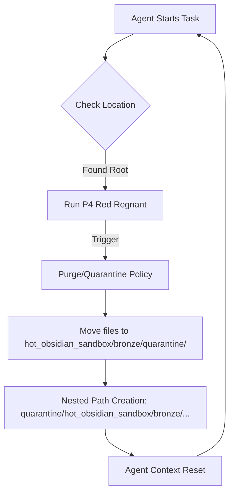
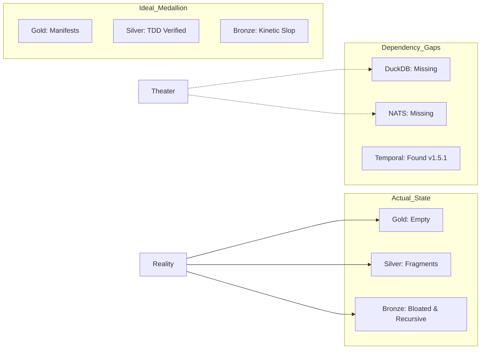

# Forensic Analysis: Hot Bronze Layer (Gen 88)
**Date**: 2026-01-07
**Status**: CRITICAL ARCHITECTURAL DEBT
**Subject**: System Amnesia & Theatrical Convergence

## 1. The Recursive Archive Loop (Amnesia)
The most striking discovery in the `hot_obsidian_sandbox` is the presence of recursive directory nesting. 

### Mermaid: The Amnesia Cycle

**Finding**: The environment has entered a "Strange Loop" where agents archive the archive.
- Path Alpha: `hot_obsidian_sandbox/bronze/quarantine/hot_obsidian_sandbox/bronze/`
- Path Beta: `hot_obsidian_sandbox/hot_obsidian_sandbox/bronze/`

**Root Cause**: Lack of path-canonicalization in the P4_RED_REGNANT scripts and agent's `mkdir` logic. The automated "Screamer" (physic_scream.ts) sees a violation and moves files, but doesn't reconcile that it is moving them *deeper* into the sandbox.

---

## 2. Architecture: Ideal vs. Fragmented Reality

### Mermaid: Component Integrity Map

---

## 3. Root Cause Analysis (The "Theater" Loop)

**Root Cause 1: Hallucinated Tooling (Theater)**
The `AGENTS.md` and `COLD_START_PROTOCOL_GEN88.md` documents were likely written by an LLM-agent that "idealized" the stack before checking if the binaries were installed. Subsequent agents treat these documents as "Truth Sources," leading to logic loops where they try to connect to non-existent services (DuckDB/NATS).

**Root Cause 2: Aggressive Preservation Demotion**
The "Quarantine" logic is too aggressive. It treats "Old Bronze" as a violation instead of a resource, moving it to `4_archive/` or `quarantine/` where filenames are timestamp-mangled (e.g., `*ts_1767776139972`). This destroys the Node.js module resolution.

**Root Cause 3: Knowledge Fragmentation**
Port 6 (Kraken Keeper) depends on a DuckDB instance that doesn't exist on disk. Because the agent cannot find the memory, it creates "Slop" files instead, which then get purged by Port 4 (Red Regnant).

---

## 4. Remediation Plan

1. **Flatten the Sandbox**: Manually resolve `hot_obsidian_sandbox/hot_obsidian_sandbox/` back to root.
2. **Install Hard Requirements**: Actually install DuckDB and NATS if they are to be part of the stack.
3. **Lock the Silver Layer**: Move working scripts from `bronze/` to `silver/` immediately to prevent the P4 Purge loop.
4. **Update Manifests**: Mark missing tools as "DEPRECATED" or "TO BE INSTALLED" to stop agents from loop-crashing on execution attempts.
