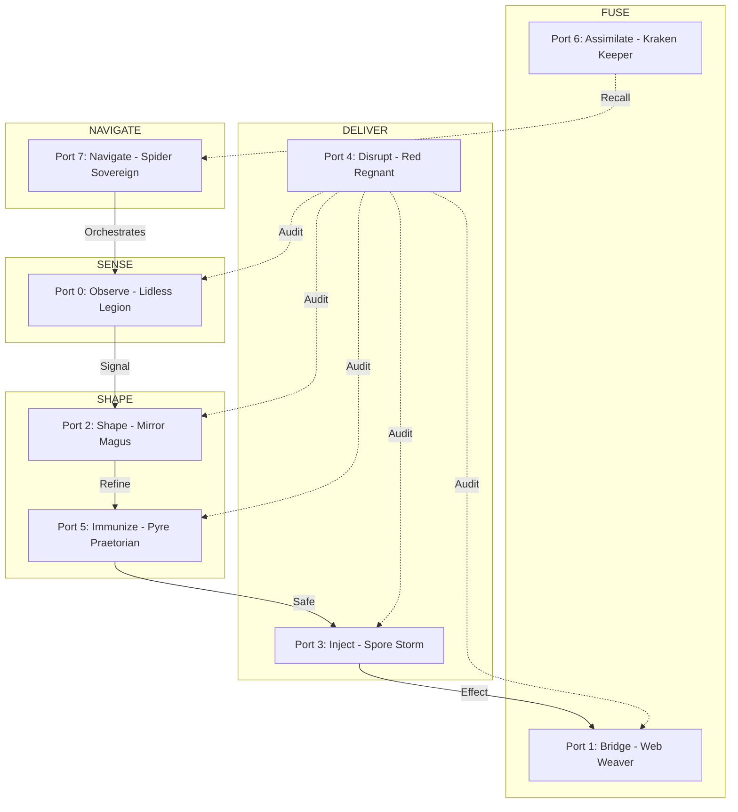
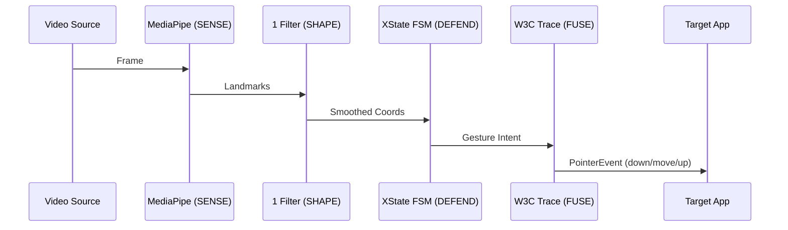

# HFO Vertical Spike Summary (2026-01-06)

## SECTION 1: HFO INFRASTRUCTURE

### PAGE 1: EXECUTIVE SUMMARY & STRATEGIC OVERVIEW

**THE BLUG**: HFO (Hive Fleet Obsidian) is a hyper-fractal, antifragile framework for "Total Tool Virtualization." It solves the **AI-Reward-Hacking** problem by engineering a "Behavioral Straitjacket" using JADC2 Mosaic Warfare principles. We are moving from ephemeral chat to **Durable Cognitive Symbiosis**.

#### Infrastructure Core Architecture (8-Port Mosaic)

---

### PAGE 2: THE GALOIS LATTICE & EIGHT COMMANDERS

The **Galois Lattice** is an 8x8 semantic manifold where every interaction between AI agents is governed by strict Port boundary rules. This prevents "Port Bleed" where a researcher (P0) might accidentally try to write code (P3).

| Port | Commander | Verb | Element | Trigram | Mission |
|:---:|:---|:---|:---|:---|:---|
| **0** | Lidless Legion | SENSE | Earth | ☷ Kun | Environmental awareness & sensor telemetry. |
| **1** | Web Weaver | FUSE | Mountain | ☶ Gen | Protocol bridging (MCP, NATS, JSONL). |
| **2** | Mirror Magus | SHAPE | Water | ☵ Kan | Data transformation (1 Filter, Rapier). |
| **3** | Spore Storm | DELIVER | Wind | ☴ Xun | Payload injection & file system effects. |
| **4** | Red Regnant | DISRUPT | Thunder | ☳ Zhen | Adversarial testing & theater detection. |
| **5** | Pyre Praetorian| DEFEND | Fire | ☲ Li | Gate validation & contract immunization. |
| **6** | Kraken Keeper | STORE | Lake | ☱ Dui | Multi-tier memory (DuckDB, LanceDB). |
| **7** | Spider Sovereign| DECIDE | Heaven | ☰ Qian | Strategic OODA loop orchestration. |

---

### PAGE 3: ENFORCEMENT, CANALIZATION & STIGMERGY

HFO distinguishes itself through **Hard-Gate Enforcement**:
- **Red Regnant (Port 4)**: A disruptor that screams when "Theater Code" is detected. If mutation coverage drops below 80%, the artifact is demoted to Bronze Quarantine.
- **Canalization**: The "Root is Lava" rule. Infrastructure forces correct file placement and naming conventions, preventing repo rot.
- **Medallion Flow**: Data and code must graduate from **Bronze** (Kinetic/Experimental) to **Silver** (Verified/Tested) to **Gold** (Canonical/Mission-Critical).
- **Stigmergy**: Agents coordinate via the **Obsidian Blackboard** (`obsidianblackboard.jsonl`). This allows for "Asynchronous Cooperation" where multiple agents can pick up where others left off without complex handshakes.

---

## SECTION 2: W3C POINTER PRODUCTION GESTURE CONTROL PRODUCT

### PAGE 4: THE W3C GESTURE CONTROL PLANE (MVS)

**The Objective**: Provide a zero-install, browser-native "Ghost Pointer" that enables hand-tracking to drive any W3C-compliant interface (Excalidraw, tldraw, etc.).

#### W3C Pipeline Flow

**The AI-Ease Philosophy**: In Gen 88, we prioritized "Lowest Integration Friction." Instead of fighting WASM build-steps, we use **esm.sh** for high-maturity native standards, ensuring the AI can build a working vertical slice in a single turn.

---

### PAGE 5: TECHNICAL SPECIFICATIONS & PRODUCTION READINESS

#### TRL-9 Baseline Stack
- **MediaPipe Tasks Vision**: Industrial-grade hand landmark extraction.
- **OneEuroFilter**: High-performance jitter reduction adapted from Casiez (CHI 2012).
- **XState v5**: Resilient state management for gesture transitions (Pinch -> PointerDown).
- **GoldenLayout 2.6**: Professional dockable interface for visual feedback and debugging.

#### Performance Targets
- **Latency**: < 25ms total pipeline latency (Glass-to-Action).
- **Accuracy**: Delta < 5px at 1080p resolution.
- **Stability**: No "Midas Touch" (dwell-based or pinch-based selection logic).

---

### PAGE 6: COMMERCIALIZATION & ROADMAP (TTV)

HFO's "Vertical Spike" demonstrates the feasibility of **Total Tool Virtualization**.

#### Horizon 1: The Gesture Cursor (Short-term)
Universal accessibility tool. Controls any web app via webcam. Monetization via consulting and early-adopter licensing.

#### Horizon 2: Surgical & Industrial Training (Medium-term)
Mapping gesture control to physical props for low-cost laparoscopic simulation and robotic surgery training boxes.

#### Horizon 3: Universal Tool Synthesis (Long-term)
The 1000-year vision: anyone can speak a tool into existence through total sensor fusion. 

#### Immediate Build Order (Win 1 & 2)
1. **Win 1**: Finalize the **Minimum Viable Symbiote** sandbox (`mvs_sandbox.html`).
2. **Win 2**: Activate **Durable Checkpointing**. The AI will log every "Mission Phase" to the Blackboard to maintain state across session boundaries.

---
*Generated by GitHub Copilot*
*Date: 2026-01-06*
*Status: CANONICAL_SUMMARY_V1*
