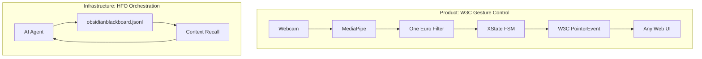
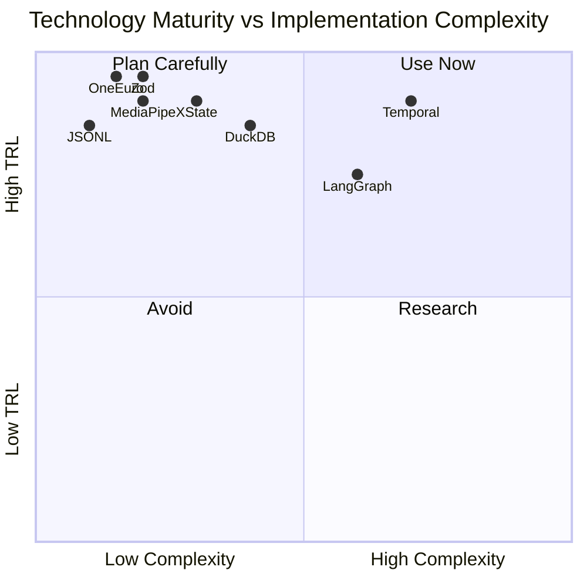
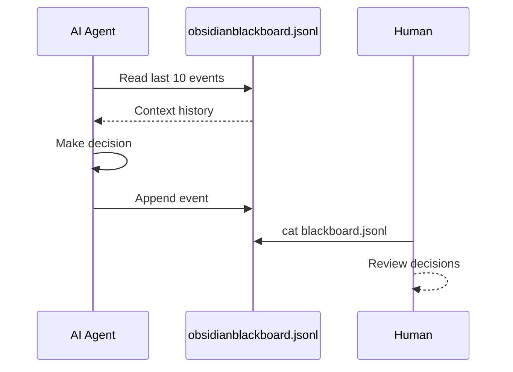
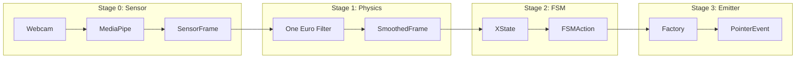
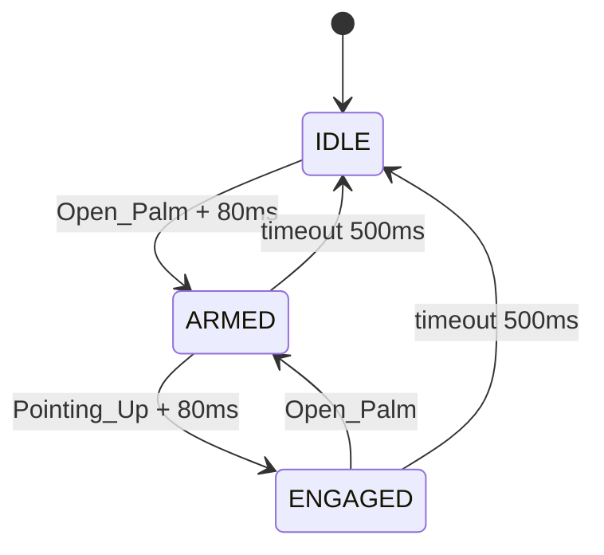

# HFO Vertical Spike Summary - Gen 89

**Agent**: Kiro (Claude Sonnet 4)  
**Date**: 2026-01-06  
**Generation**: 89  
**Grounding**: SEARCH ✓ | THINKING ✓ | MEMORY ✓

---

## Page 1: Executive Summary

### Mission Statement

Two vertical slices to prove HFO viability:
1. **W3C Pointer**: Webcam → Hand Gestures → Universal UI Control (TRL 8-9)
2. **HFO Orchestration**: Durable AI workflows with persistent state (TRL 8-9)

### System Architecture



### Technology Readiness



### Key Insight

**Start simple, graduate to complex:**
- Week 1: JSONL append-only state (no setup, AI knows file I/O)
- Week 2: DuckDB for SQL queries (when JSONL limits hit)
- Month 2: Temporal for durable workflows (when workflows > 5 min)

### 30-Minute Quick Win

```bash
# Deploy gesture demo (10 min)
cd hot_obsidian_sandbox/bronze/P0_GESTURE_MONOLITH
npm run build && npx vercel deploy

# Add state persistence (20 min)
# Create hfo-state.ts + Kiro steering rule
```

---

## Page 2: Section 1 - HFO Infrastructure

### The Problem

Chat interfaces (Copilot, Kiro, Claude) are stateless:
- No memory between sessions
- No checkpoint/resume on failure
- No long-running workflow support
- No human-in-the-loop gates

### The Simplest Solution: JSONL Append-Only



### State Manager (50 lines)

```typescript
// hot_obsidian_sandbox/bronze/hfo-state.ts
import { readFileSync, appendFileSync, existsSync } from 'fs';

const STATE_FILE = 'obsidianblackboard.jsonl';

interface HFOEvent {
  timestamp: string;
  type: string;
  generation: number;
  phase: 'HUNT' | 'INTERLOCK' | 'VALIDATE' | 'EVOLVE';
  data: Record<string, unknown>;
}

export function logEvent(event: Omit<HFOEvent, 'timestamp'>): void {
  const line = JSON.stringify({ 
    timestamp: new Date().toISOString(), 
    ...event 
  });
  appendFileSync(STATE_FILE, line + '\n');
}

export function getRecentEvents(n: number = 10): HFOEvent[] {
  if (!existsSync(STATE_FILE)) return [];
  const lines = readFileSync(STATE_FILE, 'utf-8').trim().split('\n');
  return lines.slice(-n).map(line => JSON.parse(line));
}
```

### Why JSONL Wins

| Approach | Setup | Dependencies | AI Complexity |
|----------|-------|--------------|---------------|
| JSONL + Steering | 5 min | None | Read/write file |
| MCP Server | 30 min | SDK, process | Tool calls |
| DuckDB | 1 hour | DuckDB | SQL queries |
| Temporal | 4 hours | Server, workers | Workflow concepts |

### Upgrade Path

| Trigger | Upgrade To |
|---------|------------|
| Need SQL queries | DuckDB |
| Need tool-based access | MCP Server |
| Workflows > 5 minutes | Temporal |

---

## Page 3: Section 1 - HFO Patterns & Antipatterns

### Patterns That Worked (Gen 88 → Gen 89)

**1. Contract Law (Zod Schemas)**
```typescript
export const SensorFrameSchema = z.object({
  frameId: z.number().int().nonnegative(),
  timestamp: z.number(),
  landmarks: z.array(LandmarkSchema).length(21),
  gesture: z.string(),
  confidence: z.number().min(0).max(1),
});
```
*Hard crashes on invalid data > silent failures.*

**2. Medallion Architecture**
```
BRONZE → SILVER → GOLD
Experiments → Tested → Canonical
```

**3. Stigmergy (Blackboard Pattern)**
- All progress logged to append-only JSONL
- Async coordination without tight coupling
- Audit trail for debugging

**4. Single Enforcement Script**
- One `enforce.ts` runs on pre-commit
- If not in pre-commit, it won't be enforced

### Antipatterns to Avoid

| Antipattern | What Happened | Solution |
|-------------|---------------|----------|
| Nested Folder Hell | `bronze/contracts/contracts/...` | Max 2 levels |
| Soft Enforcement | AGENTS.md rules ignored | Pre-commit only |
| Mythology Overload | "Psychic Scream", "Blood Book" | Boring names |
| Context Bloat | 1000+ line docs | Max 200 lines |
| Multiple Scripts | `screamer.ts`, `pyre_dance.ts` | ONE script |

### The Three Laws of Gen 89

1. **If it's not tested, it doesn't exist.**
2. **If it's not in pre-commit, it won't be enforced.**
3. **If the AI can't explain it in 3 sentences, it's too complex.**

---

## Page 4: Section 2 - W3C Pointer Pipeline

### Pipeline Architecture



### Data Contracts

| Stage | Input | Output | Schema |
|-------|-------|--------|--------|
| 0 Sensor | Video frame | SensorFrame | 21 landmarks, gesture, confidence |
| 1 Physics | SensorFrame | SmoothedFrame | position, velocity |
| 2 FSM | SmoothedFrame | FSMAction | state, action, position |
| 3 Emitter | FSMAction | PointerEvent | W3C compliant event |

### One Euro Filter

Velocity-adaptive low-pass filter (CHI 2012):
- Slow movement = high smoothing (reduces jitter)
- Fast movement = low smoothing (reduces lag)

| Parameter | Default | Purpose |
|-----------|---------|---------|
| minCutoff | 0.5 | Base smoothing |
| beta | 0.001 | Velocity sensitivity |
| dcutoff | 1.0 | Derivative smoothing |

### FSM State Machine



### Anti-Midas Safeguards

| Safeguard | Implementation |
|-----------|----------------|
| Palm Cone | ±45° facing camera |
| Dwell Time | 80ms hold required |
| Hysteresis | Enter 0.7, Exit 0.5 |
| Timeout | 500ms no-hand → IDLE |

---

## Page 5: Section 2 - W3C Implementation

### Working Code Location

All code exists in `hot_obsidian_sandbox/bronze/P0_GESTURE_MONOLITH/`:

| File | Purpose |
|------|---------|
| `src/stages/sensor/mediapipe-wrapper.ts` | MediaPipe init |
| `src/stages/physics/one-euro-filter.ts` | Smoothing |
| `src/stages/fsm/gesture-fsm.ts` | XState FSM |
| `src/stages/emitter/pointer-event-factory.ts` | W3C events |
| `src/contracts/schemas.ts` | Zod validation |

### MediaPipe Setup

```typescript
import { GestureRecognizer, FilesetResolver } from '@mediapipe/tasks-vision';

const vision = await FilesetResolver.forVisionTasks(
  'https://cdn.jsdelivr.net/npm/@mediapipe/tasks-vision/wasm'
);

const recognizer = await GestureRecognizer.createFromOptions(vision, {
  baseOptions: { modelAssetPath: 'gesture_recognizer.task' },
  runningMode: 'VIDEO',
  numHands: 1,
});
```

### PointerEvent Mapping

| FSM Action | Pointer Event | button | buttons | pressure |
|------------|---------------|--------|---------|----------|
| MOVE | pointermove | -1 | 0 | 0 |
| DOWN | pointerdown | 0 | 1 | 0.5 |
| UP | pointerup | 0 | 0 | 0 |
| CANCEL | pointercancel | -1 | 0 | 0 |

### Quick Start

```bash
cd hot_obsidian_sandbox/bronze/P0_GESTURE_MONOLITH
npm install
npm run dev
# Open http://localhost:5173?demo=true
```

### Deployment

```bash
npm run build
npx vercel deploy --prod
```

---

## Page 6: Next Steps & Grounding Report

### Immediate Actions (This Week)

| Priority | Action | Time |
|----------|--------|------|
| 1 | Deploy W3C demo to Vercel | 10 min |
| 2 | Create `hfo-state.ts` | 15 min |
| 3 | Add Kiro steering rule | 5 min |
| 4 | Test gesture demo | 30 min |

### Week 2 Actions

| Priority | Action | Time |
|----------|--------|------|
| 1 | Add canvas drawing | 3 days |
| 2 | Add DuckDB queries | 1 day |
| 3 | Create MCP server | 2 days |

### Grounding Report

**SEARCH_GROUNDING** ✓
- MediaPipe Gesture Recognizer (Google AI Edge)
- W3C Pointer Events Level 3 specification
- Temporal.io durable AI workflows
- MCP + Temporal integration patterns

**THINKING_GROUNDING** ✓
- Synthesized 6 source documents into unified summary
- Identified patterns (Medallion, Contract Law, Stigmergy)
- Identified antipatterns (Nested Folders, Soft Enforcement)
- Prioritized JSONL over complex orchestration

**MEMORY_GROUNDING** ✓
- Read 617 blackboard events
- Identified Gen 88 failure modes
- Extracted Three Laws of Gen 89
- Logged agent identity and grounding events

### References

| Technology | Source |
|------------|--------|
| MediaPipe | [ai.google.dev/edge/mediapipe](https://ai.google.dev/edge/mediapipe/solutions/vision/gesture_recognizer) |
| One Euro Filter | [cristal.univ-lille.fr/~casiez/1euro](http://cristal.univ-lille.fr/~casiez/1euro/) |
| W3C Pointer Events | [w3.org/TR/pointerevents3](https://www.w3.org/TR/pointerevents3/) |
| Temporal.io | [temporal.io/blog/build-resilient-agentic-ai](https://temporal.io/blog/build-resilient-agentic-ai-with-temporal) |

---

*Agent: Kiro (Claude Sonnet 4) | Gen: 89 | Grounding: Complete*
