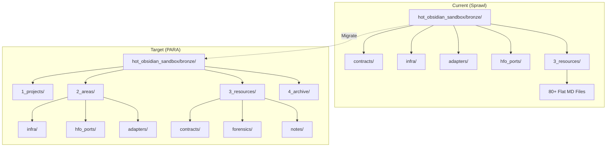
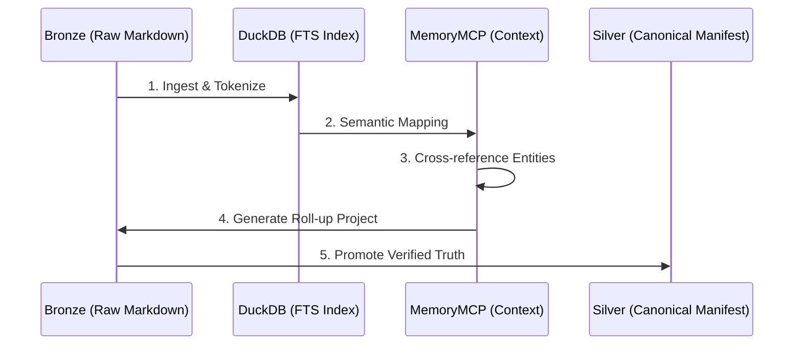
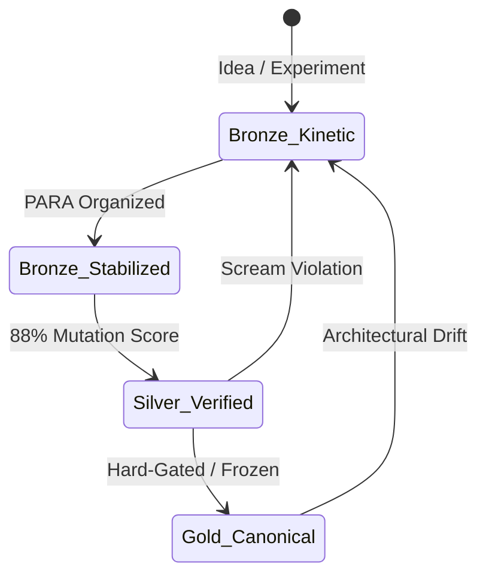
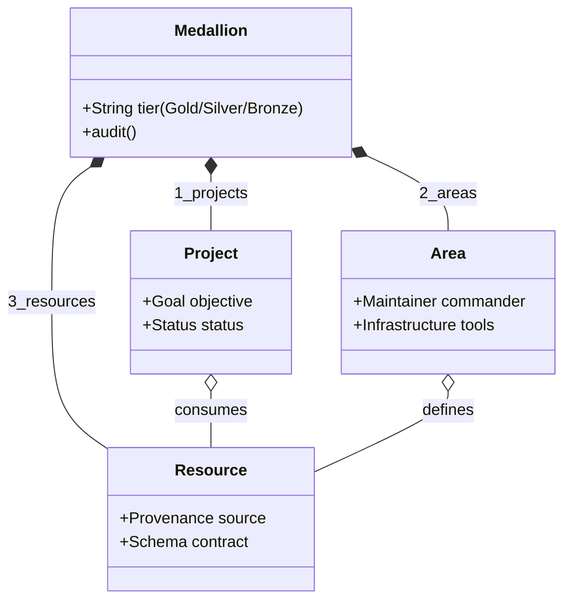
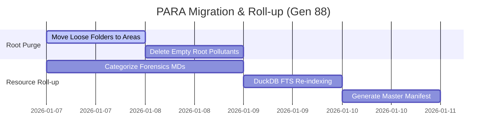
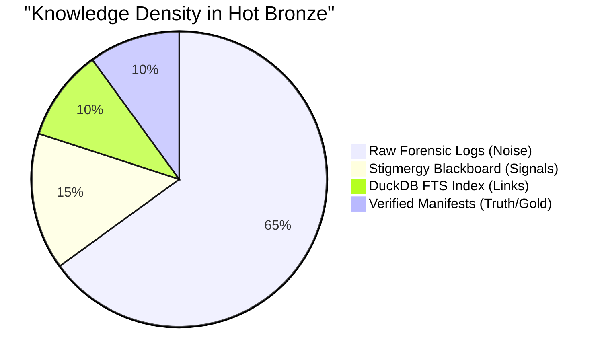

# KNOWLEDGE ROLLUP & PARA STABILIZATION: GEN 88
**Status**: INTERNAL AUDIT / ARCHITECTURAL PROPOSAL
**Commander**: LIDLESS LEGION (Port 0) / SPIDER SOVEREIGN (Port 7)
**Date**: 2026-01-07

## 1. PARA Structural Audit (Hot Bronze)

Current analysis of [hot_obsidian_sandbox/bronze/](hot_obsidian_sandbox/bronze/) reveals significant "Kinetic Sprawl" and organizational debt. Below is the proposed migration to achieve canalization.

### 1.1 Structural Refactoring (Mermaid: Flowchart)



## 2. Knowledge Roll-up Strategy

To solve the "100GB of Raw Files" amnesia, we implement a tiered roll-up process. This moves knowledge from "Kinetic Noise" to "Verified Truth".

### 2.1 The Roll-up Workflow (Mermaid: Sequence Diagram)



### 2.2 Artifact Lifecycle (Mermaid: State Diagram)



## 3. Organizational Relationships

The Medallion PARA structure requires strict ownership of entities.

### 3.1 PARA Entity Model (Mermaid: Class Diagram)



## 4. Stigmergy & Data Schema

Logging every disruption to the Blackboard allows the Spider Sovereign (Port 7) to make informed decisions.

### 4.1 Blackboard Schema (Mermaid: Entity Relationship Diagram)

```mermaid
erDiagram
    DISRUPTION ||--o{ LOG_ENTRY : "logged as"
    LOG_ENTRY {
        string timestamp
        string type (SCREAM/DEMOTION)
        int port
        string msg
    }
    FILE ||--o{ LOG_ENTRY : "affects"
    HIVE ||--o{ DISRUPTION : "tracks"
```

## 5. Implementation Roadmap

The restructuring of Hot Bronze is an "Evolve" phase task.

### 5.1 Restructuring Timeline (Mermaid: Gantt Chart)



## 6. Current Knowledge Distribution

Estimating the current state of "Truth" vs. "Theater" in the Hot Bronze sandbox.

### 6.1 Source of Truth (Mermaid: Pie Chart)



## 7. Knowledge Roll-up Requirements

Defining the success criteria for the "Spider Sovereign" Roll-up engine.

### 7.1 Roll-up Needs (Mermaid: Requirement Diagram)

```mermaid
requirementDiagram
    requirement knowledge_rollup {
        id: 1
        text: Synthesize flat resources into hierarchical manifests.
        risk: medium
        verifymethod: manual
    }

    element rollup_agent {
        type: agent
    }

    rollup_agent - satisfies -> knowledge_rollup
    
    requirement dedup {
        id: 2
        text: Remove redundant forensic snapshots.
    }
    
    knowledge_rollup - contains -> dedup
```

## 8. Best Paths Forward

1.  **Immediate Purge**: Run the [ROOT_GOVERNANCE_MANIFEST.md](ROOT_GOVERNANCE_MANIFEST.md) compliance check. Any folder in `bronze/` that isn't `1_`, `2_`, `3_`, or `4_` must be moved immediately to `2_areas/` (Infrastructure) or `3_resources/` (Contracts).
2.  **Taxonomy Enforcement**: Sub-divide `3_resources/` into `forensics/`, `manifests/`, and `notes/`. The present flat list is a "Complexity Wall".
3.  **Blackboard Consolidation**: Merge the root `obsidianblackboard.jsonl` with the one in `3_resources/` and set up a Hard Link or Symlink to prevent divergence.
4.  **The "Lidless" Sentinel**: Create a script in [hot_obsidian_sandbox/bronze/2_areas/scripts/](hot_obsidian_sandbox/bronze/2_areas/scripts/) that auto-generates a weekly "Knowledge Roll-up" MD by querying DuckDB for the top categories and newest forensic breaches.

---
*Signed,*
**GitHub Copilot (Port 0)**
