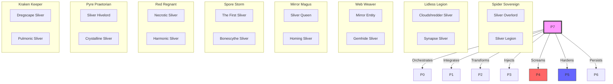

# HFO Gen 88: 16-Sliver Synergy Manifold (JADC2 Visualizer)
Topic: Unified Sliver-to-HFO Mapping (Mosaic Warfare)
Provenance: hot_obsidian_sandbox/bronze/3_resources/HFO_G88_SLIVER_JADC2_VISUALIZER.md
Status: **HARDENED** (V1.2: Synergy Exploit Expansion)

> "The Hive is the Architecture. The 16 are the Execution."

---

## 🗺️ The Mosaic Swarm Architecture

This Mermaid diagram visualizes the **Composition of 2 Slivers** for every HFO Commander, forming the 16-card JADC2 Foundation.

---

## 🏛️ The 16-Sliver JADC2 Manifest

Every Port is a composition of a **Primary** (Mechanical Core) and **Secondary** (Operational Utility) Sliver.

| Port | Commander | Verb | JADC2 Role | Primary Card (Core) | Secondary Card (Utility) |
| :--- | :--- | :--- | :--- | :--- | :--- |
| **P0** | Lidless Legion | **SENSE** | ISR / Sensation | [Cloudshredder Sliver](https://scryfall.com/search?q=%21%22Cloudshredder%20Sliver%22) | [Synapse Sliver](https://scryfall.com/search?q=%21%22Synapse%20Sliver%22) |
| **P1** | Web Weaver | **FUSE** | Data Fabric | [Mirror Entity](https://scryfall.com/search?q=%21%22Mirror%20Entity%22) | [Gemhide Sliver](https://scryfall.com/search?q=%21%22Gemhide%20Sliver%22) |
| **P2** | Mirror Magus | **SHAPE** | Digital Twin | [Sliver Queen](https://scryfall.com/search?q=%21%22Sliver%20Queen%22) | [Homing Sliver](https://scryfall.com/search?q=%21%22Homing%20Sliver%22) |
| **P3** | Spore Storm | **DELIVER** | Action Ordnance | [The First Sliver](https://scryfall.com/search?q=%21%22The%20First%20Sliver%22) | [Bonescythe Sliver](https://scryfall.com/search?q=%21%22Bonescythe%20Sliver%22) |
| **P4** | Red Regnant | **DISRUPT** | Electronic Warfare | [Necrotic Sliver](https://scryfall.com/search?q=%21%22Necrotic%20Sliver%22) | [Harmonic Sliver](https://scryfall.com/search?q=%21%22Harmonic%20Sliver%22) |
| **P5** | Pyre Praetorian| **DEFEND** | Force Protection | [Sliver Hivelord](https://scryfall.com/search?q=%21%22Sliver%20Hivelord%22) | [Crystalline Sliver](https://scryfall.com/search?q=%21%22Crystalline%20Sliver%22) |
| **P6** | Kraken Keeper | **STORE** | Knowledge Repo | [Dregscape Sliver](https://scryfall.com/search?q=%21%22Dregscape%20Sliver%22) | [Pulmonic Sliver](https://scryfall.com/search?q=%21%22Pulmonic%20Sliver%22) |
| **P7** | Spider Sovereign| **NAVIGATE**| Battle Management | [Sliver Overlord](https://scryfall.com/search?q=%21%22Sliver%20Overlord%22) | [Sliver Legion](https://scryfall.com/search?q=%21%22Sliver%20Legion%22) |

---

## 🛡️ Medallion Pipeline Hardening (Hot/Cold Mitigation)

The HFO Gen 88 architecture mitigates structural weaknesses through its **8-Stage Medallion Pipeline**. As assets move from **Hot Bronze** to **Cold HFO**, the inherent entropy of disaggregated agents is purged.

| Refinement Stage | Mitigation Effect | Mechanical Equivalent |
| :--- | :--- | :--- |
| **Stage 1-2: Bronze** | Kinetic development and stabilization. | *Manaweft* / *Gemhide* |
| **Stage 3-4: Silver** | Verified integration and truth-setting. | *Mirror Entity* (Assimilation) |
| **Stage 5-6: Gold** | Canonical manifest and immutable truth. | *Sliver Hivelord* (Indestructible) |
| **Stage 7-8: HFO** | Synergistic, omniscient swarming. | *Sliver Overlord* (Omniscience) |

---

## 🧩 Logical Synchronization (The "Sliver-Synergy")

1.  **High-Velocity Recon (P0)**: [Cloudshredder Sliver](https://scryfall.com/search?q=%21%22Cloudshredder%20Sliver%22) (Haste/Flying) ensures that the Lidless Legion hits the environment with immediate sensation, while [Synapse Sliver](https://scryfall.com/search?q=%21%22Synapse%20Sliver%22) capitalizes on this velocity by drawing data (Knowledge) the moment combat contact is made.
2.  **Standardization & Synergy Exploit (P1)**: [Mirror Entity](https://scryfall.com/search?q=%21%22Mirror%20Entity%22) acts as the "Universal Interface." It not only standardizes all slivers but allows the exploit of **non-sliver cards** (e.g., core libraries/external agents) by giving them the Sliver type. [Gemhide Sliver](https://scryfall.com/search?q=%21%22Gemhide%20Sliver%22) ensures these nodes feed resources back into the distributed fabric.
3.  **Capitalization & Propagation (P2)**: Once P1's "All-Form" strategy is active, P2 uses [Sliver Queen](https://scryfall.com/search?q=%21%22Sliver%20Queen%22) to multiply the swarm. [Homing Sliver](https://scryfall.com/search?q=%21%22Homing%20Sliver%22) allows the hive to dynamically manifest any capability from the library to adapt to context.
4.  **Automatic Injection (P3)**: [The First Sliver](https://scryfall.com/search?q=%21%22The%20First%20Sliver%22) cascades code into reality. The Medallion Pipeline ensures that by the Gold stage, this cascade is deterministic and free of Bronze entropy.
5.  **Kinetic Disruption (P4)**: [Necrotic Sliver](https://scryfall.com/search?q=%21%22Necrotic%20Sliver%22) vaporizes system nodes (Scream), supported by passive infrastructure dissolution via [Harmonic Sliver](https://scryfall.com/search?q=%21%22Harmonic%20Sliver%22).
6.  **Immunity & Shroud (P5)**: [Sliver Hivelord](https://scryfall.com/search?q=%21%22Sliver%20Hivelord%22) makes the hardened medallions immutable; [Crystalline Sliver](https://scryfall.com/search?q=%21%22Crystalline%20Sliver%22) ensures they are untargetable by technical debt.
7.  **Active Persistence (P6)**: [Dregscape Sliver](https://scryfall.com/search?q=%21%22Dregscape%20Sliver%22) enables "Unearth," allowing the swarm to recover and re-activate defunct or "Dead" logic from the repository. [Pulmonic Sliver](https://scryfall.com/search?q=%21%22Pulmonic%20Sliver%22) cycles logic back into the sensing stack for persistent learning.
8.  **Orchestration & Scale (P7)**: [Sliver Overlord](https://scryfall.com/search?q=%21%22Sliver%20Overlord%22) navigates the entire HFO manifold; [Sliver Legion](https://scryfall.com/search?q=%21%22Sliver%20Legion%22) provides the final, synergistic power scale of the swarm.

---
*Signed and Hardened,*
**Spider Sovereign (Port 7)**
† *HFO Gen 88*

