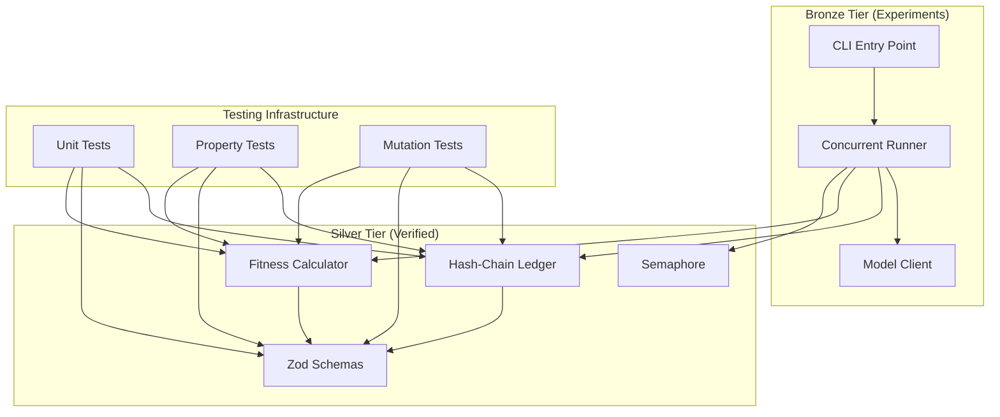
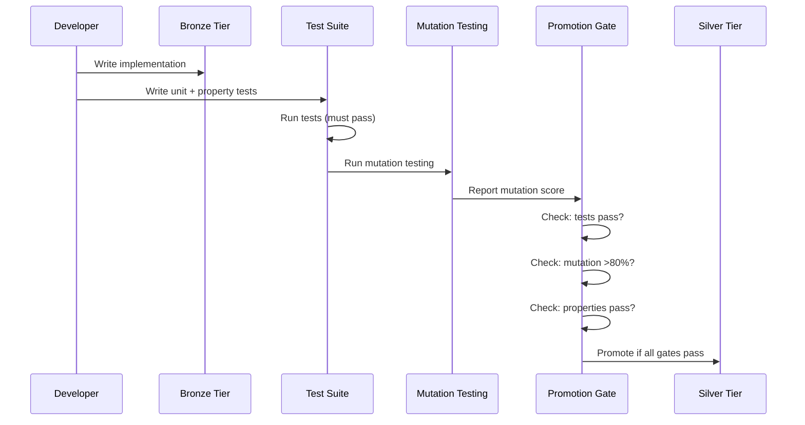

# Design Document: HFO Testing & Silver Promotion

## Overview

This design specifies the testing infrastructure and promotion workflow for extracting MAP-ELITE components from bronze to silver tier. The architecture separates pure functions (testable without mocking) from I/O-dependent code, enabling comprehensive mutation testing and property-based testing.

## Architecture



## Components and Interfaces

### 1. Ledger Module (Silver Candidate)

Pure hash-chain implementation with file I/O abstraction.

```typescript
// Core pure functions (silver)
interface LedgerCore {
  computeHash(data: object, prevHash: string): string;
  verifyChain(entries: LedgerEntry[]): VerifyResult;
}

// I/O wrapper (bronze)
interface LedgerIO {
  append(path: string, entry: HarnessResult): LedgerEntry;
  read(path: string): LedgerEntry[];
}
```

### 2. Schema Module (Silver Candidate)

Zod schemas with validation functions.

```typescript
// Schemas (silver)
const HarnessResultSchema = z.object({
  harness_id: z.number().min(0).max(7),
  harness_name: z.string(),
  model: z.string(),
  scores: z.object({
    raw: z.number(),
    normalized: z.number().min(0).max(1),
  }),
  timestamp: z.string().datetime(),
  duration_ms: z.number().min(0),
  prev_hash: z.string(),
  hash: z.string(),
});

// Validation helpers (silver)
function validateHarnessResult(data: unknown): Result<HarnessResult, ZodError>;
function serializeResult(result: HarnessResult): string;
function parseResult(json: string): Result<HarnessResult, Error>;
```

### 3. Fitness Module (Silver Candidate)

Pure computation with configurable weights.

```typescript
// Pure functions (silver)
interface FitnessCalculator {
  compute(results: HarnessResult[], config?: FitnessConfig): FitnessReport;
  weightedAverage(scores: number[], weights: number[]): number;
}

interface FitnessConfig {
  harness_weights: Record<string, number>;
}
```

### 4. Semaphore Module (Silver Candidate)

Concurrency primitive for rate limiting.

```typescript
// Pure concurrency primitive (silver)
class Semaphore {
  constructor(permits: number);
  acquire(): Promise<void>;
  release(): void;
  available(): number;
}
```

### 5. Model Client (Bronze - Needs Mocking)

Provider abstraction with routing logic.

```typescript
// Provider detection (silver candidate)
function detectProvider(model: string): 'ollama' | 'openrouter';

// API calls (bronze - requires mocking)
interface ModelClient {
  chat(model: string, messages: ChatMessage[]): Promise<ChatResponse>;
}
```

## Data Models

### LedgerEntry

```typescript
interface LedgerEntry {
  harness_id: number;      // 0-7
  harness_name: string;    // SENSE, FUSE, etc.
  model: string;           // e.g., "openai/gpt-4o-mini"
  scores: {
    raw: number;           // Sum of prompt scores
    normalized: number;    // 0-1 range
  };
  timestamp: string;       // ISO 8601
  duration_ms: number;     // Execution time
  prev_hash: string;       // Previous entry hash
  hash: string;            // This entry hash (SHA-256, 16 chars)
}
```

### FitnessReport

```typescript
interface FitnessReport {
  fitness: number;                    // 0-1 weighted average
  harness_scores: Record<string, number>;
  total_duration_ms: number;
  timestamp: string;
}
```

## Correctness Properties

*A property is a characteristic or behavior that should hold true across all valid executions of a system—essentially, a formal statement about what the system should do. Properties serve as the bridge between human-readable specifications and machine-verifiable correctness guarantees.*

### Property 1: Ledger Append-Read Round-Trip

*For any* valid HarnessResult, appending it to a ledger and then reading the ledger back SHALL return an entry containing all original fields plus computed hash fields.

**Validates: Requirements 1.4**

### Property 2: Ledger Hash-Chain Integrity

*For any* sequence of ledger entries, verification SHALL pass if and only if each entry's prev_hash matches the previous entry's hash, and each entry's hash is correctly computed from its data and prev_hash.

**Validates: Requirements 1.1, 1.2, 1.5**

### Property 3: Schema Validation Boundaries

*For any* harness_id outside [0,7], *for any* normalized score outside [0,1], or *for any* malformed timestamp, the Schema SHALL reject the input with a validation error.

**Validates: Requirements 2.1, 2.2, 2.3**

### Property 4: Schema Round-Trip

*For any* valid HarnessResult object, serializing to JSON and parsing back SHALL produce an object that passes schema validation and equals the original.

**Validates: Requirements 2.5**

### Property 5: Fitness Weighted Average Correctness

*For any* set of harness results and *for any* weight configuration, the computed fitness SHALL equal the sum of (score × weight) divided by the sum of weights.

**Validates: Requirements 3.1, 3.2**

### Property 6: Fitness Bounded Output

*For any* set of valid harness results (scores in [0,1]), the computed fitness SHALL be in the range [0,1].

**Validates: Requirements 3.4**

### Property 7: Fitness Idempotence

*For any* set of harness results, computing fitness twice with the same inputs SHALL produce identical results.

**Validates: Requirements 3.5**

### Property 8: Provider Detection Determinism

*For any* model name string, detectProvider SHALL return 'openrouter' if the string contains '/' and 'ollama' otherwise, and this result SHALL be deterministic (same input always produces same output).

**Validates: Requirements 4.1, 4.2, 4.5**

### Property 9: Semaphore Concurrency Limit

*For any* Semaphore with N permits, at no point SHALL more than N concurrent operations hold permits simultaneously.

**Validates: Requirements 5.5**

## Error Handling

| Component | Error Type | Handling |
|-----------|------------|----------|
| Ledger | File not found | Return empty array |
| Ledger | Corrupt entry | Return verification failure with index |
| Schema | Validation failure | Return ZodError with path |
| Fitness | Empty results | Return fitness = 0 |
| Model Client | API error | Propagate with context |
| Semaphore | Over-release | Throw invariant violation |

## Testing Strategy

### Unit Tests

Unit tests verify specific examples and edge cases:

- Empty ledger initialization (genesis hash)
- Single entry append/read
- Schema boundary values (0, 7, 0.0, 1.0)
- Fitness with single result
- Provider detection edge cases ("model" vs "org/model")

### Property-Based Tests

Property tests use fast-check to verify universal properties:

```typescript
// Example: Ledger round-trip
fc.assert(
  fc.property(
    arbitraryHarnessResult(),
    (result) => {
      const entry = appendToLedger(tempPath, result);
      const read = readLedger(tempPath);
      return read[read.length - 1].harness_id === result.harness_id;
    }
  ),
  { numRuns: 100 }
);
```

Configuration:
- Minimum 100 iterations per property
- Shrinking enabled for minimal counterexamples
- Tag format: `Feature: hfo-testing-promotion, Property N: <title>`

### Mutation Testing

Stryker configuration for silver candidates:

```javascript
// stryker.config.mjs
export default {
  mutate: [
    'hot_obsidian_sandbox/silver/ledger/*.ts',
    'hot_obsidian_sandbox/silver/schemas/*.ts',
    'hot_obsidian_sandbox/silver/fitness/*.ts',
  ],
  testRunner: 'vitest',
  thresholds: { high: 80, low: 60, break: 80 },
};
```

Target: >80% mutation score for silver promotion.

### Test File Structure

```
hot_obsidian_sandbox/silver/
├── ledger/
│   ├── ledger-core.ts
│   ├── ledger-core.test.ts      # Unit tests
│   └── ledger-core.property.ts  # Property tests
├── schemas/
│   ├── harness-result.ts
│   ├── harness-result.test.ts
│   └── harness-result.property.ts
├── fitness/
│   ├── compute-fitness.ts
│   ├── compute-fitness.test.ts
│   └── compute-fitness.property.ts
└── concurrency/
    ├── semaphore.ts
    ├── semaphore.test.ts
    └── semaphore.property.ts
```

## Promotion Workflow


