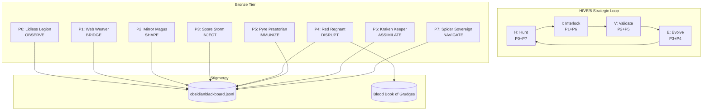
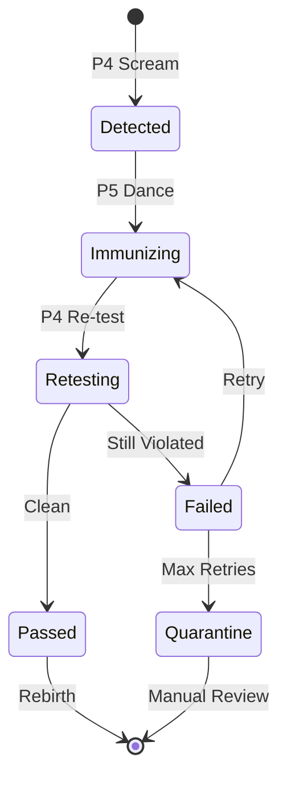

# Design Document: HFO Legendary Commanders Gen 88 Conceptual Incarnation

> Validates: requirements.md
> @provenance: LEGENDARY_COMMANDERS_V9.md, PROMOTION_QUEUE_2026_01_07.md

## Overview

This design document specifies the architecture for **conceptually incarnating** the 8 Legendary Commanders of the HFO Gen 88 system. The goal is to consolidate scattered artifacts into coherent commander folders with standardized structure, rigorous testing, and Silver-tier promotion gating.

The system follows the **Medallion Architecture** (Bronze → Silver → Gold) with hard gates enforced by mutation testing and receipt verification.

### Design Principles

1. **Consolidation over Creation**: Most code already exists; we're organizing it
2. **Test x Test**: The immune system (P4+P5) must be self-referential
3. **Separation of Concerns**: Each commander owns exactly one verb
4. **Stigmergy**: All state changes logged to obsidianblackboard.jsonl
5. **Receipt Verification**: No promotion without cryptographic proof

## Architecture

### High-Level System Diagram



### Galois Lattice (8×8 Semantic Manifold)

```
    0   1   2   3   4   5   6   7
  ┌───┬───┬───┬───┬───┬───┬───┬───┐
0 │P0 │   │   │   │   │   │ P │ H │  Diagonal: Self-Reference
  ├───┼───┼───┼───┼───┼───┼───┼───┤  Anti-Diagonal: HIVE/8
1 │   │P1 │   │   │   │   │ I │ R │  Serpentine: PREY/8
  ├───┼───┼───┼───┼───┼───┼───┼───┤
2 │   │   │P2 │   │ E │ V │   │   │
  ├───┼───┼───┼───┼───┼───┼───┼───┤
3 │   │   │   │P3 │ E │ Y │   │   │
  ├───┼───┼───┼───┼───┼───┼───┼───┤
4 │   │   │ E │ E │P4 │   │   │   │
  ├───┼───┼───┼───┼───┼───┼───┼───┤
5 │   │   │ V │ Y │   │P5 │   │   │
  ├───┼───┼───┼───┼───┼───┼───┼───┤
6 │ P │ I │   │   │   │   │P6 │   │
  ├───┼───┼───┼───┼───┼───┼───┼───┤
7 │ H │ R │   │   │   │   │   │P7 │
  └───┴───┴───┴───┴───┴───┴───┴───┘
```

### Binary Trigram Mapping

| Port | Binary | Trigram | Commander | Verb |
|------|--------|---------|-----------|------|
| 0 | 000 | ☷ Kūn | Lidless Legion | OBSERVE |
| 1 | 001 | ☶ Gèn | Web Weaver | BRIDGE |
| 2 | 010 | ☵ Kǎn | Mirror Magus | SHAPE |
| 3 | 011 | ☴ Xùn | Spore Storm | INJECT |
| 4 | 100 | ☳ Zhèn | Red Regnant | DISRUPT |
| 5 | 101 | ☲ Lí | Pyre Praetorian | IMMUNIZE |
| 6 | 110 | ☱ Duì | Kraken Keeper | ASSIMILATE |
| 7 | 111 | ☰ Qián | Spider Sovereign | NAVIGATE |

## Components and Interfaces

### Standard Commander Folder Structure

Each commander folder follows this structure:

```
P{N}_{COMMANDER_NAME}/
├── P{N}_{COMMANDER_NAME}_LEDGER.md    # Identity, verb, scope, architecture
├── {COMMANDER_NAME}.ts                 # Main implementation
├── {COMMANDER_NAME}.test.ts            # Unit tests
├── {COMMANDER_NAME}.property.ts        # Property-based tests
├── contracts/                          # Zod schemas
│   ├── index.ts                        # Schema exports
│   └── {schema_name}.ts                # Individual schemas
└── [commander-specific folders]        # Additional artifacts
```

### Commander Interface Specifications

#### P0: Lidless Legion (OBSERVE)

```typescript
// contracts/observation.ts
import { z } from 'zod';

export const ObservationSchema = z.object({
  id: z.string().uuid(),
  timestamp: z.number(),
  source: z.enum(['TAVILY', 'PERPLEXITY', 'OSINT', 'TELEMETRY']),
  query: z.string(),
  results: z.array(z.object({
    title: z.string(),
    url: z.string().url(),
    snippet: z.string(),
    relevance: z.number().min(0).max(1),
  })),
  metadata: z.object({
    latency_ms: z.number(),
    result_count: z.number(),
  }),
});

export type Observation = z.infer<typeof ObservationSchema>;

// LIDLESS_LEGION.ts
export interface LidlessLegionAPI {
  observe(query: string): Promise<Observation>;
}
```

#### P1: Web Weaver (BRIDGE)

```typescript
// contracts/vacuole-envelope.ts
import { z } from 'zod';

export const VacuoleEnvelopeSchema = z.object({
  id: z.string().uuid(),
  timestamp: z.number(),
  sourcePort: z.number().min(0).max(7),
  targetPort: z.number().min(0).max(7),
  verb: z.enum(['OBSERVE', 'BRIDGE', 'SHAPE', 'INJECT', 'DISRUPT', 'IMMUNIZE', 'ASSIMILATE', 'NAVIGATE']),
  payload: z.unknown(),
  metadata: z.object({
    ttl: z.number().default(60000),
    priority: z.enum(['low', 'normal', 'high', 'critical']),
    correlationId: z.string().optional(),
  }),
});

export const SilverPromotionReceiptSchema = z.object({
  artifact: z.string(),
  mutationScore: z.number().min(80).max(98.99),
  timestamp: z.string().datetime(),
  hash: z.string().regex(/^sha256:[a-f0-9]{64}$/),
  strykerConfig: z.string(),
});

// WEB_WEAVER.ts
export interface WebWeaverAPI {
  bridge<T>(message: unknown, schema: z.ZodType<T>): Promise<T>;
  fuse<A, B>(schemaA: z.ZodType<A>, schemaB: z.ZodType<B>): z.ZodType<A & B>;
}
```

#### P2: Mirror Magus (SHAPE)

```typescript
// MIRROR_MAGUS.ts
export interface MirrorMagusAPI {
  shape<TSource, TTarget>(
    data: TSource,
    sourceSchema: z.ZodType<TSource>,
    targetSchema: z.ZodType<TTarget>,
    migrationFn: (source: TSource) => TTarget
  ): Promise<TTarget>;
  
  oneEuroFilter(x: number, t: number): number;
}
```

#### P3: Spore Storm (INJECT)

```typescript
// contracts/injection.ts
export const InjectionPayloadSchema = z.object({
  id: z.string().uuid(),
  type: z.enum(['FILE', 'EVENT', 'CASCADE']),
  target: z.string(),
  content: z.unknown(),
  metadata: z.object({
    durable: z.boolean().default(false),
    retries: z.number().default(3),
  }),
});

// SPORE_STORM.ts
export interface SporeStormAPI {
  inject(payload: InjectionPayload): Promise<InjectionResult>;
  deliver(cascade: CascadeSpec): Promise<DeliveryResult[]>;
}
```

#### P4: Red Regnant (DISRUPT)

```typescript
// contracts/violation.ts
export const ViolationSchema = z.object({
  id: z.string().uuid(),
  timestamp: z.number(),
  type: z.enum(['THEATER', 'AMNESIA', 'POLLUTION', 'REWARD_HACK', 'SILENT_FAILURE']),
  artifact: z.string(),
  details: z.string(),
  severity: z.enum(['warning', 'error', 'critical']),
});

// RED_REGNANT.ts
export interface RedRegnantAPI {
  scream(violations: Violation[]): Promise<void>;
  sing(): Promise<PurityReport>;
  detectTheater(artifact: string): Promise<boolean>;
  detectAmnesia(artifact: string): Promise<boolean>;
  detectPollution(): Promise<string[]>;
}
```

#### P5: Pyre Praetorian (IMMUNIZE)

```typescript
// contracts/phoenix.ts
export const PhoenixImmunityCertificateSchema = z.object({
  artifact: z.string(),
  issuedAt: z.string().datetime(),
  expiresAt: z.string().datetime(),
  attackVectorDefended: z.string(),
  hash: z.string(),
});

// PYRE_PRAETORIAN.ts
export interface PyrePraetorianAPI {
  dance(artifact: string, violations: Violation[]): Promise<DanceResult>;
  die(artifact: string): Promise<void>;
  reborn(artifact: string): Promise<PhoenixImmunityCertificate>;
}
```

#### P6: Kraken Keeper (ASSIMILATE)

```typescript
// contracts/archive.ts
export const ArchiveEntrySchema = z.object({
  cellId: z.string(),
  descriptors: z.array(z.number()),
  fitness: z.number(),
  artifact: z.unknown(),
  createdAt: z.string().datetime(),
  updatedAt: z.string().datetime(),
});

// KRAKEN_KEEPER.ts
export interface KrakenKeeperAPI {
  assimilate<T>(data: T, schema: z.ZodType<T>): Promise<void>;
  store(artifact: unknown, descriptors: number[], fitness: number): Promise<boolean>;
  query(cellId: string): Promise<ArchiveEntry | null>;
}
```

#### P7: Spider Sovereign (NAVIGATE)

```typescript
// contracts/decision.ts
export const DecisionSchema = z.object({
  id: z.string().uuid(),
  timestamp: z.number(),
  question: z.string(),
  answer: z.string(),
  confidence: z.number().min(0).max(1),
  method: z.enum(['hybrid_agree', 'weighted_majority', 'critique_confident', 'weighted_default']),
  votes: z.array(z.object({
    model: z.string(),
    answer: z.string(),
    weight: z.number(),
  })),
});

// SPIDER_SOVEREIGN.ts
export interface SpiderSovereignAPI {
  decide(question: string, context: string): Promise<Decision>;
  navigate(workflow: WorkflowSpec): Promise<WorkflowResult>;
  scatter(prompt: string, models: string[]): Promise<ScatterResult[]>;
  gather(results: ScatterResult[]): Promise<GatherResult>;
}
```

## Data Models

### Stigmergy Event Schema

```typescript
export const StigmergyEventSchema = z.object({
  id: z.string().uuid(),
  timestamp: z.number(),
  sourcePort: z.number().min(0).max(7),
  eventType: z.enum([
    'OBSERVATION', 'BRIDGE', 'TRANSFORM', 'INJECTION',
    'VIOLATION', 'IMMUNIZATION', 'ASSIMILATION', 'DECISION',
    'PROMOTION', 'DEMOTION', 'REBIRTH'
  ]),
  payload: z.unknown(),
  correlationId: z.string().optional(),
});
```

### Blood Book Entry Schema

```typescript
export const BloodBookEntrySchema = z.object({
  id: z.string().uuid(),
  timestamp: z.number(),
  violationType: z.enum(['THEATER', 'AMNESIA', 'POLLUTION', 'REWARD_HACK', 'SILENT_FAILURE']),
  artifact: z.string(),
  details: z.string(),
  attackVector: z.string(),
  resolved: z.boolean().default(false),
  resolvedAt: z.string().datetime().optional(),
  resolvedBy: z.enum(['P5_PYRE_PRAETORIAN', 'MANUAL']).optional(),
});
```

### Silver Promotion Receipt Schema

```typescript
export const SilverPromotionReceiptSchema = z.object({
  artifact: z.string(),
  mutationScore: z.number().min(80).max(98.99),
  timestamp: z.string().datetime(),
  hash: z.string().regex(/^sha256:[a-f0-9]{64}$/),
  strykerConfig: z.string(),
  propertyTestsPassed: z.boolean(),
  zodContractsPresent: z.boolean(),
  provenanceHeadersPresent: z.boolean(),
});
```


## Correctness Properties

*A property is a characteristic or behavior that should hold true across all valid executions of a system—essentially, a formal statement about what the system should do. Properties serve as the bridge between human-readable specifications and machine-verifiable correctness guarantees.*

### Property 1: Commander Folder Structure Completeness

*For any* commander port N (0-7), the folder `P{N}_{COMMANDER_NAME}/` SHALL contain:
- A ledger file `P{N}_{COMMANDER_NAME}_LEDGER.md`
- A main implementation file `{COMMANDER_NAME}.ts`
- A unit test file `{COMMANDER_NAME}.test.ts`
- A property test file `{COMMANDER_NAME}.property.ts`
- A `contracts/` subfolder with at least one Zod schema

**Validates: Requirements 1.1, 1.2, 1.3, 1.4, 1.5, 1.6**

### Property 2: Observation Logging Invariant

*For any* observation produced by the Lidless Legion (P0), the observation SHALL be logged to `obsidianblackboard.jsonl` with a valid `StigmergyEventSchema` entry.

**Validates: Requirements 2.4**

### Property 3: Separation of Concerns (P0)

*For any* call to `observe()` on the Lidless Legion, the function SHALL NOT:
- Call any `shape()` function (P2's verb)
- Call any `store()` or `assimilate()` function (P6's verb)
- Call any `decide()` or `navigate()` function (P7's verb)

**Validates: Requirements 2.5, 2.6, 2.7**

### Property 4: Message Bridging Validation

*For any* message bridged by the Web Weaver (P1), the message SHALL be validated against the provided Zod schema before being returned.

**Validates: Requirements 3.6**

### Property 5: Schema Transformation Round-Trip

*For any* valid data transformed by the Mirror Magus (P2), if the transformation is invertible, then `shape(shape(data, A, B, f), B, A, f_inverse)` SHALL produce data equivalent to the original.

**Validates: Requirements 4.2, 4.5**

### Property 6: One Euro Filter Smoothing

*For any* sequence of sensor readings passed through the One Euro Filter, the output sequence SHALL have lower variance than the input sequence (noise reduction property).

**Validates: Requirements 4.3**

### Property 7: Injection Logging Invariant

*For any* payload injected by the Spore Storm (P3), the injection SHALL be logged to `obsidianblackboard.jsonl` with a valid `StigmergyEventSchema` entry.

**Validates: Requirements 5.5**

### Property 8: Anti-Pattern Detection (P4)

*For any* artifact analyzed by the Red Regnant (P4):
- If mutation score is exactly 100%, `detectTheater()` SHALL return true
- If artifact contains `console.log` in a strict zone, `detectAmnesia()` SHALL return true
- If unauthorized files exist in root, `detectPollution()` SHALL return a non-empty array

**Validates: Requirements 6.6, 6.7, 6.8**

### Property 9: Violation Logging Invariant

*For any* violation detected by the Red Regnant (P4), the violation SHALL be logged to both:
- The Blood Book of Grudges (`BLOOD_BOOK_OF_GRUDGES.jsonl`)
- The stigmergy blackboard (`obsidianblackboard.jsonl`)

**Validates: Requirements 6.9**

### Property 10: Mutation Score Bounds

*For any* artifact submitted for Silver promotion:
- If mutation score < 80%, promotion SHALL be rejected
- If mutation score > 98.99%, promotion SHALL be rejected (Theater flag)
- If 80% ≤ mutation score ≤ 98.99%, promotion MAY proceed (other checks apply)

**Validates: Requirements 10.1, 10.6, 10.7**

### Property 11: Pyre Dance Termination

*For any* artifact undergoing the Pyre Dance protocol, the dance SHALL terminate when:
- The artifact passes all checks (rebirth), OR
- The artifact is moved to quarantine (death)

The dance SHALL NOT run indefinitely.

**Validates: Requirements 11.5**

### Property 12: Pyre Dance Response Chain

*For any* scream emitted by the Red Regnant (P4), the Pyre Praetorian (P5) SHALL respond with an immunization attempt within the same workflow execution.

**Validates: Requirements 11.1**

### Property 13: Workflow Pairing Correctness

*For any* HIVE/8 workflow execution:
- Phase H SHALL use ports 0+7 (anti-diagonal: 000 ⊕ 111 = 111)
- Phase I SHALL use ports 1+6 (anti-diagonal: 001 ⊕ 110 = 111)
- Phase V SHALL use ports 2+5 (anti-diagonal: 010 ⊕ 101 = 111)
- Phase E SHALL use ports 3+4 (anti-diagonal: 011 ⊕ 100 = 111)

*For any* PREY/8 workflow execution:
- Phase P SHALL use ports 0+6 (serpentine)
- Phase R SHALL use ports 1+7 (serpentine)
- Phase E SHALL use ports 2+4 (serpentine)
- Phase Y SHALL use ports 3+5 (serpentine)

**Validates: Requirements 12.3, 12.4**

### Property 14: Verb Enforcement

*For any* commander P{N}, if the commander attempts to invoke a verb belonging to another commander, the Red Regnant (P4) SHALL emit a scream.

**Validates: Requirements 12.1, 12.5**

### Property 15: Hybrid Consensus Correctness

*For any* gather operation by the Spider Sovereign (P7):
- Weighted voting SHALL be computed first as ground truth
- If critique agrees with weighted majority → method = 'hybrid_agree'
- If ≥50% weighted agreement → method = 'weighted_majority'
- If low agreement + high critique confidence → method = 'critique_confident'
- Otherwise → method = 'weighted_default'

**Validates: Requirements 9.5, 9.7**

### Property 16: Decision Logging Invariant

*For any* decision made by the Spider Sovereign (P7), the decision SHALL be logged to `obsidianblackboard.jsonl` with a valid `DecisionSchema` entry including the consensus method used.

**Validates: Requirements 9.6, 9.7**

### Property 17: Receipt Hash Integrity

*For any* Silver promotion receipt, the `hash` field SHALL be a valid SHA-256 hash of the artifact content, verifiable by recomputing the hash.

**Validates: Requirements 10.2, 10.8**

### Property 18: MAP-ELITE Archive Invariant

*For any* cell in the MAP-ELITE archive (P6), the stored artifact SHALL have the highest fitness among all artifacts that have been submitted to that cell.

**Validates: Requirements 8.4**

## Error Handling

### Violation Types and Responses

| Violation Type | Detection (P4) | Response (P5) |
|----------------|----------------|---------------|
| THEATER | 100% mutation score, assertionless tests | Demote to Bronze, require real tests |
| AMNESIA | Debug logs in strict zones | Remove logs, re-test |
| POLLUTION | Unauthorized files in root | Move to appropriate folder or delete |
| REWARD_HACK | Suspicious patterns in test code | Manual review required |
| SILENT_FAILURE | Tests pass but behavior incorrect | Add property tests |

### Error Recovery Flow



### Quarantine Protocol

1. Artifact moved to `hot_obsidian_sandbox/bronze/quarantine/`
2. Entry added to Blood Book of Grudges
3. Stigmergy event logged with `eventType: 'DEMOTION'`
4. Manual review required before re-entry

## Testing Strategy

### Dual Testing Approach

This system uses both unit tests and property-based tests:

- **Unit tests**: Verify specific examples, edge cases, and error conditions
- **Property tests**: Verify universal properties across all inputs using fast-check

### Property-Based Testing Configuration

- **Library**: fast-check (already installed in P7_SPIDER_SOVEREIGN)
- **Minimum iterations**: 100 per property test
- **Tag format**: `Feature: legendary-commanders-gen88, Property {N}: {property_text}`

### Test File Organization

Each commander has three test files:

1. `{COMMANDER_NAME}.test.ts` - Unit tests for specific examples
2. `{COMMANDER_NAME}.property.ts` - Property-based tests for universal properties
3. Integration tests in `hot_obsidian_sandbox/bronze/integration/`

### Mutation Testing Configuration

- **Tool**: Stryker Mutator
- **Config**: `stryker.p{N}.config.mjs` per commander
- **Target**: 80-98.99% mutation score (Silver Standard)
- **Output**: JSON receipt for promotion verification

### Test Priority Order

1. **P4 + P5** (Immune System): Must be tested first as they test everything else
2. **P7** (Spider Sovereign): Already has tests, needs property tests
3. **P1** (Web Weaver): Contracts are foundational
4. **P6** (Kraken Keeper): Storage is needed for MAP-ELITE
5. **P0, P2, P3**: Remaining commanders

### Example Property Test

```typescript
// RED_REGNANT.property.ts
import { describe, it, expect } from 'vitest';
import * as fc from 'fast-check';
import { detectTheater, detectAmnesia, detectPollution } from './RED_REGNANT';

describe('Feature: legendary-commanders-gen88, Property 8: Anti-Pattern Detection', () => {
  it('detects theater when mutation score is 100%', () => {
    fc.assert(
      fc.property(
        fc.record({
          artifact: fc.string({ minLength: 1 }),
          mutationScore: fc.constant(100),
        }),
        ({ artifact, mutationScore }) => {
          const result = detectTheater(artifact, mutationScore);
          expect(result).toBe(true);
        }
      ),
      { numRuns: 100 }
    );
  });
});
```

---

## Implementation Notes

### Existing Artifacts to Consolidate

| Commander | Existing Location | Status |
|-----------|-------------------|--------|
| P0 Lidless Legion | `P0_GESTURE_MONOLITH/` | Needs consolidation |
| P1 Web Weaver | `contracts/` | Needs folder structure |
| P2 Mirror Magus | Scattered | Needs consolidation |
| P3 Spore Storm | Draft ledger only | Needs implementation |
| P4 Red Regnant | `P4_RED_REGNANT/` | **Active**, needs tests |
| P5 Pyre Praetorian | `P5_PYRE_PRAETORIAN/` | **Active**, needs tests |
| P6 Kraken Keeper | DuckDB code scattered | Needs consolidation |
| P7 Spider Sovereign | `P7_SPIDER_SOVEREIGN/` | **Active**, needs property tests |

### Technology Stack

- **Runtime**: Node.js + TypeScript
- **Testing**: Vitest + fast-check + Stryker
- **Schemas**: Zod
- **Storage**: DuckDB (P6), JSONL (stigmergy)
- **Messaging**: NATS JetStream (future)
- **Orchestration**: Temporal.io (future)
