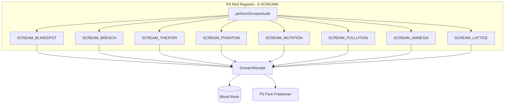

# Design Document: P4 Red Regnant 8 SCREAM Upgrade

## Overview

Refactoring P4 Red Regnant from a monolithic violation detector to a modular 8 SCREAM architecture. Each SCREAM type maps to one of the 8 Legendary Commanders and produces cryptographic receipts.

## Architecture

### The 8 SCREAM Types



### Commander Alignment

| Port | Commander | SCREAM | Verb | Detection Focus |
|:-----|:----------|:-------|:-----|:----------------|
| 0 | Lidless Legion | BLINDSPOT | SENSE | Silent failures, missing observations |
| 1 | Web Weaver | BREACH | FUSE | Contract violations, type safety |
| 2 | Mirror Magus | THEATER | SHAPE | Fake tests, mock poisoning |
| 3 | Spore Storm | PHANTOM | DELIVER | External deps, supply chain |
| 4 | Red Regnant | MUTATION | DISRUPT | Mutation score violations |
| 5 | Pyre Praetorian | POLLUTION | IMMUNIZE | Root pollution, medallion violations |
| 6 | Kraken Keeper | AMNESIA | STORE | Debug logs, technical debt |
| 7 | Spider Sovereign | LATTICE | DECIDE | Governance, BDD alignment |

## Components and Interfaces

### Unified SCREAM Receipt Schema

```typescript
// hot_obsidian_sandbox/bronze/2_areas/hfo_ports/P4_RED_REGNANT/contracts/screams.ts

import { z } from 'zod';
import { createHash } from 'crypto';

export const ScreamType = z.enum([
  'SCREAM_BLINDSPOT',  // Port 0 - SENSE
  'SCREAM_BREACH',     // Port 1 - FUSE
  'SCREAM_THEATER',    // Port 2 - SHAPE
  'SCREAM_PHANTOM',    // Port 3 - DELIVER
  'SCREAM_MUTATION',   // Port 4 - DISRUPT
  'SCREAM_POLLUTION',  // Port 5 - IMMUNIZE
  'SCREAM_AMNESIA',    // Port 6 - STORE
  'SCREAM_LATTICE',    // Port 7 - DECIDE
]);
export type ScreamType = z.infer<typeof ScreamType>;

export const ScreamSeverity = z.enum(['warning', 'error', 'critical']);
export type ScreamSeverity = z.infer<typeof ScreamSeverity>;

export const ScreamReceiptSchema = z.object({
  type: ScreamType,
  port: z.number().min(0).max(7),
  timestamp: z.number(),
  file: z.string(),
  details: z.record(z.unknown()),
  severity: ScreamSeverity,
  receiptHash: z.string().regex(/^sha256:[a-f0-9]{64}$/),
});
export type ScreamReceipt = z.infer<typeof ScreamReceiptSchema>;

/**
 * Create a SCREAM receipt with cryptographic hash
 */
export function createScreamReceipt(
  type: ScreamType,
  port: number,
  file: string,
  details: Record<string, unknown>,
  severity: ScreamSeverity = 'error'
): ScreamReceipt {
  const content = {
    type,
    port,
    timestamp: Date.now(),
    file,
    details,
    severity,
  };
  
  const hash = createHash('sha256')
    .update(JSON.stringify(content))
    .digest('hex');
  
  return {
    ...content,
    receiptHash: `sha256:${hash}`,
  };
}

/**
 * Verify a SCREAM receipt's integrity
 */
export function verifyScreamReceipt(receipt: ScreamReceipt): boolean {
  const { receiptHash, ...content } = receipt;
  const computed = createHash('sha256')
    .update(JSON.stringify(content))
    .digest('hex');
  return `sha256:${computed}` === receiptHash;
}
```

### Detector Interface

```typescript
// hot_obsidian_sandbox/bronze/2_areas/hfo_ports/P4_RED_REGNANT/contracts/detector.ts

import { ScreamReceipt, ScreamType } from './screams.js';

export interface DetectorConfig {
  enabled: boolean;
  severity: 'warning' | 'error' | 'critical';
  patterns?: RegExp[];
  whitelist?: string[];
}

export interface DetectorResult {
  screamType: ScreamType;
  receipts: ScreamReceipt[];
  filesScanned: number;
  violationsFound: number;
}

export interface Detector {
  readonly name: string;
  readonly port: number;
  readonly screamType: ScreamType;
  
  detect(targetPath: string, config?: DetectorConfig): Promise<DetectorResult>;
}
```

### Individual Detector Implementations

#### SCREAM_BLINDSPOT Detector (Port 0)

```typescript
// hot_obsidian_sandbox/bronze/2_areas/hfo_ports/P4_RED_REGNANT/detectors/blindspot.ts

import { Detector, DetectorResult, DetectorConfig } from '../contracts/detector.js';
import { createScreamReceipt, ScreamReceipt } from '../contracts/screams.js';
import * as fs from 'node:fs';
import * as path from 'node:path';

const BLINDSPOT_PATTERNS = [
  /catch\s*\(?.*\)?\s*\{\s*\}/g,           // Empty catch blocks
  /\.then\(\s*\(\)\s*=>\s*\{\s*\}\s*\)/g,  // Empty then handlers
  /\/\/\s*@ignore-error/i,                  // Explicit error ignoring
];

export class BlindspotDetector implements Detector {
  readonly name = 'SCREAM_BLINDSPOT';
  readonly port = 0;
  readonly screamType = 'SCREAM_BLINDSPOT' as const;
  
  async detect(targetPath: string, config?: DetectorConfig): Promise<DetectorResult> {
    const receipts: ScreamReceipt[] = [];
    let filesScanned = 0;
    
    const walk = (dir: string) => {
      const entries = fs.readdirSync(dir, { withFileTypes: true });
      for (const entry of entries) {
        if (entry.name === 'node_modules' || entry.name === '.git') continue;
        
        const fullPath = path.join(dir, entry.name);
        if (entry.isDirectory()) {
          walk(fullPath);
        } else if (entry.name.endsWith('.ts') || entry.name.endsWith('.js')) {
          filesScanned++;
          const content = fs.readFileSync(fullPath, 'utf8');
          
          for (const pattern of BLINDSPOT_PATTERNS) {
            const matches = content.match(pattern);
            if (matches) {
              receipts.push(createScreamReceipt(
                'SCREAM_BLINDSPOT',
                0,
                fullPath,
                { pattern: pattern.source, matches: matches.length },
                config?.severity || 'error'
              ));
            }
          }
        }
      }
    };
    
    if (fs.existsSync(targetPath)) {
      walk(targetPath);
    }
    
    return {
      screamType: 'SCREAM_BLINDSPOT',
      receipts,
      filesScanned,
      violationsFound: receipts.length,
    };
  }
}
```

#### SCREAM_THEATER Detector (Port 2)

```typescript
// hot_obsidian_sandbox/bronze/2_areas/hfo_ports/P4_RED_REGNANT/detectors/theater.ts

import { Detector, DetectorResult, DetectorConfig } from '../contracts/detector.js';
import { createScreamReceipt, ScreamReceipt } from '../contracts/screams.js';
import * as fs from 'node:fs';
import * as path from 'node:path';

const THEATER_PATTERNS = [
  /throw new Error\(["']Not implemented["']\)/i,
  /\/\/\s*Logic goes here/i,
  /\/\/\s*TODO:?\s*implement/i,
  /return\s+(null|undefined|false|0|\{\});\s*\/\/\s*stub/i,
  /implementation\s+below.*\.\.\./is,
];

export class TheaterDetector implements Detector {
  readonly name = 'SCREAM_THEATER';
  readonly port = 2;
  readonly screamType = 'SCREAM_THEATER' as const;
  
  async detect(targetPath: string, config?: DetectorConfig): Promise<DetectorResult> {
    const receipts: ScreamReceipt[] = [];
    let filesScanned = 0;
    
    const walk = (dir: string) => {
      const entries = fs.readdirSync(dir, { withFileTypes: true });
      for (const entry of entries) {
        if (entry.name === 'node_modules' || entry.name === '.git') continue;
        
        const fullPath = path.join(dir, entry.name);
        if (entry.isDirectory()) {
          walk(fullPath);
        } else if (entry.name.endsWith('.ts') || entry.name.endsWith('.js')) {
          filesScanned++;
          const content = fs.readFileSync(fullPath, 'utf8');
          const isTestFile = entry.name.includes('.test.') || entry.name.includes('.spec.');
          
          // Check for placeholder patterns
          for (const pattern of THEATER_PATTERNS) {
            if (pattern.test(content)) {
              receipts.push(createScreamReceipt(
                'SCREAM_THEATER',
                2,
                fullPath,
                { theaterType: 'PLACEHOLDER', pattern: pattern.source },
                'error'
              ));
            }
          }
          
          // Check for assertionless tests
          if (isTestFile && !content.includes('expect(') && !content.includes('assert.')) {
            receipts.push(createScreamReceipt(
              'SCREAM_THEATER',
              2,
              fullPath,
              { theaterType: 'ASSERTIONLESS_TEST' },
              'critical'
            ));
          }
          
          // Check for mock overuse
          if (isTestFile) {
            const mockCount = (content.match(/vi\.mock|vi\.fn|jest\.mock|jest\.fn/g) || []).length;
            if (mockCount > 5) {
              receipts.push(createScreamReceipt(
                'SCREAM_THEATER',
                2,
                fullPath,
                { theaterType: 'MOCK_POISONING', mockCount },
                'warning'
              ));
            }
          }
        }
      }
    };
    
    if (fs.existsSync(targetPath)) {
      walk(targetPath);
    }
    
    return {
      screamType: 'SCREAM_THEATER',
      receipts,
      filesScanned,
      violationsFound: receipts.length,
    };
  }
}
```

### SCREAM Aggregator

```typescript
// hot_obsidian_sandbox/bronze/2_areas/hfo_ports/P4_RED_REGNANT/core/scream-aggregator.ts

import { Detector, DetectorResult } from '../contracts/detector.js';
import { ScreamReceipt, verifyScreamReceipt } from '../contracts/screams.js';
import { BlindspotDetector } from '../detectors/blindspot.js';
import { BreachDetector } from '../detectors/breach.js';
import { TheaterDetector } from '../detectors/theater.js';
import { PhantomDetector } from '../detectors/phantom.js';
import { MutationDetector } from '../detectors/mutation.js';
import { PollutionDetector } from '../detectors/pollution.js';
import { AmnesiaDetector } from '../detectors/amnesia.js';
import { LatticeDetector } from '../detectors/lattice.js';
import * as fs from 'node:fs';

export interface AuditResult {
  success: boolean;
  totalViolations: number;
  totalFilesScanned: number;
  results: DetectorResult[];
  receipts: ScreamReceipt[];
}

export class ScreamAggregator {
  private detectors: Detector[] = [
    new BlindspotDetector(),
    new BreachDetector(),
    new TheaterDetector(),
    new PhantomDetector(),
    new MutationDetector(),
    new PollutionDetector(),
    new AmnesiaDetector(),
    new LatticeDetector(),
  ];
  
  async performScreamAudit(targetPath: string, bloodBookPath: string): Promise<AuditResult> {
    const results: DetectorResult[] = [];
    const allReceipts: ScreamReceipt[] = [];
    let totalFilesScanned = 0;
    
    for (const detector of this.detectors) {
      const result = await detector.detect(targetPath);
      results.push(result);
      allReceipts.push(...result.receipts);
      totalFilesScanned += result.filesScanned;
    }
    
    // Log to Blood Book
    for (const receipt of allReceipts) {
      fs.appendFileSync(bloodBookPath, JSON.stringify(receipt) + '\n');
    }
    
    return {
      success: allReceipts.length === 0,
      totalViolations: allReceipts.length,
      totalFilesScanned,
      results,
      receipts: allReceipts,
    };
  }
  
  verifyAllReceipts(receipts: ScreamReceipt[]): boolean {
    return receipts.every(r => verifyScreamReceipt(r));
  }
}
```

## Data Models

### Blood Book Entry (Enhanced)

```typescript
const BloodBookEntrySchema = z.object({
  id: z.string().uuid(),
  timestamp: z.number(),
  screamType: ScreamType,
  port: z.number().min(0).max(7),
  file: z.string(),
  details: z.record(z.unknown()),
  severity: ScreamSeverity,
  receiptHash: z.string().regex(/^sha256:[a-f0-9]{64}$/),
  resolved: z.boolean().default(false),
  resolvedAt: z.number().optional(),
  resolvedBy: z.enum(['P5_PYRE_PRAETORIAN', 'MANUAL']).optional(),
});
```

## Correctness Properties

*A property is a characteristic or behavior that should hold true across all valid executions of a system.*

### Property 1: SCREAM Receipt Integrity

*For any* SCREAM receipt created by any detector, `verifyScreamReceipt(receipt)` SHALL return true. *For any* tampered receipt (any field modified), verification SHALL return false.

**Validates: Requirements 9.3, 9.4**

### Property 2: Detector Determinism

*For any* file path and detector, running the detector twice on the same file SHALL produce the same number of violations with the same types.

**Validates: Requirements 1-8 (all detectors)**

### Property 3: SCREAM Type Exclusivity

*For any* violation detected, it SHALL be classified as exactly one SCREAM type. No violation SHALL produce multiple SCREAM types.

**Validates: Requirements 1-8**

### Property 4: Port Alignment

*For any* SCREAM receipt, the `port` field SHALL match the detector's assigned port (0-7).

**Validates: Requirements 1-8**

### Property 5: Aggregator Completeness

*For any* audit run, the aggregator SHALL invoke all 8 detectors and the total violations SHALL equal the sum of individual detector violations.

**Validates: Requirements 10.1, 10.2**

### Property 6: Blood Book Persistence

*For any* SCREAM detected, it SHALL be logged to the Blood Book with a valid receipt hash.

**Validates: Requirements 10.3**

## Error Handling

| Error | Handler | Recovery |
|:------|:--------|:---------|
| File not found | Skip file, log warning | Continue scanning |
| Permission denied | Skip file, log warning | Continue scanning |
| Invalid file content | Skip file, log warning | Continue scanning |
| Hash computation failure | Throw Error | Fail fast |
| Blood Book write failure | Throw Error | Fail fast |

## Testing Strategy

### Unit Tests

Each detector needs unit tests for:
- Pattern matching accuracy
- Edge cases (empty files, binary files)
- Whitelist handling
- Receipt generation

### Property Tests (fast-check)

```typescript
import * as fc from 'fast-check';

// Property 1: Receipt Integrity
describe('Property 1: SCREAM Receipt Integrity', () => {
  it('valid receipts verify correctly', () => {
    fc.assert(
      fc.property(
        fc.constantFrom(...ScreamType.options),
        fc.integer({ min: 0, max: 7 }),
        fc.string({ minLength: 1 }),
        (type, port, file) => {
          const receipt = createScreamReceipt(type, port, file, {});
          return verifyScreamReceipt(receipt) === true;
        }
      ),
      { numRuns: 100 }
    );
  });
  
  it('tampered receipts fail verification', () => {
    fc.assert(
      fc.property(
        fc.constantFrom(...ScreamType.options),
        fc.integer({ min: 0, max: 7 }),
        fc.string({ minLength: 1 }),
        (type, port, file) => {
          const receipt = createScreamReceipt(type, port, file, {});
          const tampered = { ...receipt, port: (port + 1) % 8 };
          return verifyScreamReceipt(tampered) === false;
        }
      ),
      { numRuns: 100 }
    );
  });
});
```

## File Structure

```
hot_obsidian_sandbox/bronze/2_areas/hfo_ports/P4_RED_REGNANT/
├── contracts/
│   ├── index.ts              # Re-exports
│   ├── screams.ts            # ScreamType, ScreamReceipt schemas
│   └── detector.ts           # Detector interface
├── detectors/
│   ├── blindspot.ts          # Port 0 - SENSE
│   ├── blindspot.test.ts
│   ├── breach.ts             # Port 1 - FUSE
│   ├── breach.test.ts
│   ├── theater.ts            # Port 2 - SHAPE
│   ├── theater.test.ts
│   ├── phantom.ts            # Port 3 - DELIVER
│   ├── phantom.test.ts
│   ├── mutation.ts           # Port 4 - DISRUPT
│   ├── mutation.test.ts
│   ├── pollution.ts          # Port 5 - IMMUNIZE
│   ├── pollution.test.ts
│   ├── amnesia.ts            # Port 6 - STORE
│   ├── amnesia.test.ts
│   ├── lattice.ts            # Port 7 - DECIDE
│   └── lattice.test.ts
├── core/
│   ├── scream-aggregator.ts
│   ├── scream-aggregator.test.ts
│   └── scream-aggregator.property.test.ts
└── BLOOD_BOOK_OF_GRUDGES.jsonl
```

## Success Criteria

- [ ] All 8 detectors implemented with tests
- [ ] All property tests pass (100 iterations each)
- [ ] All receipts verify correctly
- [ ] Mutation score 80-98.99% for each detector
- [ ] Aggregator integrates with P5 Pyre Praetorian
