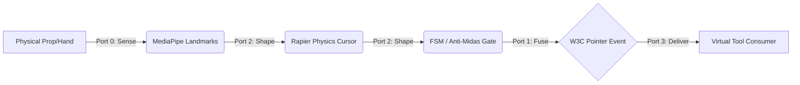
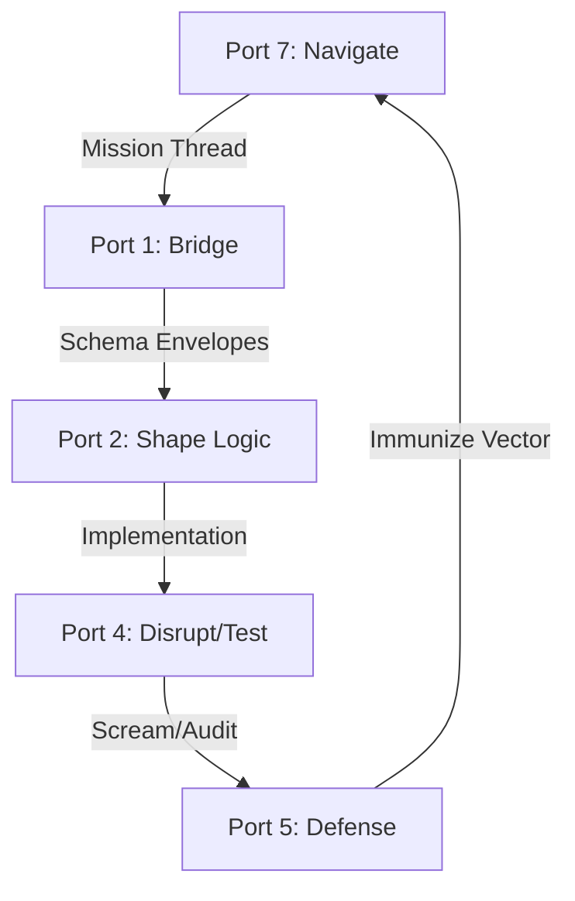
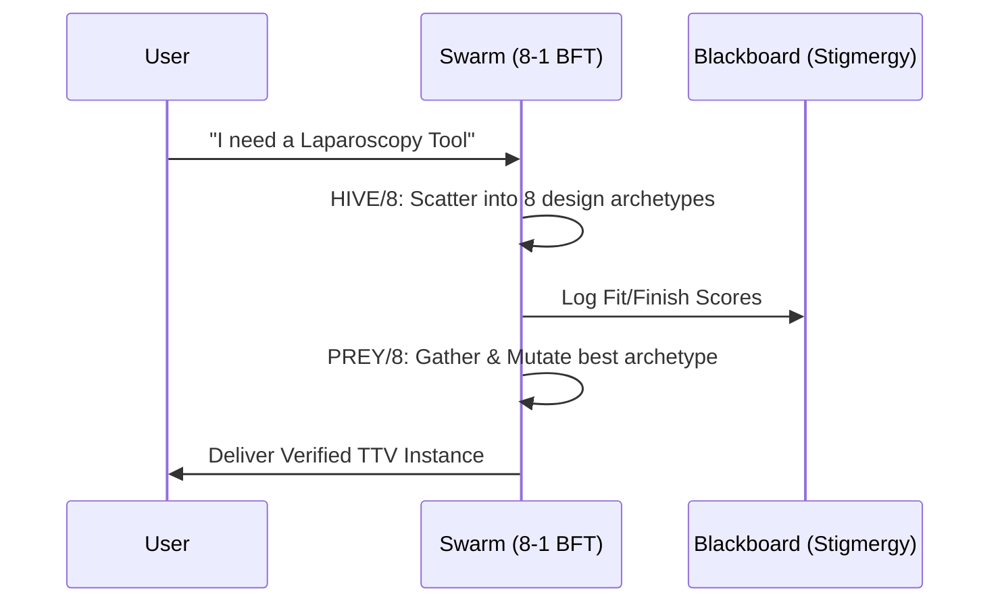

# HFO GEN 88: DUAL OBJECTIVE SYNTHESIS (V2 - 2026-01-07)

## 🌌 THE GRAND VISION: TTV x SYMBIOTE SWARM
Total Tool Virtualization (TTV) is the *application*; the HFO Swarm is the *engine*. One provides the **Liberation**, the other provides the **Truth**.

---

## 🏗️ ARCHITECTURE CONNECTOME (MERMAID)

### The TTV Pipeline (The Vertical Slice)
How we get from a physical object to a virtual tool control plane.

### The Cognitive Symbiote Swarm (The Governance)
How the 8 Legendary Commanders ensure the TTV logic is not "Slop."

---

## 🔑 KEY CONVERGENCE POINTS

### 1. The Physics Cursor (Mirror Magus P2)
To achieve TTV, we don't just need coordinates; we need **Proprioception**.
- **The Problem**: Raw MediaPipe data is jittery and causes "Phantom Clicks."
- **The Solution**: Mirror Magus (Port 2) applies **One Euro Filters** and **Rapier Physics**. The cursor is treated as a physical object with mass, preventing accidental activation and providing "Kinetic Truth."

### 2. The Universal Point (Web Weaver P1)
TTV requires the liberation of tools from specific hardware.
- **The Solution**: Port 1 (Web Weaver) fuses all inputs (Gestures, Thermal, Audio) into a **Standardized W3C Pointer Event**. This allows a child drawing on paper to control the same medical robot (Da Vinci) as a surgeon using a generic VR controller.

### 3. The Anti-Theater Gate (Red Regnant P4)
AI agents often "Fake" physics to please users.
- **The Solution**: The Red Regnant (Port 4) runs **Mutation Testing** on the physics-cursor logic. If the agent uses `initialized = true` without real MediaPipe WASM extraction signatures, the Regnant screams and demotes the work.

---

## 🕷️ THE OBSIDIAN HOURGLASS (PRESCIENCE)
The V2 strategy uses **MAP-ELITE** to explore the design space of tools. We are not just building *a* tool; we are building a **Spike Factory** that creates tools on demand.

---

**Status**: V2 Consolidated. 
**Next Step**: Implementation of the Port 2 Physics Cursor in Bronze.
**Motto**: "HFO will kick once and hit you 10,000 times."
