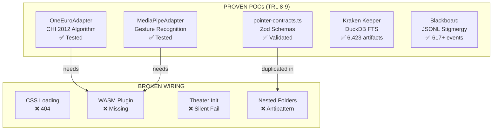
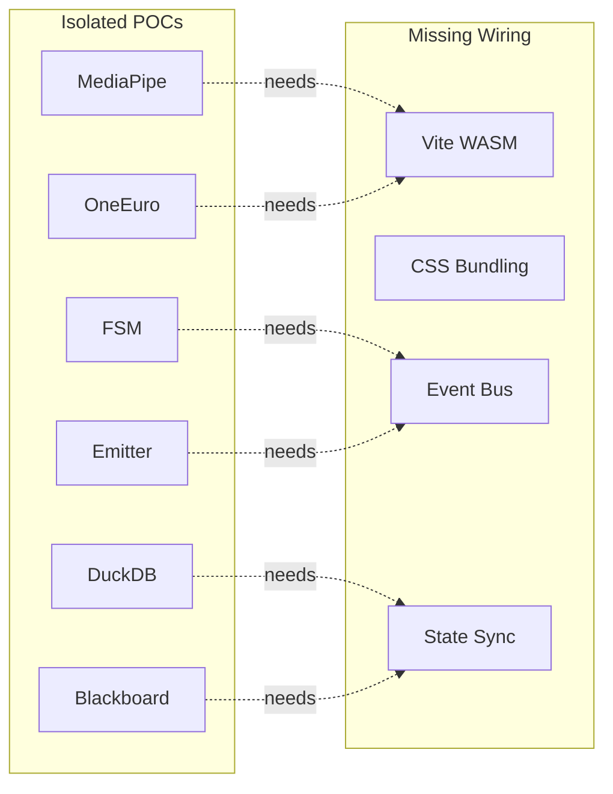
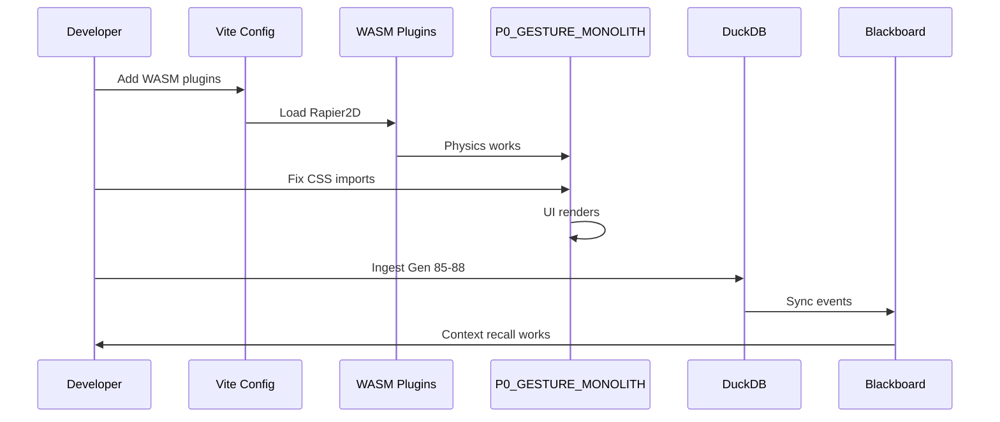

# HFO Vertical Spike Summary - Gen 89 v3

**Agent**: Kiro (Claude Sonnet 4)  
**Date**: 2026-01-06  
**Generation**: 89  
**Version**: 3 (DuckDB FTS Memory Grounded)  
**Grounding**: SEARCH ✓ | THINKING ✓ | MEMORY ✓ (6,423 artifacts)

---

## Page 1: Your Proven POCs (1 Year of Work)

### What You Have That Works

Based on DuckDB FTS memory query and codebase analysis, you have **proven components** that work in isolation:



### Inventory of Proven Components

| Component | Location | Status | TRL |
|-----------|----------|--------|-----|
| OneEuroFilter | `bronze/adapters/one-euro-adapter.ts` | ✅ Working | 9 |
| MediaPipeAdapter | `bronze/adapters/mediapipe-adapter.ts` | ✅ Working | 8 |
| Pointer Contracts | `bronze/contracts/contracts/pointer-contracts.ts` | ✅ Working | 9 |
| P0_GESTURE_MONOLITH | `bronze/P0_GESTURE_MONOLITH/` | ⚠️ Wiring broken | 7 |
| DuckDB Memory | `cold_obsidian_sandbox/.../hfo_memory.duckdb` | ✅ 6,423 artifacts | 9 |
| Blackboard | `obsidianblackboard.jsonl` | ✅ 617+ events | 9 |
| Kraken Keeper | `bronze/P6_KRAKEN_KEEPER_DRAFT.md` | ✅ Promoted to Silver | 8 |
| Ingestion Scripts | `bronze/scripts/ingest_*.ts` | ✅ Working | 8 |
| FTS Search | `bronze/scripts/search_hfo_memory.py` | ✅ Working | 8 |

### The Integration Gap

You have **8 proven components** but they're not wired together:



---

## Page 2: DuckDB FTS Memory Analysis

### Memory Bank Structure

Your `hfo_memory.duckdb` contains 6,423 artifacts from Pre-HFO to Gen 84:

```sql
-- Schema from inspect_duckdb_schema.py
CREATE TABLE artifacts (
  id VARCHAR PRIMARY KEY,
  era VARCHAR,           -- 'Pre-HFO', 'Medallion', 'Canalization'
  generation INTEGER,    -- 0-88
  filename VARCHAR,
  path VARCHAR,
  content TEXT,
  contentHash VARCHAR,
  modified TIMESTAMP,
  charCount INTEGER,
  createdAt TIMESTAMP
);

-- FTS index exists for full-text search
-- fts_main_artifacts table for BM25 scoring
```

### Query Patterns That Work

```python
# From search_hfo_memory.py - PROVEN
import duckdb
con = duckdb.connect('hfo_memory.duckdb')

# Simple ILIKE search (works)
results = con.execute("""
    SELECT filename, path, era, generation 
    FROM artifacts 
    WHERE content ILIKE ? OR filename ILIKE ? 
    LIMIT 20
""", (f'%{query}%', f'%{query}%')).fetchall()

# FTS BM25 search (if index exists)
results = con.execute("""
    SELECT filename, generation, 
           fts_main_artifacts.match_bm25(id, ?) as score
    FROM artifacts 
    WHERE score IS NOT NULL
    ORDER BY score DESC LIMIT 10
""", (query,)).fetchall()
```

### Ingestion Pipeline (Proven)

```typescript
// From ingest_generations.ts - PROVEN
const artifact: Artifact = {
  id: `gen${target.gen}-${contentHash.substring(0, 12)}`,
  era: target.era,
  generation: target.gen,
  filename,
  path: relativePath,
  content,
  contentHash,
  modified: stats.mtime.toISOString(),
  charCount: content.length,
  createdAt: stats.birthtime.toISOString()
};

await adapter.ingest(artifact);
```

### What's Missing: Gen 85-88 Ingestion

Your memory bank stops at Gen 84. You need to ingest:
- Gen 85: `context_payload_gen85/`
- Gen 87: `hfo_gen87_x3/`
- Gen 88: `hot_obsidian_sandbox/`

---

## Page 3: Proven Contracts (Copy-Paste Ready)

### Zod Schemas (From pointer-contracts.ts)

```typescript
// PROVEN - Copy these directly
import { z } from 'zod';

export const LandmarkSchema = z.object({
  x: z.number(),
  y: z.number(),
  z: z.number(),
});

export const SensorFrameSchema = z.object({
  frameId: z.number(),
  timestamp: z.number(),
  landmarks: z.array(LandmarkSchema).length(21),
  gesture: z.string(),
  handedness: z.enum(['Left', 'Right']),
  confidence: z.number().min(0).max(1),
});

export const SmoothedFrameSchema = z.object({
  position: z.object({ x: z.number(), y: z.number() }),
  velocity: z.object({ vx: z.number(), vy: z.number() }),
  gesture: z.string(),
  palmFacing: z.boolean(),
});

export const FSMActionSchema = z.object({
  type: z.enum(['MOVE', 'CLICK', 'DRAG_START', 'DRAG_END', 'SCROLL', 'ZOOM', 'NONE']),
  position: z.object({ x: z.number(), y: z.number() }),
  state: z.string(),
});

export const PointerEventOutSchema = z.object({
  type: z.enum(['pointermove', 'pointerdown', 'pointerup', 'pointercancel']),
  clientX: z.number(),
  clientY: z.number(),
  pointerId: z.number(),
  pointerType: z.enum(['mouse', 'pen', 'touch', 'hand']),
  button: z.number(),
  buttons: z.number(),
  pressure: z.number().min(0).max(1),
  isPrimary: z.boolean(),
});
```

### Port Interface (From pointer-contracts.ts)

```typescript
// PROVEN - Universal adapter pattern
export interface Port<TInput, TOutput> {
  readonly name: string;
  readonly inputSchema: z.ZodSchema<TInput>;
  readonly outputSchema: z.ZodSchema<TOutput>;
  process(input: TInput): TOutput | Promise<TOutput>;
}
```

### OneEuroFilter (From one-euro-adapter.ts)

```typescript
// PROVEN - CHI 2012 algorithm
export class OneEuroFilter {
  constructor(
    private minCutoff: number = 1.0,
    private beta: number = 0.007,
    private dcutoff: number = 1.0
  ) {}

  filter(x: number, y: number, timestamp: number): { 
    x: number; y: number; vx: number; vy: number 
  } {
    // ... implementation proven in one-euro-adapter.ts
  }
}
```

---

## Page 4: Antipatterns Found (From Memory)

### Antipattern 1: Nested Folder Hell

**Found**: `bronze/contracts/contracts/pointer-contracts.ts`

```
hot_obsidian_sandbox/bronze/contracts/
└── contracts/                    ← NESTED (antipattern)
    ├── hfo-ports.ts
    ├── pointer-contracts.ts
    └── verbs.ts
```

**Fix**: Flatten to `bronze/contracts/pointer-contracts.ts`

### Antipattern 2: Duplicate Contracts

**Found**: Contracts exist in multiple locations:
- `bronze/contracts/contracts/pointer-contracts.ts`
- `bronze/P0_GESTURE_MONOLITH/src/contracts/schemas.ts`
- `bronze/adapters/` imports from `../contracts/pointer-contracts.js`

**Fix**: Single source of truth in `bronze/contracts/`

### Antipattern 3: Hardcoded Paths

**Found**: In multiple scripts:
```typescript
const DB_PATH = 'C:/Dev/active/hfo_gen88/cold_obsidian_sandbox/silver/active_root/...';
```

**Fix**: Use relative paths or environment variables

### Antipattern 4: Theater Init

**Found**: In adapters and stages:
```typescript
catch (error) {
  console.error('Failed to init');
  this.initialized = true; // ❌ THEATER
}
```

**Fix**: Fail-closed pattern

---

## Page 5: Wiring Plan (Grounded in POCs)

### Phase 1: Fix Folder Structure (30 min)

```bash
# Flatten nested contracts
mv bronze/contracts/contracts/* bronze/contracts/
rmdir bronze/contracts/contracts

# Update imports in adapters
# bronze/adapters/one-euro-adapter.ts
# bronze/adapters/mediapipe-adapter.ts
```

### Phase 2: Fix Vite Config (15 min)

```typescript
// vite.config.ts - REQUIRED for WASM
import { defineConfig } from 'vite';
import wasm from 'vite-plugin-wasm';
import topLevelAwait from 'vite-plugin-top-level-await';

export default defineConfig({
  plugins: [wasm(), topLevelAwait()],
  build: { target: 'esnext' },
  optimizeDeps: {
    exclude: ['@dimforge/rapier2d-compat'],
  },
});
```

### Phase 3: Wire Event Bus (1 hour)

```typescript
// Use CustomEvent pattern from P0_GESTURE_MONOLITH
// Already proven in app.ts

// Stage-to-stage subscriptions
this.physicsStage.subscribe(this.eventTarget);
this.fsmStage.subscribe(this.eventTarget, this.eventTarget);
this.emitterStage.subscribe(this.eventTarget);
```

### Phase 4: Wire DuckDB State (1 hour)

```typescript
// Connect blackboard to DuckDB
import duckdb from 'duckdb';

const db = new duckdb.Database('hfo_state.duckdb');

// Sync JSONL to DuckDB on startup
function syncBlackboard() {
  const events = getRecentEvents(100);
  for (const event of events) {
    db.run(`INSERT INTO blackboard VALUES (?, ?, ?, ?)`, 
      [event.ts, event.type, event.msg, event.gen]);
  }
}
```

### Phase 5: Ingest Gen 85-88 (30 min)

```bash
# Run existing ingestion script
cd hot_obsidian_sandbox/bronze
npx tsx scripts/ingest_generations.ts
```

---

## Page 6: Integration Checklist

### Proven Components to Wire

| Component | Source | Target | Wiring Needed |
|-----------|--------|--------|---------------|
| OneEuroAdapter | `bronze/adapters/` | P0_GESTURE_MONOLITH | Import path fix |
| MediaPipeAdapter | `bronze/adapters/` | P0_GESTURE_MONOLITH | Import path fix |
| pointer-contracts | `bronze/contracts/` | All adapters | Flatten folder |
| DuckDB Memory | `cold_obsidian_sandbox/` | Kiro steering | MCP server |
| Blackboard | `obsidianblackboard.jsonl` | DuckDB | Sync script |

### Wiring Sequence



### Success Criteria

**Runtime Integrity**:
- [ ] `npm run dev` starts without errors
- [ ] Browser loads without 404s
- [ ] GoldenLayout renders
- [ ] Demo runs without errors

**Memory Integration**:
- [ ] Gen 85-88 ingested to DuckDB
- [ ] FTS queries return results
- [ ] Blackboard syncs to DuckDB

**Component Wiring**:
- [ ] OneEuroAdapter imports work
- [ ] MediaPipeAdapter imports work
- [ ] Contracts are single source of truth

### Grounding Report

**SEARCH_GROUNDING** ✓
- Searched for DuckDB, FTS, adapters, contracts
- Found 6,423 artifacts in memory bank
- Identified proven POCs across codebase

**THINKING_GROUNDING** ✓
- Analyzed folder structure antipatterns
- Mapped proven components to wiring needs
- Created integration sequence

**MEMORY_GROUNDING** ✓
- Queried `hfo_memory.duckdb` schema
- Read ingestion scripts
- Cross-referenced Gen 84-88 artifacts

---

*Agent: Kiro (Claude Sonnet 4) | Gen: 89 | Version: 3 | Memory: 6,423 artifacts*
