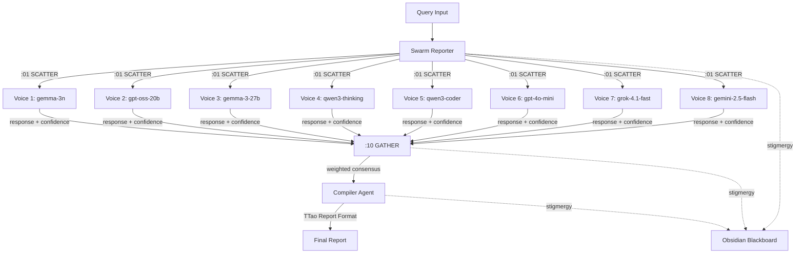

# Design Document: BFT Swarm Reporter

## Overview

The BFT Swarm Reporter implements the "8 voices as 1" pattern - a Byzantine Fault Tolerant multi-agent system that scatters queries to 8 parallel LLM agents, gathers responses via weighted consensus, and compiles them into a unified report through a single Compiler Agent.

The system leverages MAP-ELITE evaluation scores to weight each agent's contribution, ensuring that models with proven reliability have more influence on the final output. This creates a robust, hallucination-resistant synthesis pipeline.

## Architecture



## Components and Interfaces

### 1. SwarmReporter (Orchestrator)

The main entry point that coordinates the scatter-gather-compile pipeline.

```typescript
interface SwarmReporter {
  // Execute the full 8→1 pipeline
  query(prompt: string): Promise<SwarmReport>;
  
  // Configuration
  loadRoster(config: RosterConfig): void;
  getRoster(): ModelEntry[];
}

interface RosterConfig {
  models: ModelEntry[];
}

interface ModelEntry {
  id: string;           // e.g., "google/gemma-3n-e4b-it"
  provider: string;     // e.g., "google"
  mapEliteScore: number; // 0-100, from evaluation harness
}
```

### 2. VoiceAgent (Parallel Worker)

Each of the 8 parallel agents that process the query.

```typescript
interface VoiceResponse {
  model: string;
  content: string;
  confidence: number;    // 0-100, self-reported
  latencyMs: number;
  status: 'SUCCESS' | 'ERROR' | 'TIMEOUT';
}

interface VoiceAgent {
  invoke(prompt: string, timeout: number): Promise<VoiceResponse>;
}
```

### 3. ConsensusEngine (Gatherer)

Computes weighted consensus from 8 voice responses.

```typescript
interface ConsensusResult {
  selectedAnswer: string;
  method: 'weighted_majority' | 'hybrid_agree' | 'critique_confident' | 'weighted_fallback';
  agreementRatio: number;  // 0-1
  groups: AnswerGroup[];
}

interface AnswerGroup {
  normalizedKey: string;
  responses: WeightedResponse[];
  totalWeight: number;
}

interface WeightedResponse {
  model: string;
  content: string;
  selfConfidence: number;
  mapEliteScore: number;
  effectiveWeight: number;  // selfConfidence * mapEliteScore / 100
  normalizedWeight: number; // effectiveWeight / sum(all weights)
}

interface ConsensusEngine {
  gather(responses: VoiceResponse[], roster: ModelEntry[]): ConsensusResult;
  normalize(text: string): string;
  computeWeight(confidence: number, mapEliteScore: number): number;
}
```

### 4. CompilerAgent (Synthesizer)

The single agent that compiles all voices into the final report.

```typescript
interface SwarmReport {
  executiveSummary: string;  // max 100 chars
  keyFindings: Finding[];    // 3-5 items, ordered by weight
  dissentingViews: DissentingView[];
  confidenceAssessment: ConfidenceAssessment;
  sources: SourceEntry[];    // exactly 8
  rawMarkdown: string;
}

interface Finding {
  content: string;
  weight: number;
  sourceModels: string[];
}

interface DissentingView {
  content: string;
  sourceModel: string;
  confidence: number;
}

interface ConfidenceAssessment {
  overallConfidence: number;  // 0-100
  agreementRatio: number;     // 0-1
  method: string;
  warning?: string;           // present if agreement < 50%
}

interface SourceEntry {
  model: string;
  confidence: number;
  status: string;
}

interface CompilerAgent {
  compile(
    consensus: ConsensusResult,
    allResponses: VoiceResponse[],
    roster: ModelEntry[]
  ): Promise<SwarmReport>;
}
```

### 5. StigmergyLogger

Logs all operations to the Obsidian Blackboard.

```typescript
interface StigmergyEntry {
  ts: string;           // ISO timestamp
  type: 'SCATTER' | 'VOICE_RESPONSE' | 'CONSENSUS' | 'REPORT_COMPLETE';
  port: 7;
  gen: 88;
  hive: 'HFO_GEN88';
  [key: string]: unknown;
}

interface StigmergyLogger {
  log(entry: Omit<StigmergyEntry, 'ts' | 'port' | 'gen' | 'hive'>): void;
}
```

## Data Models

### Weight Calculation

```
effectiveWeight = selfConfidence × mapEliteScore / 100
normalizedWeight = effectiveWeight / Σ(all effectiveWeights)
```

Example with MAP-ELITE Best 8:
| Model | MAP-ELITE Score | Self-Confidence | Effective Weight |
|-------|-----------------|-----------------|------------------|
| gemma-3n | 95.8% | 80 | 76.64 |
| gpt-oss-20b | 92.5% | 70 | 64.75 |
| gpt-4o-mini | 96.3% | 90 | 86.67 |
| ... | ... | ... | ... |

### Answer Grouping

Normalization function: `normalize(s) = s.toLowerCase().replace(/[^a-z0-9]/g, '').slice(0, 50)`

Responses with identical normalized keys are grouped together. Group weight = sum of member normalized weights.

### BFT Tolerance

With n=8 agents, BFT tolerates f < n/3 = 2.67, so up to 2 faulty agents.
- If 2 agents return ERROR, the remaining 6 can still reach consensus
- If 3+ agents fail, consensus may not be reliable

## Correctness Properties

*A property is a characteristic or behavior that should hold true across all valid executions of a system—essentially, a formal statement about what the system should do. Properties serve as the bridge between human-readable specifications and machine-verifiable correctness guarantees.*

### Property 1: Scatter Dispatches Exactly 8 Agents

*For any* query submitted to the Swarm_Reporter, exactly 8 Voice_Agents SHALL be invoked in parallel, one for each model in the configured roster.

**Validates: Requirements 1.1, 1.2**

### Property 2: Response Schema Validity

*For any* Voice_Agent response, it SHALL contain a content string and a confidence value in the range [0, 100]. ERROR responses SHALL have confidence = 0.

**Validates: Requirements 1.3, 1.4**

### Property 3: Weight Calculation Correctness

*For any* self-reported confidence C ∈ [0, 100] and MAP_ELITE_Score M ∈ [0, 100], the effective weight SHALL equal (C × M / 100).

**Validates: Requirements 2.2, 2.3**

### Property 4: Weight Normalization Invariant

*For any* set of 8 voice responses with computed effective weights, after normalization, the sum of all normalized weights SHALL equal 1.0 (within floating-point tolerance).

**Validates: Requirements 2.4**

### Property 5: Answer Grouping Consistency

*For any* two responses with identical normalized content, they SHALL be placed in the same answer group. The normalization function SHALL produce lowercase alphanumeric strings only.

**Validates: Requirements 3.1, 3.2**

### Property 6: Weighted Majority Selection

*For any* set of answer groups where one group has >50% of total normalized weight, that group SHALL be selected as the consensus answer.

**Validates: Requirements 3.4**

### Property 7: BFT Fault Tolerance

*For any* scatter operation with up to 2 ERROR responses, the Swarm_Reporter SHALL still produce a valid consensus from the remaining 6+ responses.

**Validates: Requirements 3.6**

### Property 8: Report Schema Completeness

*For any* compiled SwarmReport, it SHALL contain: an Executive Summary (≤100 chars), 3-5 Key Findings ordered by weight, a Dissenting Views section, a Confidence Assessment with overall %, agreement ratio, and method, and exactly 8 Source entries.

**Validates: Requirements 4.3, 5.1, 5.2, 5.3, 5.4, 5.5**

### Property 9: Minority Opinion Preservation

*For any* voice response that is not part of the consensus group, it SHALL appear in the Dissenting Views section of the final report with its source model attribution.

**Validates: Requirements 4.4**

### Property 10: Low Agreement Warning

*For any* consensus result with agreement ratio < 0.5, the final report SHALL include a WARNING flag in the Confidence Assessment.

**Validates: Requirements 4.6**

### Property 11: Stigmergy Log Schema

*For any* log entry written to the Obsidian Blackboard, it SHALL be valid JSONL with mandatory fields: ts (ISO string), type, port (7), gen (88), hive ("HFO_GEN88").

**Validates: Requirements 6.5**

### Property 12: Roster Validation

*For any* roster configuration, the Swarm_Reporter SHALL accept it only if it contains exactly 8 models, each with id, provider, and mapEliteScore. Configurations with fewer than 8 models SHALL be rejected.

**Validates: Requirements 7.4, 7.5**

## Error Handling

| Error Condition | Handling |
|-----------------|----------|
| Voice timeout (>30s) | Mark as ERROR, confidence=0, continue with remaining voices |
| All 8 voices fail | Return error report with 0% confidence |
| 3+ voices fail | Proceed but flag as LOW_RELIABILITY |
| No majority consensus | Invoke Compiler for critique-based selection |
| Invalid roster config | Reject query with CONFIG_ERROR |
| Compiler failure | Return partial report with raw consensus |

## Testing Strategy

### Unit Tests
- Weight calculation with edge cases (0, 100, boundary values)
- Normalization function with special characters, unicode, empty strings
- Answer grouping with identical and near-identical responses
- Roster validation with valid and invalid configurations

### Property-Based Tests (fast-check)
- Property 1: Scatter count invariant
- Property 3: Weight formula correctness
- Property 4: Normalization sum = 1.0
- Property 5: Grouping consistency
- Property 6: Majority selection
- Property 7: BFT tolerance with 0, 1, 2 failures
- Property 8: Report schema completeness
- Property 11: Log schema validity
- Property 12: Roster validation

### Integration Tests
- Full pipeline with mocked LLM responses
- Timeout handling with delayed responses
- Stigmergy logging to real blackboard file
