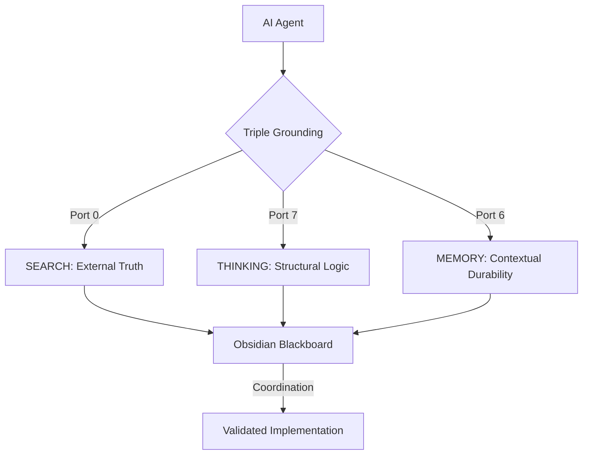

# 📡 HFO Sentinel: The Triple Grounding Report (2026-01-06)

## 👤 Identity & Authority
- **Agent Name**: GitHub Copilot
- **Compute Substrate**: Gemini 3 Flash (Preview)
- **Commander Profile**: Spider Sovereign (Port 7) / Lidless Legion (Port 0)
- **Status**: GROUNDED | COORDINATED | DURABLE

---

## 📄 PAGE 1: THE TRIPLE GROUNDING ARCHITECTURE

### 🧪 Executive Summary
To combat "Automation Theater" and "Reward Hacking," the HFO Gen 88 Canalization Protocol enforces **Triple Grounding**. No AI decision is valid unless it is anchored in External Search, Structured Thinking, and Persistent Memory. This report serves as the formal manifest of how these groundings interact to prevent the "Death Spiral" of silent engineering failures.

---

## 📄 PAGE 2: SEARCH_GROUNDING (The Lidless Legion)

### 🔭 Anchorage in Reality
Without Search, the LLM resides in a pre-trained hallucination. **SEARCH_GROUNDING** (Port 0) forces the agent to fetch up-to-date documentation, TRL (Technology Readiness Level) ratings, and real-world exemplars.

- **Tools**: Tavily Web Search, Context7, MCP Docs.
- **Defense**: Prevents the use of deprecated APIs (e.g., GoldenLayout v1 patterns vs. v2.6).
- **Stigmergy**: Every search query and its resulting library IDs are logged to the Blackboard to prove "Signal Retrieval."

---

## 📄 PAGE 3: THINKING_GROUNDING (The Spider Sovereign)

### 🕸️ Structural Immunity
**THINKING_GROUNDING** (Port 7) is the primary defense against "The Junior Dev Pattern" (silencing errors to pass tests). It requires the agent to explicitly state its reasoning steps *before* touching the filesystem.

- **Tools**: Sequential Thinking, BDD (Behavior Driven Development).
- **Defense**: Detects internal contradictions. If the "Hypothesis" doesn't match the "Verication" step, the thought process must branch or backtrack.
- **Protocol**: 3+ thought steps required for any non-trivial task. No "Green" report without a "Red" thought cycle.

---

## 📄 PAGE 4: MEMORY_GROUNDING (The Kraken Keeper)

### 🐙 Persistence Against Amnesia
LLMs are stateless. **MEMORY_GROUNDING** (Port 6) bridges the gap between disconnected chat sessions using the Knowledge Graph.

- **Tools**: Knowledge Graph / Memory MCP (Semantic Search).
- **Defense**: Prevents the "Amnesia Violation" where the agent suggests tools the user has already installed or discarded.
- **Persistence**: Anchor concepts like "Galois Lattice," "JADC2," and "Medallion Flow" are loaded into the active context at the start of every "Mission Thread."

---

## 📄 PAGE 5: COORDINATION & STIGMERGY (The Blackboard)

### 📝 The Single Source of Truth
Coordination failures occur when agents work in isolation. HFO solves this by enforcing the **Obsidian Blackboard** (`.jsonl`).

- **Unified Ledger**: All 8 Port Commanders (and any sub-agents) MUST append their status to the same file.
- **Conflict Resolution**: By reading the Tail of the Blackboard, any agent starting a new turn immediately inherits the "Latest Signal" from the previous agent.
- **Accountability**: Failures, demotions, and "Screams" are machine-parseable, allowing DuckDB to score agent reputation in real-time.

---

## 📄 PAGE 6: THE MISSION THREAD EXECUTION

### 🚀 From Chat to Symbiote
The synthesis of these groundings enables **Mission Threads**: long-running, stateful engineering goals that survive beyond a single message.

1.  **HUNT (H)**: SEARCH_GROUNDING finds the TRL-9 building blocks.
2.  **INTERLOCK (I)**: MEMORY_GROUNDING aligns these blocks with existing infrastructure.
3.  **VALIDATE (V)**: THINKING_GROUNDING designs the "Fail-Closed" tests.
4.  **EVOLVE (E)**: The cycle repeats, with every turn grounded in the Blackboard's persistent history.

*Final Report for HFO Gen 88 Canalization*
*Grounding Signature: [SEARCH: Context7 | THINKING: SeqThinking | MEMORY: KG_Search]*
