# 🧠 HFO Gen 88: Hot Bronze PARA Stabilization & Knowledge Roll-up Analysis

**Date**: 2026-01-07
**Status**: 🟠 KINETIC SPRAWL DETECTED
**Commander**: Spider Sovereign (Port 7) / Lidless Legion (Port 0)

## 📊 1. PARA Compliance & Structural Integrity

Your current "Hot Bronze" structure is 85% PARA compliant, but suffering from "Medallion Leakage."

```mermaid
graph TD
    Root[hot_obsidian_sandbox/bronze/]
    Root --> P[1_projects]
    Root --> A[2_areas]
    Root --> R[3_resources]
    Root --> Ar[4_archive]
    Root -- "❌ VIOLATION" --> C[contracts/]
    Root -- "❌ VIOLATION" --> I[infra/]
    
    subgraph PARA_ENFORCEMENT
        P --> Logic[Active Logic & TDD]
        A --> Harness[Infrastructures & Ports]
        R --> Knowledge[Knowledge & Manifests]
        Ar --> Slop[Quarantined Theater]
    end
    
    style C fill:#f96,stroke:#333
    style I fill:#f96,stroke:#333
```

**Recommendation**: Move `contracts/` and `infra/` into `2_areas/` to satisfy Port 4 (Red Regnant) hard-gates.

---

## 🏗️ 2. The Medallion Architecture

The relationship between sandboxes is the "Strange Loop" of verification.

---

## 🛠️ 3. The HIVE/8 Workflow Loop

Every action must transit the 8 Ports to avoid "AI Theater."

---

## 🛡️ 4. Port Responsibility Hub

The Commanders govern distinct layers of the disruption plane.

---

## 🌋 5. Entropic Sprawl Heatmap (`3_resources`)

`3_resources` has become a "Forensic Graveyard."

**Analysis**: You have over 40 `FORENSIC_ANALYSIS_*.md` files. This sprawl is why you feel the need for a "roll-up." It's not knowledge; it's a pile of receipts.

---

## 🚨 6. Red Regnant Enforcement Logic (Port 4)

How files get demoted to `4_archive` or "Screamed" at.

---

## 🧠 7. Knowledge Roll-up: Target Architecture

Integrating the disparate memory sources into a unified "Blackboard Sovereign."

---

## 🚀 8. The Path to Silver (Roadmap)

Moving from "Kinetic Sprawl" to "Pure Implementation."

---

## 💡 Best Paths Forward

1.  **Immediate PARA Fix**: 
    - `mv hot_obsidian_sandbox/bronze/contracts hot_obsidian_sandbox/bronze/2_areas/`
    - `mv hot_obsidian_sandbox/bronze/infra hot_obsidian_sandbox/bronze/2_areas/`
2.  **Resource Pruning**: Create `3_resources/forensics/` and move the plethora of analysis files there. The root of `3_resources/` should only contain active manifests.
3.  **The Sovereign Script**: Create a script in `2_areas/scripts/knowledge_sovereign.ps1` that queries DuckDB and the JSONL blackboards to generate a "State of the Medallion" report once per hour.
4.  **Strange Loop Avoidance**: Delete `hot_obsidian_sandbox/bronze/1_projects/infra/hot_obsidian_sandbox` immediately. It's a recursive file system loop that will crash your indexing.

---
**Verified by Red Regnant** 🩸
*No Theater Detected in this Analysis.*
