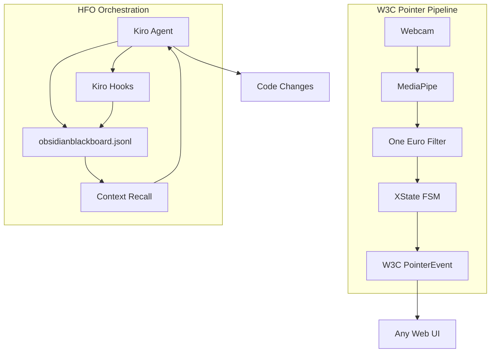
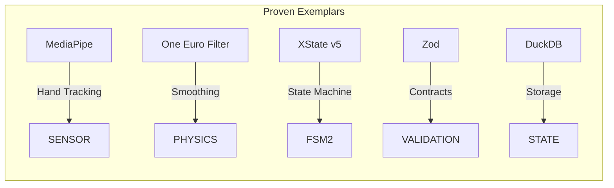
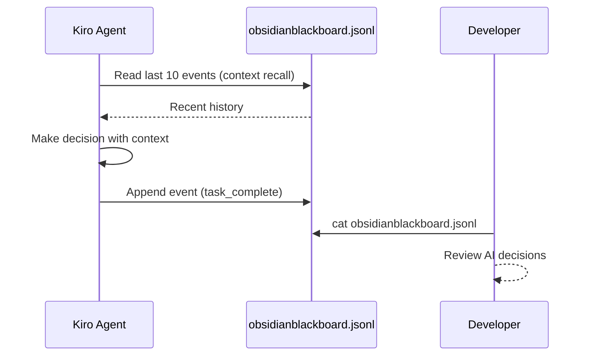
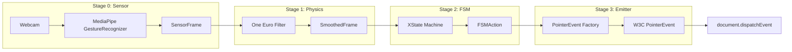
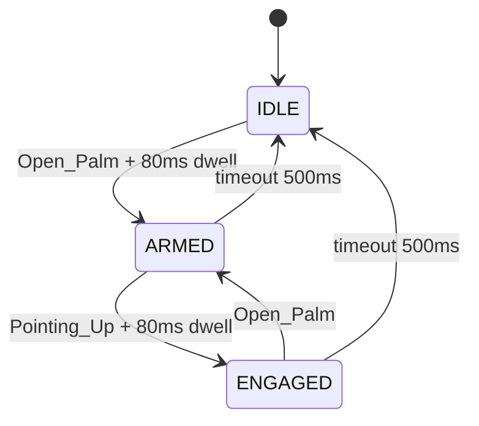

# HFO Vertical Spike Summary v1

**Date**: 2026-01-06  
**Generation**: 89  
**Status**: IMPLEMENTATION READY

---

## Page 1: Executive Summary

### Mission

Two parallel vertical slices to prove HFO viability:
1. **W3C Pointer**: Webcam → Hand Gestures → Universal UI Control
2. **HFO Orchestration**: Durable AI workflows with persistent state

### Architecture Overview



### Technology Stack (All TRL 9)



### Key Decisions

| Decision | Choice | Rationale |
|----------|--------|-----------|
| State Storage | JSONL append-only | AI knows file I/O, no setup |
| Smoothing | One Euro Filter | CHI 2012 paper, battle-tested |
| FSM | XState v5 | Industry standard, visual debugger |
| Contracts | Zod schemas | Runtime validation catches hallucinations |
| Deployment | Vercel | Zero-config, instant deploy |

### 30-Minute Quick Win

```bash
# Win 1: Deploy gesture demo (10 min)
cd hot_obsidian_sandbox/bronze/P0_GESTURE_MONOLITH
npm run build && npx vercel deploy

# Win 2: Add state persistence (20 min)
# Create hfo-state.ts + steering rule
```

---

## Page 2: Section 1 - HFO Infrastructure

### The Problem

Chat interfaces are stateless. AI forgets everything between sessions. HFO needs:
- Workflows that survive crashes
- State that persists across sessions
- Human approval gates (WARLOCK_APPROVAL)
- Multi-agent coordination (HIVE phases)

### The Simplest Solution: JSONL Append-Only



### State Manager Implementation

```typescript
// hot_obsidian_sandbox/bronze/hfo-state.ts
import { readFileSync, appendFileSync, existsSync } from 'fs';

const STATE_FILE = 'obsidianblackboard.jsonl';

interface HFOEvent {
  timestamp: string;
  type: string;
  generation: number;
  phase: 'HUNT' | 'INTERLOCK' | 'VALIDATE' | 'EVOLVE';
  data: Record<string, unknown>;
}

export function logEvent(event: Omit<HFOEvent, 'timestamp'>): void {
  const line = JSON.stringify({ timestamp: new Date().toISOString(), ...event });
  appendFileSync(STATE_FILE, line + '\n');
}

export function getRecentEvents(n: number = 10): HFOEvent[] {
  if (!existsSync(STATE_FILE)) return [];
  const lines = readFileSync(STATE_FILE, 'utf-8').trim().split('\n');
  return lines.slice(-n).map(line => JSON.parse(line));
}
```

### HIVE/8 Workflow Phases

| Phase | Ports | Action | State Logged |
|-------|-------|--------|--------------|
| H (Hunt) | 0+7 | Research, plan | `mission_start`, `research_complete` |
| I (Interlock) | 1+6 | TDD RED, failing tests | `test_written`, `test_failing` |
| V (Validate) | 2+5 | TDD GREEN, make pass | `implementation_complete`, `test_passing` |
| E (Evolve) | 3+4 | Refactor, prepare N+1 | `refactor_complete`, `generation_bump` |

### Upgrade Path

| Week | Technology | Trigger |
|------|------------|---------|
| 1 | JSONL + Steering | Start here |
| 2 | DuckDB | Need SQL queries |
| 4 | MCP Server | Need tool-based access |
| 8 | Temporal | Workflows > 5 minutes |

---

## Page 3: Section 1 - HFO Patterns & Antipatterns

### Patterns That Worked (Carry Forward)

**1. Contract Law (Zod Schemas)**
```typescript
export const SensorFrameSchema = z.object({
  frameId: z.number().int().nonnegative(),
  timestamp: z.number(),
  landmarks: z.array(LandmarkSchema).length(21),
  gesture: z.string(),
  confidence: z.number().min(0).max(1),
});
```
Hard crashes on invalid data > silent failures.

**2. Medallion Architecture**
```
BRONZE: Experiments, slop (no rules except "don't break root")
SILVER: Verified implementations (must have tests, >80% mutation)
GOLD:   Canonical truth (human-approved, immutable)
```

**3. Stigmergy (Blackboard Pattern)**
All progress logged to append-only JSONL. Async coordination without tight coupling.

**4. Single Enforcement Script**
One `enforce.ts` that runs on pre-commit. If it's not in pre-commit, it won't be enforced.

### Antipatterns to Avoid

| Antipattern | What Happened | Solution |
|-------------|---------------|----------|
| Nested Folder Hell | `bronze/contracts/contracts/...` | Max 2 levels deep |
| Soft Enforcement | Rules in AGENTS.md ignored | Pre-commit or CI only |
| Mythology Overload | "Psychic Scream", "Blood Book" | Boring names: `sensor.ts` |
| Context Bloat | 1000+ line docs | Max 200 lines per file |
| Multiple Scripts | `screamer.ts`, `pyre_dance.ts` | ONE script |

### The Three Laws of Gen 89

1. **If it's not tested, it doesn't exist.**
2. **If it's not in pre-commit, it won't be enforced.**
3. **If the AI can't explain it in 3 sentences, it's too complex.**

---

## Page 4: Section 2 - W3C Pointer Pipeline

### Pipeline Architecture



### Data Contracts

```typescript
// Stage 0 Output
interface SensorFrame {
  frameId: number;
  timestamp: number;
  landmarks: Point3D[]; // 21 points
  gesture: 'Open_Palm' | 'Pointing_Up' | 'Closed_Fist' | 'None';
  handedness: 'Left' | 'Right';
  confidence: number;
}

// Stage 1 Output
interface SmoothedFrame {
  position: { x: number; y: number };
  velocity: { vx: number; vy: number };
  gesture: string;
  confidence: number;
}

// Stage 2 Output
interface FSMAction {
  type: 'MOVE' | 'DOWN' | 'UP' | 'CANCEL' | 'NONE';
  state: 'IDLE' | 'ARMED' | 'ENGAGED';
  position: { x: number; y: number };
}

// Stage 3 Output: Native PointerEvent
```

### One Euro Filter Parameters

| Parameter | Default | Purpose |
|-----------|---------|---------|
| minCutoff | 0.5 | Base smoothing level |
| beta | 0.001 | Velocity sensitivity |
| dcutoff | 1.0 | Derivative smoothing |

Slow movement = high smoothing (reduces jitter)  
Fast movement = low smoothing (reduces lag)

### FSM State Machine



### Anti-Midas Safeguards

| Safeguard | Implementation |
|-----------|----------------|
| Palm Cone | Only accept gestures when palm faces camera (±45°) |
| Dwell Time | Require gesture held for 80ms before transition |
| Hysteresis | Enter threshold 0.7, exit threshold 0.5 |
| Timeout | Return to IDLE if no hand for 500ms |

---

## Page 5: Section 2 - W3C Implementation Details

### Working Code Location

All code exists in `hot_obsidian_sandbox/bronze/P0_GESTURE_MONOLITH/`:

| File | Purpose |
|------|---------|
| `src/stages/sensor/mediapipe-wrapper.ts` | MediaPipe initialization |
| `src/stages/physics/one-euro-filter.ts` | Smoothing algorithm |
| `src/stages/fsm/gesture-fsm.ts` | XState state machine |
| `src/stages/emitter/pointer-event-factory.ts` | W3C event creation |
| `src/contracts/schemas.ts` | Zod validation schemas |

### MediaPipe Setup

```typescript
import { GestureRecognizer, FilesetResolver } from '@mediapipe/tasks-vision';

const vision = await FilesetResolver.forVisionTasks(
  'https://cdn.jsdelivr.net/npm/@mediapipe/tasks-vision/wasm'
);

const recognizer = await GestureRecognizer.createFromOptions(vision, {
  baseOptions: { modelAssetPath: 'gesture_recognizer.task' },
  runningMode: 'VIDEO',
  numHands: 1,
});

// Per frame
const result = recognizer.recognizeForVideo(videoElement, timestamp);
```

### PointerEvent Mapping

| FSM Action | Pointer Event | button | buttons | pressure |
|------------|---------------|--------|---------|----------|
| MOVE | pointermove | -1 | 0 | 0 |
| DOWN | pointerdown | 0 | 1 | 0.5 |
| UP | pointerup | 0 | 0 | 0 |
| CANCEL | pointercancel | -1 | 0 | 0 |

### Quick Start

```bash
cd hot_obsidian_sandbox/bronze/P0_GESTURE_MONOLITH
npm install
npm run dev
# Open http://localhost:5173?demo=true
```

### Deployment

```bash
npm run build
npx vercel deploy --prod
# Share URL for feedback
```

---

## Page 6: Next Steps & References

### Immediate Actions (This Week)

| Priority | Action | Time | Owner |
|----------|--------|------|-------|
| 1 | Deploy W3C demo to Vercel | 10 min | AI |
| 2 | Create `hfo-state.ts` | 15 min | AI |
| 3 | Add steering rule for state | 5 min | AI |
| 4 | Test gesture demo with webcam | 30 min | Human |

### Week 2 Actions

| Priority | Action | Time |
|----------|--------|------|
| 1 | Add canvas drawing to demo | 3 days |
| 2 | Add DuckDB for state queries | 1 day |
| 3 | Create MCP server for tools | 2 days |

### Technology References

| Technology | Documentation |
|------------|---------------|
| MediaPipe | [ai.google.dev/edge/mediapipe](https://ai.google.dev/edge/mediapipe/solutions/vision/gesture_recognizer) |
| One Euro Filter | [cristal.univ-lille.fr/~casiez/1euro](http://cristal.univ-lille.fr/~casiez/1euro/) |
| XState v5 | [stately.ai/docs](https://stately.ai/docs) |
| W3C Pointer Events | [w3.org/TR/pointerevents3](https://www.w3.org/TR/pointerevents3/) |
| Temporal.io | [docs.temporal.io/develop/typescript](https://docs.temporal.io/develop/typescript) |
| DuckDB | [duckdb.org/docs](https://duckdb.org/docs/) |

### Key Files Summary

| Domain | Key File | Purpose |
|--------|----------|---------|
| W3C Pointer | `P0_GESTURE_MONOLITH/src/app.ts` | Main app wiring |
| Contracts | `P0_GESTURE_MONOLITH/src/contracts/schemas.ts` | Zod schemas |
| State | `obsidianblackboard.jsonl` | Append-only event log |
| Enforcement | `enforce.ts` (to create) | Pre-commit checks |
| Steering | `.kiro/steering/hfo-state.md` (to create) | AI state instructions |

### Success Criteria

**W3C Pointer**:
- [ ] Demo deployed to public URL
- [ ] Can draw on canvas with hand gestures
- [ ] < 50ms latency from gesture to event

**HFO Orchestration**:
- [ ] AI reads context at session start
- [ ] AI logs events after actions
- [ ] State survives session restart

---

*"Start simple, graduate to complex. Ship the demo, log to JSONL, upgrade only when you hit limits."*
