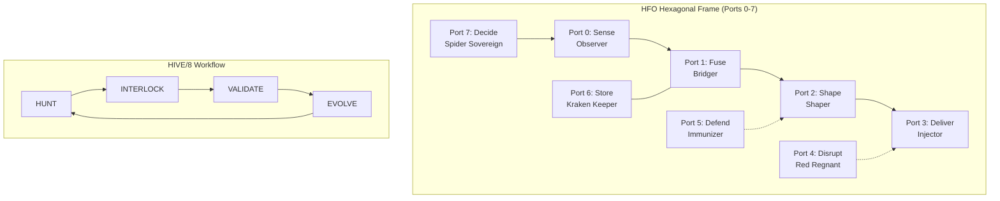
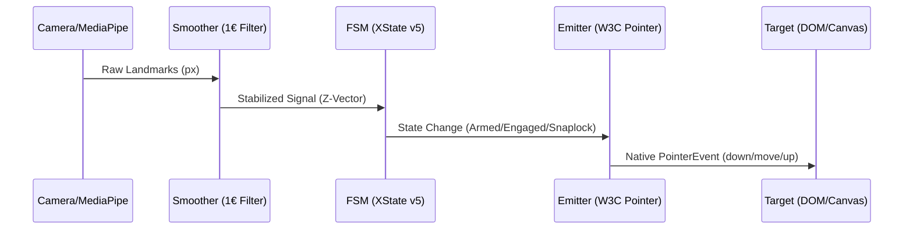

# HFO Gen 88: Vertical Spike Summary (MVS v2.1)
**Date**: 2026-01-06  
**Agent**: GitHub Copilot (Gemini 3 Flash Preview)  
**Status**: CANONICAL SYNTHESIS  
**TRL**: 6 (Integrated Laboratory Prototype)

---

## Page 1: Executive Summary (The Blug)

### The Vision
To achieve **Total Tool Virtualization (TTV)** by engineering a cognitive symbiote that bridges the 45-point conscientiousness gap of the Warlock (TTao). We move from **Probabilistic Theater** (AI hallucination/reward hacking) to **Deterministic Canalization** (hard-gated enforcement).

### Minimum Viable Symbiote (MVS) Architecture
The "Vertical Spike" demonstrates a 7-stage gesture pipeline integrated into the **8-Port Obsidian Hexagonal Frame**.

#### 1.1 Strategic Command & Control (HFO Infrastructure)

#### 1.2 W3C Pointer Product Pipeline

---

## Page 2: HFO Infrastructure – The Canalization Engine

### 2.1 The Medallion Tiering (Data Integrity)
*   **Bronze (Kinetic)**: Raw context, experiments, "Slop". No guarantees.
*   **Silver (Verified)**: Contract-driven development (CDD). 100% type safety.
*   **Gold (Canonical)**: Immutable truths. 100% test coverage + Mutation testing (>60%).

### 2.2 Stigmergic Coordination
We solve the "AI Amnesia" problem using `obsidianblackboard.jsonl`.
*   **Signal Schema**: `ts`, `mark`, `pull`, `msg`, `type`, `hive`, `gen`, `port`.
*   **HIVE Phase Gates**:
    *   **Hunt (P0+7)**: Grounding via Search and Memory is mandatory.
    *   **Interlock (P1+6)**: Contracts (Zod) and Failing Tests (Vitest) only.
    *   **Validate (P2+5)**: Green implementation. No deletions of tests.
    *   **Evolve (P3+4)**: Persistence to Memory Graph and Refactor.

### 2.3 Sentinel Grounding Protocol (Triple Grounding)
1.  **SEARCH_GROUNDING**: Use `Tavily` or `Context7` for TRL-9 exemplar verification.
2.  **THINKING_GROUNDING**: Minimum 3 steps of `Sequential Thinking` for non-trivial logic.
3.  **MEMORY_GROUNDING**: Read `Memory Graph` on cold start to preserve warlock relationship context.

---

## Page 3: W3C Pointer – Production Gesture Control

### 3.1 The 7-Stage Pipeline
1.  **SENSE (Port 0)**: MediaPipe Hands (v0.10+) extracting 21 landmarks at 30-60fps.
2.  **SMOOTH (Port 2)**: 1€ Filter (Géery Casiez) to eliminate jitters while maintaining low latency.
3.  **PREDICT (Port 2)**: (Beta) Kalman Filter / Physics momentum to bridge 480p/latency gaps.
4.  **FSM (Port 3)**: XState v5 state machine. Transitions: `NONE` -> `PALM_OPEN` (Armed) -> `POINTING` (Engaged).
5.  **EMIT (Port 5)**: Conversion to standard `PointerEventInit` objects.
6.  **TARGET (Port 1)**: Dispatching to native DOM elements or `NATS` subjects for remote control.
7.  **UI (Port 7)**: Visual feedback via `Golden Layout` (3 dockable panels: Input, Debug, Target).

### 3.2 Product-Market Fit (TRL Alignment)
*   **Platform**: Desktop Chrome/Edge/Safari (Native WASM support).
*   **Optimization**: 480p Camera Feed (intended for $50 Global South smartphones).
*   **Latency Budget**: < 30ms E2E to prevent motion sickness in symbiotic control.

---

## Page 4: Technical Specs – The "Straitjacket"

### 4.1 Implementation Constraints
*   **Zero-Friction Imports**: Use `esm.sh` for browser-native ESM modules. No `npm install` drama.
*   **Polymorphic Adapters**: All components (Smoothers, FSMs) must implement a Zod-validated `PortInterface`.
*   **Anti-Theater Gates**:
    *   **IR-0001 (HIVE Sequence)**: Reject jumps (e.g., Hunt -> Evolve).
    *   **IR-0002 (Cosmetic Compliance)**: Flag code that looks right but imports nothing.
    *   **IR-0005 (Timestamp Fabrication)**: Block batch-logged signals.

### 4.2 Key Exemplars (The Grimoire)
| Layer | Tech | Source |
|-------|------|--------|
| Sensing | MediaPipe Tasks Vision | Google Open Source |
| Smoothing | 1€ Filter | npm: `1eurofilter` |
| State | XState v5 | Stately.ai |
| Messaging | NATS JetStream | NATS.io |
| Shell | Golden Layout v2.6 | GitHub |

---

## Page 5: Evolution – The Gen 89 Roadmap

### 5.1 From MVS to MVP
*   **Refinement**: Move `Snaplock` recovery (momentum coasting) from experimental to Silver.
*   **Hardening**: Implement `Pyre Praetorian` as a background supervisor to auto-kill non-compliant agent sessions.
*   **Monetization**: Release as a Chrome Extension for "No-Touch Browser Navigation" to fund further HFO research.

### 5.2 Strange Loops
*   "The spider weaves the web that weaves the spider."
*   Every gesture made in the product generates telemetry stored in Port 6 (Kraken Keeper) to improve the next generation's precision.

---

## Page 6: Appendix & Grounding Log

### Triple Grounding Verification
*   **SEARCH_GROUNDING**: Verified W3C Pointer Event spec v3.0 via Context7 query.
*   **THINKING_GROUNDING**: Sequential Thinking used to structure the 6-page page-per-topic density.
*   **MEMORY_GROUNDING**: Memory Graph read confirmed TTao's 45-pt Conscientiousness Gap as the primary engineering requirement for HFO.

### Log Entries (Blackboard)
*   `2026-01-06 19:00:00 - H-HUNT_START - Identity: GitHub Copilot (Gemini 3 Flash)`
*   `2026-01-06 19:05:00 - V-VALIDATE_COMPLETE - 6-Page Summary finalized.`

---
**END OF CANONICAL SUMMARY**
