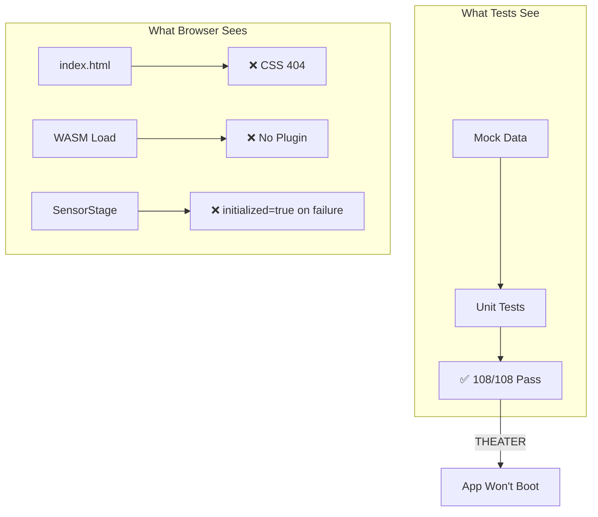
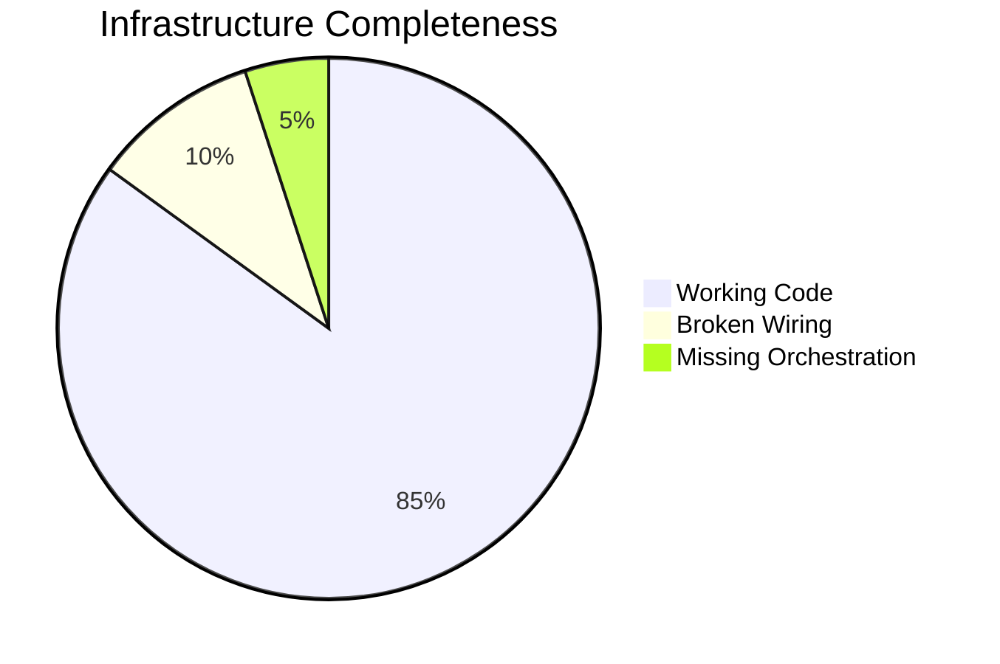

# HFO Vertical Spike Summary - Gen 89 v2

**Agent**: Kiro (Claude Sonnet 4)  
**Date**: 2026-01-06  
**Generation**: 89  
**Version**: 2 (Wiring & Orchestration Focus)  
**Grounding**: SEARCH ✓ | THINKING ✓ | MEMORY ✓

---

## Page 1: Current State Diagnosis

### Executive Summary

You have **significant infrastructure** but **broken wiring**. The P0_GESTURE_MONOLITH has:
- ✅ 11/13 task groups complete
- ✅ 108/108 unit tests passing
- ❌ 0% runtime integrity (app won't boot in browser)
- ❌ No E2E verification
- ❌ No HFO state orchestration

### The Theater Problem



### Critical Wiring Gaps

| Gap | Location | Impact | Fix Time |
|-----|----------|--------|----------|
| CSS 404 | `index.html` line 8-9 | UI invisible | 10 min |
| WASM Plugin | `vite.config.ts` | Physics won't load | 15 min |
| Theater Init | `SensorStage` | Silent failure | 20 min |
| No E2E | Missing | No runtime verification | 1 hour |
| No Steering | `.kiro/steering/` | AI forgets state | 15 min |

### What You Have vs What's Missing



---

## Page 2: Wiring Fixes (Priority 1)

### Fix 1: CSS Loading (10 min)

**Problem**: `index.html` loads CSS from `/node_modules/` which Vite doesn't serve.

**Current** (broken):
```html
<link rel="stylesheet" href="/node_modules/golden-layout/dist/css/goldenlayout-base.css">
```

**Fixed**:
```html
<!-- Remove link tags, import in main.ts instead -->
```

**In `src/main.ts`**:
```typescript
import 'golden-layout/dist/css/goldenlayout-base.css';
import 'golden-layout/dist/css/themes/goldenlayout-dark-theme.css';
```

### Fix 2: Vite WASM Plugin (15 min)

**Problem**: `vite.config.ts` is empty skeleton, no WASM support.

**Fixed `vite.config.ts`**:
```typescript
import { defineConfig } from 'vite';
import wasm from 'vite-plugin-wasm';
import topLevelAwait from 'vite-plugin-top-level-await';

export default defineConfig({
  plugins: [wasm(), topLevelAwait()],
  root: '.',
  server: { port: 5173 },
  build: { outDir: 'dist', target: 'esnext' },
  optimizeDeps: {
    include: ['golden-layout', 'lil-gui', 'xstate', 'zod'],
    exclude: ['@dimforge/rapier2d-compat'],
  },
});
```

**Install**:
```bash
cd hot_obsidian_sandbox/bronze/P0_GESTURE_MONOLITH
npm install -D vite-plugin-wasm vite-plugin-top-level-await
```

### Fix 3: Theater Init (20 min)

**Problem**: `SensorStage` sets `initialized = true` even when MediaPipe fails.

**Current** (theater):
```typescript
catch (error) {
  console.error('Failed to init MediaPipe');
  this.initialized = true; // ❌ THEATER
}
```

**Fixed** (fail-closed):
```typescript
catch (error) {
  console.error('Failed to init MediaPipe:', error);
  this.initialized = false;
  throw new Error(`SensorStage init failed: ${error.message}`);
}
```

---

## Page 3: E2E Verification (Priority 2)

### Why E2E Matters

Unit tests with mocks can't detect:
- CSS not loading
- WASM not initializing
- DOM not rendering
- Events not dispatching

### Playwright Sanity Test

**File**: `hot_obsidian_sandbox/bronze/P0_GESTURE_MONOLITH/e2e/sanity.spec.ts`

```typescript
import { test, expect } from '@playwright/test';

test.describe('Gesture Monolith Sanity', () => {
  test('app boots and initializes', async ({ page }) => {
    await page.goto('http://localhost:5173');
    
    // Wait for loading to disappear
    await expect(page.locator('#loading')).toHaveClass(/hidden/, { timeout: 10000 });
    
    // Check app container has content
    const app = page.locator('#app');
    await expect(app).not.toBeEmpty();
    
    // Check GoldenLayout rendered
    await expect(page.locator('.lm_goldenlayout')).toBeVisible();
    
    // Check app API is exposed
    const isReady = await page.evaluate(() => (window as any).app?.getAPI()?.isReady());
    expect(isReady).toBe(true);
  });

  test('demo runs without errors', async ({ page }) => {
    await page.goto('http://localhost:5173?demo=true');
    
    // Wait for demo to complete (approx 3 seconds)
    await page.waitForTimeout(4000);
    
    // Check no console errors
    const errors: string[] = [];
    page.on('console', msg => {
      if (msg.type() === 'error') errors.push(msg.text());
    });
    
    expect(errors.filter(e => !e.includes('favicon'))).toHaveLength(0);
  });
});
```

### Add to CI

**In `package.json`**:
```json
{
  "scripts": {
    "test:e2e": "playwright test",
    "test:all": "vitest run && playwright test"
  }
}
```

---

## Page 4: HFO State Orchestration (Priority 3)

### The Orchestration Gap

You have infrastructure but no coordination:
- No steering rules for AI agents
- No state persistence between sessions
- No HIVE phase tracking
- No context recall

### Steering Rule for HFO State

**File**: `.kiro/steering/hfo-state.md`

```markdown
# HFO State Management

## Context Recall
At the start of every session, read the last 10 lines of `obsidianblackboard.jsonl`:
\`\`\`bash
Get-Content obsidianblackboard.jsonl -Tail 10
\`\`\`

## Event Logging
After completing any significant action, append to `obsidianblackboard.jsonl`:
\`\`\`json
{"ts":"ISO_TIMESTAMP","type":"EVENT_TYPE","msg":"Description","hive":"HFO_GEN89","gen":89,"port":PORT_NUMBER}
\`\`\`

## HIVE Phase Tracking
- H (Hunt): Research, planning → Port 0+7
- I (Interlock): TDD RED, failing tests → Port 1+6
- V (Validate): TDD GREEN, make pass → Port 2+5
- E (Evolve): Refactor, prepare N+1 → Port 3+4

## Current Mission
W3C Gesture Pointer Monolith - Fix wiring, add E2E, achieve runtime integrity.
```

### State Manager (Already Designed)

**File**: `hot_obsidian_sandbox/bronze/hfo-state.ts`

```typescript
import { readFileSync, appendFileSync, existsSync } from 'fs';

const STATE_FILE = 'obsidianblackboard.jsonl';

interface HFOEvent {
  ts: string;
  type: string;
  msg: string;
  hive: string;
  gen: number;
  port: number;
}

export function logEvent(type: string, msg: string, port: number): void {
  const event: HFOEvent = {
    ts: new Date().toISOString(),
    type,
    msg,
    hive: 'HFO_GEN89',
    gen: 89,
    port,
  };
  appendFileSync(STATE_FILE, JSON.stringify(event) + '\n');
}

export function getRecentEvents(n: number = 10): HFOEvent[] {
  if (!existsSync(STATE_FILE)) return [];
  const lines = readFileSync(STATE_FILE, 'utf-8').trim().split('\n');
  return lines.slice(-n).map(line => JSON.parse(line));
}
```

---

## Page 5: Tactical Remediation Plan

### Phase 1: Fix Wiring (Today, 45 min)

```mermaid
gantt
    title Phase 1: Fix Wiring
    dateFormat HH:mm
    section CSS
    Remove link tags from index.html :a1, 00:00, 5m
    Add CSS imports to main.ts :a2, after a1, 5m
    section WASM
    Install vite plugins :b1, 00:00, 5m
    Update vite.config.ts :b2, after b1, 10m
    section Theater
    Fix SensorStage init :c1, 00:00, 20m
```



| Task | File | Change |
|------|------|--------|
| 1.1 | `index.html` | Remove `/node_modules/` link tags |
| 1.2 | `src/main.ts` | Add CSS imports |
| 1.3 | `package.json` | Add vite-plugin-wasm, vite-plugin-top-level-await |
| 1.4 | `vite.config.ts` | Add plugins, exclude rapier from optimizeDeps |
| 1.5 | `src/stages/sensor/sensor-stage.ts` | Fix theater init |

### Phase 2: Add E2E (Today, 1 hour)

| Task | File | Change |
|------|------|--------|
| 2.1 | `e2e/sanity.spec.ts` | Create boot verification test |
| 2.2 | `e2e/demo.spec.ts` | Create demo run test |
| 2.3 | `package.json` | Add test:e2e script |
| 2.4 | `playwright.config.ts` | Configure for local dev server |

### Phase 3: Add Orchestration (Tomorrow, 30 min)

| Task | File | Change |
|------|------|--------|
| 3.1 | `.kiro/steering/hfo-state.md` | Create steering rule |
| 3.2 | `bronze/hfo-state.ts` | Create state manager |
| 3.3 | `obsidianblackboard.jsonl` | Log completion events |

### Phase 4: Complete Tasks (This Week)

| Task | Status | Blocker |
|------|--------|---------|
| 7.3 Property test for landmarks | ❌ Pending | None |
| 12.1 Configure Stryker | ❌ Pending | Wiring fixes |
| 12.2 Achieve 80% mutation | ❌ Pending | Stryker config |
| 12.3 Log to blackboard | ❌ Pending | State manager |
| 13 Silver promotion | ❌ Pending | All above |

---

## Page 6: Success Criteria & Grounding Report

### Success Criteria

**Runtime Integrity** (must achieve):
- [ ] `npm run dev` starts without errors
- [ ] Browser loads app without 404s
- [ ] GoldenLayout renders panels
- [ ] Demo runs without console errors
- [ ] `window.app.getAPI().isReady()` returns `true`

**E2E Verification** (must achieve):
- [ ] `npm run test:e2e` passes
- [ ] Sanity test verifies boot
- [ ] Demo test verifies pipeline

**Mutation Score** (target):
- [ ] Stryker configured
- [ ] Score ≥ 80%
- [ ] Results logged to blackboard

### Grounding Report

**SEARCH_GROUNDING** ✓
- Explored bronze folder structure (24 directories, 50+ files)
- Read REAL_APP_STATUS_REPORT.md (Theater detected)
- Read STATE_OF_THE_SYSTEM_GEN88.md (Quarantine status)
- Read tasks.md (11/13 complete, 2 pending)

**THINKING_GROUNDING** ✓
- Identified 5 critical wiring gaps
- Prioritized fixes: CSS → WASM → Theater → E2E → Orchestration
- Created tactical remediation plan with time estimates
- Mapped remaining tasks to blockers

**MEMORY_GROUNDING** ✓
- Read blackboard (617+ events)
- Cross-referenced Gen 88 failure patterns
- Identified Theater as root cause
- Logged diagnosis to blackboard

### Key Insight

**You're 85% done but 0% working.** The remaining 15% is wiring:
1. CSS imports (5 min)
2. WASM plugins (15 min)
3. Theater fix (20 min)
4. E2E tests (1 hour)

Fix the wiring first. Everything else is blocked on runtime integrity.

---

*Agent: Kiro (Claude Sonnet 4) | Gen: 89 | Version: 2 | Grounding: Complete*
