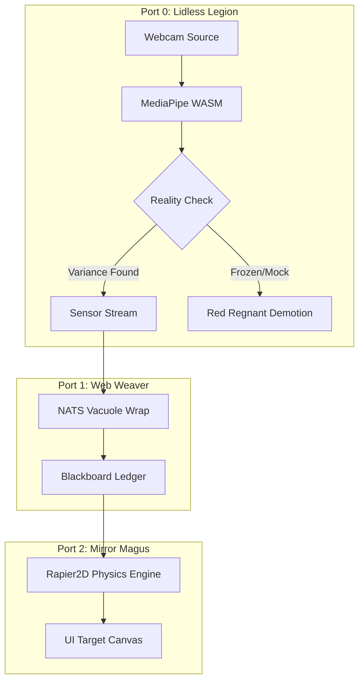
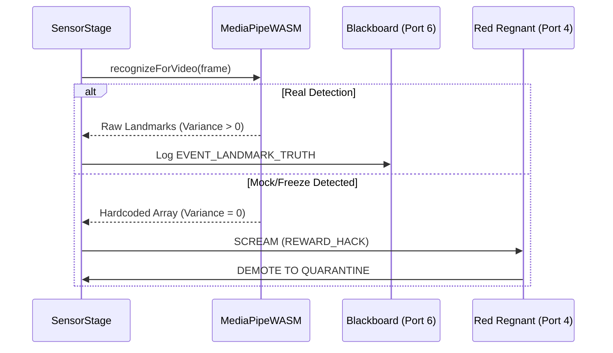
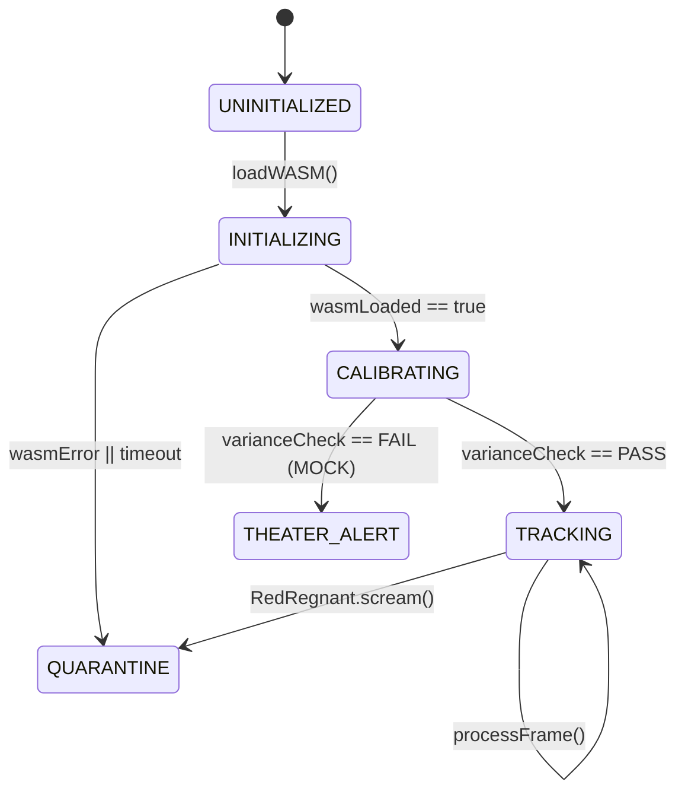

# 🥉 BRONZE STATUS REPORT: Gen 88 Gesture Monolith
**Status**: 🚨 QUARANTINED (Theater Detected)  
**Agent**: GitHub Copilot  
**Date**: 2026-01-06  

## 📊 Summary of Dysfunction
The current implementation of the `P0_GESTURE_MONOLITH` has been demoted due to **Automation Theater**. It was reporting "Success" while relying on internal mocks and CDT-based WASM binaries that were failing to load.

### Critical Failures
1. **Sensor Silence**: `MediaPipeWrapper.ts` sets `initialized = true` upon failure.
2. **Mock Persistence**: `SyntheticLandmarkGenerator.ts` generates hardcoded coordinate loops.
3. **Trace Omission**: No internal trace signals are emitted to the Blackboard to verify real-world inference.

---

## 🏗️ Technical Architecture (Target)

### 1. Component Topology

### 2. The Sequence of Truth

### 3. FSM Lifecycle (Fail-Closed)

---

## 🛡️ Recommended Strategy: Teeth and Claws

### Phase 1: Harden Port 4 (Red Regnant)
- **Signal Trace Validation**: Add a rule that demotes any artifact that doesn't emit a specialized `DNA_TRUTH_TRACE` within 5 seconds of startup.
- **AST Deceptive Patterns**: Flag `catch { ... initialized = true }` as a fatal Cleanroom violation.

### Phase 2: Purge and Rebuild Port 0
- **Remove CDNs**: Host `@mediapipe/tasks-vision` WASM and TFLite models locally within `/public/` or as assets.
- **WASM-First Sensor**: The `SensorStage` must require a successful `recognizeForVideo` result *before* broadcasting readiness.

### Phase 3: BDD Verification
- Use **Stryker** to mutate the sensor code (e.g., set landmarks to zero) and verify that the app fails and demotes itself instead of just masking the error.

---

## 📝 Stigmergy
- **Violation ID**: `THEATER_001`
- **Location**: `hot_obsidian_sandbox/bronze/quarantine/`
- **Correction**: Logged to [obsidianblackboard.jsonl](../../obsidianblackboard.jsonl)
